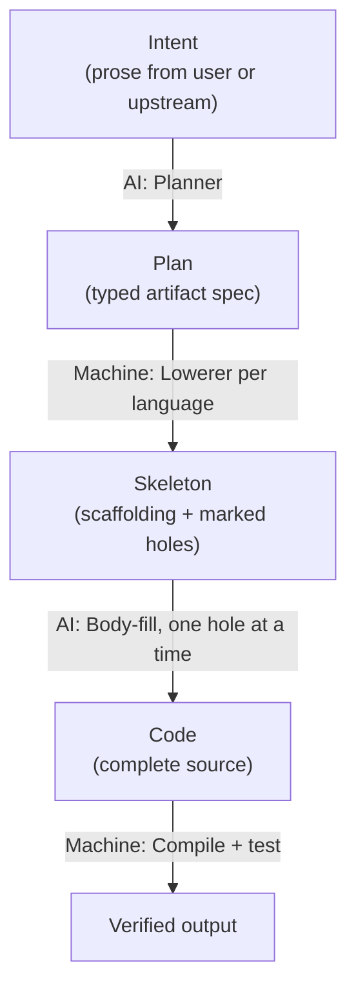

# Plan → Code Architecture

*Typed plans, deterministic codegen, and the precision dial that decides how much AI shows up in each artifact.*

> **Status (2026-05-24):** The architectural shape described here is ~80% built. The Planner, C# Lowerer, C# Emitter, Validator, and all four language decomposers exist today. Four gaps remain — typed `changes[]` schema, Hermes bounded-hole refactor, Python/TS lowerers, L5 algorithm IR — tracked in [`context-store/plans/011-typed-changes-hermes-refactor.md`](context-store/plans/) (TODO). This doc explains the model the gap-fills are converging toward.

---

## Motivation

Most AI coding agents do too much with the LLM. The LLM is asked to read intent, plan the work, write the code, and verify it — all in one loosely-typed stream. The result is expensive (long context every step), brittle (no place to insert checks between steps), and hard to debug (when something goes wrong, you can't tell which step failed).

The premise of this architecture is the opposite: **the LLM should do as little as possible, and what it does should happen inside a tight, typed box.** Everything else — parsing, scaffolding, wiring, validation — is the job of deterministic machine logic that runs once and runs the same way every time.

To get there, we need a sharp boundary between the parts of the pipeline that require judgment and the parts that don't. The Plan is that boundary. It's a typed, language-neutral description of what code should exist. The AI works above it (turning prose intent into a plan) and inside it (filling specific bodies when the plan can't fully specify them). Everything else is machine logic.

---

## The four-layer cake



Each arrow is owned by exactly one side — AI or machine. Crossing the boundary requires translating to a typed artifact.

| Arrow | Owner | Why |
|---|---|---|
| Intent → Plan | AI | Genuinely ambiguous; needs judgment on decomposition, naming, dependencies |
| Plan → Skeleton | Machine | Plan is structured; emitting the scaffold is a deterministic transform |
| Skeleton → Code | AI (sometimes) | Only the holes; constrained by the contract and neighbor types |
| Code → Verified | Machine | Compiler + test runner — definitive, no judgment needed |

The leverage: **the AI never sees "the whole problem."** When it plans, it sees intent and high-level context. When it fills a body, it sees one hole, one contract, and the local neighbors — not the rest of the plan, not the rest of the repo. That bound is what makes the system cheap, fast, and reviewable.

---

## The precision dial

Not every artifact needs the same amount of specification. A `clamp` function can be specified down to executable pseudocode; a `recommendProducts` function probably can't. The Plan lets each artifact land at the appropriate level.

| Level | Plan contains | Body filled by | Relative cost |
|---|---|---|---|
| **L1** | Signature only — name, params, return type | Open-ended AI synthesis | Highest — large context, full latitude |
| **L2** | + behavioral contract — pre/post conditions, examples, "what it does" | AI fills, but bounded by the contract | Medium — most artifacts live here |
| **L3** | + structured algorithm IR (expr / if / loop / call / return) | Pure codegen — no AI in the body | Zero AI cost |

The Planner's job isn't "make every artifact L3." It's to **push each artifact as far down as is genuinely useful**. Forcing a fuzzy artifact to L3 means reinventing the body in IR form, which is just code with extra steps. The art is knowing where to stop.

Hekate currently implements this as a five-level system (L1–L5) where L4 splits "signatures provided" from "bodies provided." That's a finer-grained version of the same idea — the conceptual model is unchanged. See [`Odin/gods/plan_levels.py`](Odin/gods/plan_levels.py).

---

## Worked example: `validateEmail`

### Intent comes in

> Add an email validation function to the auth utilities. Should return `Ok` for valid emails and `Err` with a reason for invalid ones.

### Planner emits a Plan with one artifact at L2

```yaml
artifact:
  kind: function
  name: validateEmail
  signature:
    params:  [{name: email, type: {kind: primitive, name: string}}]
    returns: {kind: ref, symbol: ValidationResult}
  contract:
    level: L2
    intent: "Check whether a string is a valid email address"
    spec:
      preconditions:  ["email is not null"]
      postconditions:
        - "returns Ok if email matches RFC 5322 simple form"
        - "returns Err with reason otherwise"
      examples:
        - {in: "alice@example.com", out: {Ok: true}}
        - {in: "not-an-email",      out: {Err: "missing @"}}
```

### C# Lowerer emits a skeleton (deterministic)

```csharp
namespace Auth;

public class EmailValidator
{
    public ValidationResult ValidateEmail(string email)
    {
        // AI HOLE
        //   pre:  email is not null
        //   post: returns Ok if email matches RFC 5322 simple form
        //         returns Err with reason otherwise
        //   ex:   "alice@example.com" → Ok
        //         "not-an-email"      → Err("missing @")
    }
}
```

### Body-fill AI receives only the hole

The AI sees the hole, the contract, the type definition of `ValidationResult`, and the surrounding class. It does **not** see the rest of the plan, the rest of the repo, or the original intent prose. It returns just the body:

```csharp
public ValidationResult ValidateEmail(string email)
{
    if (string.IsNullOrEmpty(email))
        return ValidationResult.Err("empty");
    var at = email.IndexOf('@');
    if (at <= 0 || at == email.Length - 1)
        return ValidationResult.Err("missing @");
    return ValidationResult.Ok();
}
```

### Validator runs (deterministic)

Roslyn compiles the file. The contract's examples become assertions and run as inline tests. If they pass, the artifact is done. If they fail, the body-fill AI is invoked again with the failure as additional context — but the Plan never changes.

### Contrast with a conventional agent

The same task handed to a conventional agent: full repo in context, prose task description, agent decides where to put the function, what to name it, what the result type looks like, what error model to use, plus the implementation. Many more decisions, many more places to drift, many more tokens. With the typed-plan approach, each of those decisions has either already been made by the Planner (above) or has been removed from the AI's purview entirely (it's emitting code into a fixed signature, against a fixed contract).

---

## The symmetric pair: decomposer ↔ lowerer

The Plan/Code interface works the same in both directions:

```mermaid
flowchart LR
    subgraph "Read direction"
        Code1["Existing source code"] -->|Decomposer<br/>(real parser)| Nodes1["Node tree"]
    end
    subgraph "Write direction"
        Plan["Plan"] -->|Lowerer| Nodes2["Node tree"]
        Nodes2 -->|Emitter| Code2["Generated source"]
    end
```

A **decomposer** reads source code, parses it with the real language parser (Roslyn / Jedi / TS compiler / Clang), and produces a tree of typed nodes (`compilation_unit → namespace → class → method → block → statement`).

An **emitter** walks that same node tree and produces compilable source.

A **lowerer** is what turns a Plan into the same node tree — so the Plan ultimately gets emitted by the same code that emits parsed source. One node model, two write paths into it (parse and lower), one write path out (emit).

This symmetry is what makes round-tripping work: decompose existing code into nodes, modify them via a Plan, lower the Plan's changes into the same node tree, and re-emit. Nothing in the pipeline cares whether a node came from parsing or planning.

Hekate has the decomposer side built for all four supported languages (Roslyn in-process for C#; out-of-process workers for Python, TS, C++) behind the HekateServer MCP on port 5110. The emitter and lowerer currently exist for C# only — see [`context-store/Generator/CSharpGenerator.cs`](context-store/Generator/CSharpGenerator.cs) and [`PlanToCodeGenerator.cs`](context-store/Generator/PlanToCodeGenerator.cs).

---

## What exists today

The architectural shape is mostly built:

- **Planner** (Athena) with L1–L5 levels, rule-engine validation, DAG checks, tooling-aware level suggestion: [`Odin/gods/plan_levels.py`](Odin/gods/plan_levels.py), [`Odin/gods/handlers/athena_leveled.py`](Odin/gods/handlers/athena_leveled.py)
- **Lowerer (C#)** with task → method provenance via `IMPLEMENTED_BY` temporal edges: [`context-store/Generator/PlanToCodeGenerator.cs`](context-store/Generator/PlanToCodeGenerator.cs)
- **Emitter (C#)**: [`context-store/Generator/CSharpGenerator.cs`](context-store/Generator/CSharpGenerator.cs)
- **Validator (C#)**: [`context-store/Generator/RoslynValidator.cs`](context-store/Generator/RoslynValidator.cs)
- **Decomposers** for all four languages, fronted by the HekateServer MCP (port 5110)
- **Executor** (Hermes) that runs the AI body-fill via Claude Code CLI: [`Odin/gods/handlers/hermes_async.py`](Odin/gods/handlers/hermes_async.py)

A foundational design principle is already documented in the codebase. From the header of [`PlanToCodeGenerator.cs`](context-store/Generator/PlanToCodeGenerator.cs):

> *Task attributes (method_name, return_type, params, body) are structured, not free-text. PlanToCodeGenerator does NOT parse natural language descriptions.*

That principle is the load-bearing rule for the whole stack — not just the C# generator.

---

## What's missing

Four gaps, tracked with status in [`context-store/plans/011-typed-changes-hermes-refactor.md`](context-store/plans/):

1. **Typed `changes[]` schema.** `TaskSpec.changes` is currently `list[dict[str, Any]]`. The L4/L5 validators check that keys named `signature`/`body` exist but enforce no structure on their contents. Need `Change` / `Signature` / `Type` / `Contract` dataclasses, with a converter so the loose dict form keeps working during migration.

2. **Hermes refactor: bounded holes, not whole tasks.** Today Hermes hands the whole task to Claude Code CLI, which sees the full repo. Refactor to consume a typed contract for one hole at a time. Drops context cost; verification becomes a typed check instead of a diff scan. Ships together with gap 1 — typed changes are the input contract.

3. **Python lowerer.** Mirrors `CSharpGenerator` but emits Python. Most of Hekate's actual codebase is Python, so this is high-leverage. Calls the Jedi worker for validation symmetric to RoslynValidator. Parallelizable with gap 2 once gap 1 ships.

4. **Algorithm IR for true L5.** Today the L5 `body` field is a literal code string — "the LLM already wrote it." Add a portable algorithm IR (expr + if + loop + call + return + literal) that per-language emitters lower deterministically. Narrow win (only trivial/algorithmic artifacts qualify) but trims AI surface to zero on those. Do last.

---

## Why we're extending Hekate rather than starting fresh

The alternative was to build a successor system that did this cleanly from scratch. Rejected because:

- The four gaps above are **additive**. None requires breaking the running system, and each is shippable on its own.
- A new system would re-solve the rule engine, DAG validation, level auto-selection, traceability edges, MCP transport — months of work that doesn't move the architecture forward.
- The decomposer side is the hardest part of the symmetric pair, and it's already built across all four languages. Starting over throws that away.

Extending in place is more work to coordinate (existing services, deployed binaries, dependent components) but vastly less work to build.

---

## Reading order

**New to this:** Read this doc, then the status of the four gaps in [`context-store/plans/011-typed-changes-hermes-refactor.md`](context-store/plans/), then [`Odin/gods/plan_levels.py`](Odin/gods/plan_levels.py) and [`PlanToCodeGenerator.cs`](context-store/Generator/PlanToCodeGenerator.cs) to see the existing shape.

**About to extend one of the four gaps:** Read this doc, then [`GODS.md`](GODS.md) for the gods/pipeline view, the relevant component `CLAUDE.md` ([`context-store/CLAUDE.md`](context-store/CLAUDE.md) or [`orchestration/CLAUDE.md`](orchestration/CLAUDE.md)), then the section of the numbered plan covering your gap.
