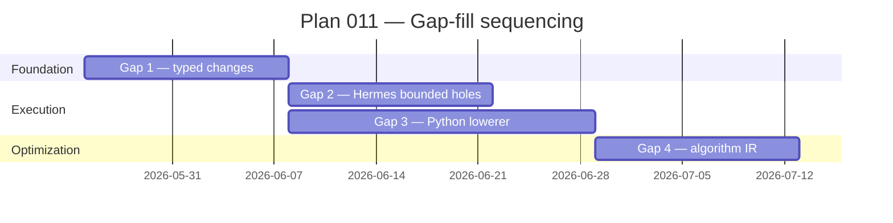

# Plan 011 — Typed Changes Schema + Hermes Bounded-Hole Refactor

**Level: L2**
**Status: planned**
**Goal: Close the four gaps between Hekate's current Plan→Code stack and the target architecture in [`PLAN_TO_CODE.md`](../../PLAN_TO_CODE.md). Each gap is independently shippable.**

## Why

See [`PLAN_TO_CODE.md`](../../PLAN_TO_CODE.md) for the full architectural model. Short version: Hekate has ~80% of the typed-plan / deterministic-codegen architecture built, but four gaps remain. This plan is the operational tracking doc for closing them.

## The four gaps

### Gap 1 — Typed `changes[]` schema   `[planned]`

**Problem.** `TaskSpec.changes` in [`Odin/gods/plan_levels.py`](../../Odin/gods/plan_levels.py) is `list[dict[str, Any]]`. The L4/L5 validators check that keys named `signature`/`body` exist but enforce nothing about their structure. PlanToCodeGenerator then has to defensively parse these dicts.

**What ships.** New dataclasses as siblings of `TaskSpec`:
- `Change` — wraps action + target + artifact
- `Signature` — params list, return type, error type, modifiers
- `Type` — tagged union (primitive | list | record | union | optional | ref)
- `Contract` — level + intent + spec (pre/post/examples) + algorithm
- Converter `change_from_dict` / `dict_from_change` for backward compatibility

Validator updates:
- `validate_task_at_level` accepts both typed `Change` and loose `dict[str, Any]` during migration
- New `validate_change_structure` for typed paths; loose-dict path emits deprecation warning
- One release window before removing the loose path

**Touches.** `Odin/gods/plan_levels.py`, `Odin/gods/handlers/athena_leveled.py` (planner output), `context-store/Generator/PlanToCodeGenerator.cs` (consumer).

**Done when.** A real plan flows through `Athena → typed Change → PlanToCodeGenerator → compiled C#` end-to-end with no `dict[str, Any]` access in the codegen path.

---

### Gap 2 — Hermes refactor: bounded holes, not whole tasks   `[planned, blocked on Gap 1]`

**Problem.** [`Odin/gods/handlers/hermes_async.py`](../../Odin/gods/handlers/hermes_async.py) hands the whole task to Claude Code CLI today, which sees the full repo. That:
- Burns context on every invocation
- Makes verification a diff scan rather than a typed check
- Allows the executor to drift from the plan (rename methods, change signatures, add files)

**What ships.** Hermes consumes a typed `Change` (from Gap 1) and produces only the body for a single named hole. The skeleton has already been written by the C# lowerer; Hermes' input is the contract + neighbor types + the hole marker. Output is a body that gets inserted into the existing skeleton. Validator then compiles and runs the contract's examples as assertions.

**Touches.** `Odin/gods/handlers/hermes_async.py`, the contract Odin uses to dispatch to Hermes, the verification path in Mimir.

**Risk.** Hermes is the active execution engine. The refactor needs a feature flag so existing whole-task tasks keep working while bounded-hole tasks ramp up.

**Done when.** At least one full project completes end-to-end where every L4/L5 task goes through Hermes as bounded holes, not whole tasks.

---

### Gap 3 — Python lowerer mirroring CSharpGenerator   `[planned, parallelizable with Gap 2 after Gap 1]`

**Problem.** [`context-store/Generator/CSharpGenerator.cs`](../Generator/CSharpGenerator.cs) is the only emitter. [`PlanToCodeGenerator.cs`](../Generator/PlanToCodeGenerator.cs) is the only lowerer. Python, TypeScript, and C++ have decomposers (read direction) but no generators (write direction). Most of Hekate's actual codebase is Python, so this is high-leverage.

**What ships.** `PythonGenerator` — likely Python-side rather than C#, calling the existing Jedi worker (`HekatePythonWorker`, port 9200) for validation symmetric to RoslynValidator. Same node model as the C# generator; same `IMPLEMENTED_BY` temporal edges.

**Touches.** New code in `context-store/Generator/` (or a parallel Python service if symmetry with Jedi-worker call site is cleaner), Jedi worker validation API.

**Decision needed.** Where the Python emitter lives — keep it C#-side calling the worker, or move it Python-side colocated with the worker. C#-side preserves the existing pattern; Python-side avoids a network hop per emit.

**Done when.** A real Python artifact (a tool handler in `orchestration/` or `Odin/gods/`) is generated end-to-end from a Plan with no manual edits.

---

### Gap 4 — Algorithm IR for true L5   `[planned, do last]`

**Problem.** Today's L5 `body` field is a literal code string — "the LLM already wrote it, the system just applies it." That's not actually deterministic codegen from a portable spec; it's deferred AI output. The L5 promise in `plan_levels.py` of "executable spec (tool applies directly, no LLM needed)" is met only in the sense that nothing re-runs the LLM at apply time.

**What ships.** A small portable algorithm IR:
- Primitives: `literal`, `var`, `call`
- Operators: arithmetic, comparison, logical
- Control flow: `if`, `loop`, `return`
- Types reuse the `Type` schema from Gap 1

Per-language emitters lower the IR to language-specific syntax:
- C#: extend `CSharpGenerator` with IR → expression / statement
- Python: extend `PythonGenerator` (Gap 3) with the same

**Why last.** Narrow win — only algorithmic/trivial bodies qualify. The IR is easy to add but easy to grow into a half-baked DSL. Defer until the typed-changes + bounded-hole foundation is solid so the IR's scope can be informed by what artifacts *actually* hit L5 in practice.

**Done when.** At least one common pattern (clamp, validation guard chain, simple dispatch) ships as L5 algorithm IR and emits identical C# and Python from the same spec.

---

## Sequencing

Gap 1 unblocks Gaps 2 and 3 (both consume the typed schema). Gaps 2 and 3 are parallelizable. Gap 4 waits until 2 and 3 ship so its scope is informed by real usage.

## Concrete first step

Read [`Odin/gods/handlers/hermes_async.py`](../../Odin/gods/handlers/hermes_async.py) to ground Gap 2's design in what Hermes actually consumes today (current understanding is projection from `CLAUDE.md`, not verified). Then start Gap 1 with the dataclass definitions.

## Out of scope

- Replacing the C# generator (it works; we extend it for Gap 4 only)
- Replacing the decomposer side (already built across all four languages)
- Rebuilding the rule engine, DAG validation, or level auto-selection
- A successor system to Hekate — see [`PLAN_TO_CODE.md`](../../PLAN_TO_CODE.md) §"Why we're extending Hekate rather than starting fresh" for the rationale
