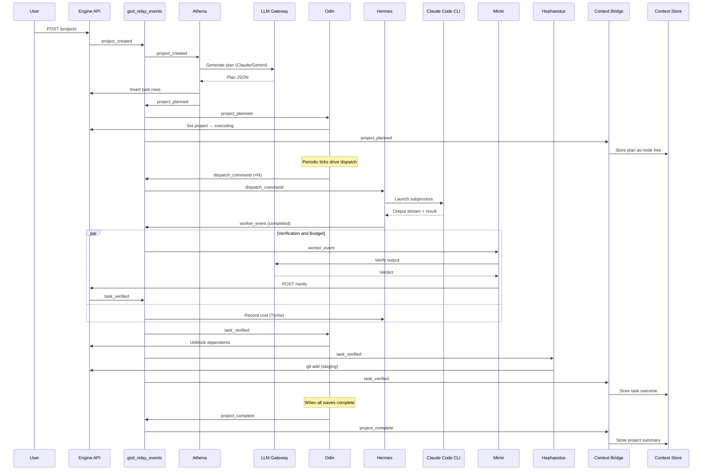

# Data Flow

This page traces data through the system from project creation to completion.

---

## End-to-End Flow



---

## Data Stores

### Relay Table (god_relay_events)

The central nervous system. All inter-god communication flows through this table.

```
Direction: Write → Read
Writers: API endpoints, god handlers
Readers: Pipeline event loop (cursor-based)
Retention: Permanent (full audit trail)
```

### Task Database (projects, tasks, plans)

Mutable state for the orchestration layer.

```
Direction: Read/Write
Writers: API endpoints, god handlers (via transition_and_emit)
Readers: API endpoints, dashboard, god handlers
Backend: PostgreSQL (production) or SQLite (development)
```

### Context Store (PostgreSQL + AGE + pgvector)

Persistent agent memory. Write-heavy during execution, read-heavy during planning.

```
Direction: Write (via context bridge), Read (via MCP or API)
Writers: Context bridge handlers, external agents
Readers: Athena (planning context), external agents (semantic search)
Backend: PostgreSQL 16 with AGE and pgvector extensions
```

---

## Communication Protocols

| From | To | Protocol | Purpose |
|------|----|----------|---------|
| Extension | Engine | HTTP REST + SSE | Project management, event streaming |
| Engine | LLM Gateway | HTTP REST + SSE | LLM calls (planning, verification) |
| Engine | Context Store | HTTP REST | Context enrichment, knowledge sync |
| Engine | Hekate MCP | HTTP JSON-RPC | Code analysis for task enrichment |
| Hermes | Claude Code | Subprocess stdin/stdout | Task execution |
| Claude Code | Prometheus MCP | SSE | Project management from within execution |
| Claude Code | Agent Context MCP | SSE | Memory storage/retrieval |
| Hades | NSSM | Process management | Service start/stop/restart |
| Dashboard | Engine | HTTP + SSE | UI rendering + real-time updates |

---

## Event Categories

Events fall into four categories based on their role in the data flow:

### Lifecycle Events

Drive the project forward. Each triggers the next phase.

```
project_created → project_planned → project_started → project_complete
```

### Work Events

Request and report execution.

```
dispatch_command → task_running → worker_event (completed/failed) → task_verified
```

### Infrastructure Events

Wave management and periodic maintenance.

```
tick → project_tick → wave_complete → wave_assessed
```

### Informational Events

Observable but don't drive state changes.

```
narration, budget_spent, files_staged, gate_failed
```
