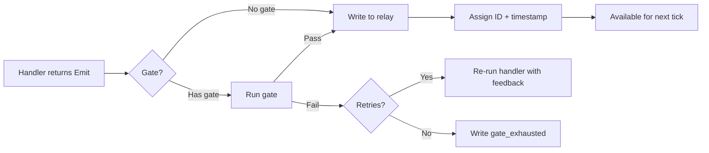

# Event Protocol

Complete reference for all event types in the Hekate pipeline.

---

## Event Types

| Event | Source | Subscribers | Payload |
|-------|--------|-------------|---------|
| `project_created` | API | Athena | `{project_id, name, requirements}` |
| `project_planned` | Athena | Odin, Context Bridge | `{project_id, plan_id, task_count}` |
| `project_started` | Odin | (informational) | `{project_id}` |
| `project_tick` | Odin, API | Odin (dispatch) | `{project_id}` |
| `tick` | Pipeline | Odin (tick handler) | `{}` |
| `dispatch_command` | Odin | Hermes | `{task_id, provider, model_tier}` |
| `task_running` | Hermes | (informational) | `{task_id, provider}` |
| `worker_event` | Hermes | Mimir, Tyche | `{task_id, status, output, cost_usd, tokens}` |
| `task_verified` | /verify API | Odin, Hephaestus, Mimir (review), Context Bridge | `{task_id, verdict, confidence, feedback}` |
| `wave_complete` | Odin | Athena (reassess) | `{project_id, wave}` |
| `wave_assessed` | Athena | Odin (decide) | `{project_id, wave, assessment}` |
| `project_complete` | Odin | Hephaestus, Context Bridge | `{project_id}` |
| `project_failed` | Odin | (terminal) | `{project_id, reason}` |
| `task_diagnosis` | Odin | Odin (handle diagnosis) | `{task_id, error_category, strategy}` |
| `needs_human_review` | Mimir | (stalls) | `{task_id, reason}` |
| `narration` | Athena, Hermes | (informational) | `{source, message, project_id}` |
| `budget_spent` | Tyche | (informational) | `{task_id, cost_usd}` |
| `files_staged` | Hephaestus | (informational) | `{task_id, files, sha}` |
| `pr_created` | Hephaestus | (informational) | `{project_id, pr_url}` |
| `gate_failed` | Pipeline | (retry logic) | `{handler, gate, reason, attempt}` |
| `gate_exhausted` | Pipeline | (alerting) | `{handler, gate, reason, max_retries}` |
| `plan_node_created` | Athena | Athena (deepen) | `{node_id, parent_id, depth}` |
| `plan_node_complete` | Athena | Athena (bubble up) | `{node_id}` |
| `plan_node_executable` | Athena | Athena (materialize) | `{node_id}` |

---

## Event Lifecycle



---

## Ordering Guarantees

- Events are assigned **monotonically increasing IDs** by the relay table
- The pipeline processes events **in ID order** within each event type
- **No cross-type ordering guarantee** — `task_verified` events for different tasks may process in any order
- **Coalescing** reduces duplicate ticks: multiple `project_tick` events for the same project collapse into one per pipeline cycle

---

## Idempotency Protocol

Events may carry an `idempotency_key`. The relay table has a UNIQUE constraint on this column.

```python
Emit(
    event_type="dispatch_command",
    payload={"task_id": "abc-123"},
    idempotency_key="dispatch-abc-123-attempt-1"
)
```

If the key already exists, the emit is silently skipped. This enables safe crash recovery — replaying the same handler produces the same idempotency key, which the database rejects as a duplicate.

### Key Naming Convention

```
{action}-{entity_id}-{qualifier}
```

Examples:

- `dispatch-abc-123-attempt-1`
- `verify-abc-123-passed`
- `plan-proj-456-l2`

---

## Payload Schemas

### project_created

```json
{
  "project_id": "uuid",
  "name": "string",
  "requirements": "string",
  "repo_path": "string",
  "config": {
    "target_level": "auto|L1|L2|L3|L4|L5",
    "tdd": true,
    "review_cycle": true
  }
}
```

### dispatch_command

```json
{
  "task_id": "uuid",
  "project_id": "uuid",
  "provider": "claude_code|gemini_cli|ollama",
  "model_tier": "sonnet|opus|haiku",
  "task_type": "code|test|research|docs",
  "prompt": "string",
  "context": "string (prior task outputs)",
  "attempt": 1
}
```

### worker_event

```json
{
  "task_id": "uuid",
  "status": "completed|failed",
  "output": "string",
  "cost_usd": 0.03,
  "prompt_tokens": 1200,
  "completion_tokens": 800,
  "model": "claude-sonnet-4-6",
  "duration_seconds": 45.2,
  "narration": ["line1", "line2"]
}
```

### task_verified

```json
{
  "task_id": "uuid",
  "verdict": "passed|gaps_found|human_needed",
  "confidence": 0.92,
  "feedback": "string",
  "knowledge_extracted": "string (optional)"
}
```
