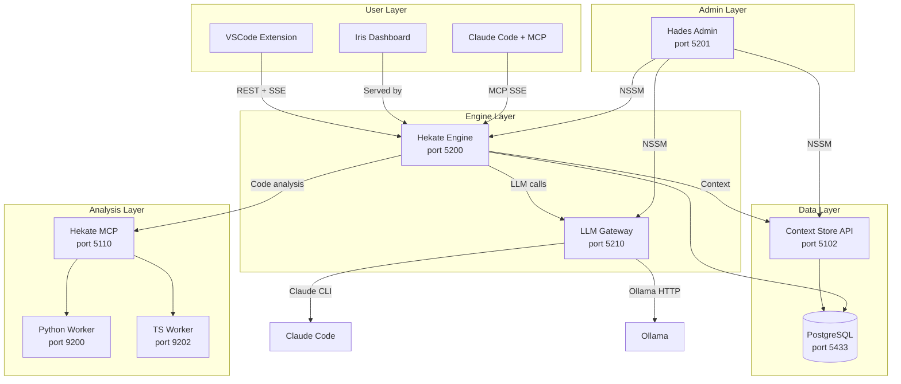

# System Overview

Hekate is a six-component AI agent platform. Each component has a single responsibility and communicates through well-defined interfaces.

---

## Components

### Hekate Engine (port 5200)

The core. Runs the gods pipeline (event loop), serves the REST API, and hosts the Iris dashboard. Written in Python (FastAPI). Stores state in PostgreSQL (or SQLite for development).

### Context Store (port 5102)

Agent memory. A .NET 8 API backed by PostgreSQL with Apache AGE (property graph) and pgvector (embeddings). Stores plans, decisions, findings, and knowledge for semantic retrieval.

### LLM Gateway (port 5210)

Multi-provider LLM proxy. Routes requests to Claude CLI, Gemini CLI, or Ollama. Exists because NSSM services run as LocalSystem — the gateway runs with user OAuth tokens that CLI tools need.

### Hekate MCP (port 5110)

Code analysis server. Uses Roslyn (C#), Jedi (Python), and TS Compiler (TypeScript) for static analysis. Provides 32+ tools: find implementations, usages, patterns, contracts, dependency graphs.

### Hades Admin (port 5201)

Infrastructure management. Controls NSSM services (start, stop, restart), runs deployments (build, copy, syntax check, health verify), tails logs, and ensures Docker/Postgres are running.

### MCP Servers (ports 5211-5213)

Three SSE-based MCP servers that expose Hekate's capabilities to external agents:

- **Hades MCP** (5211) — service management
- **Prometheus MCP** (5212) — project and task management
- **Agent Context MCP** (5213) — persistent memory

---

## Port Allocation

| Port | Service | Protocol |
|------|---------|----------|
| 5102 | Context Store API | HTTP REST |
| 5110 | Hekate MCP (code analysis) | HTTP JSON-RPC |
| 5200 | Hekate Engine | HTTP REST + SSE |
| 5201 | Hades Admin | HTTP REST |
| 5210 | LLM Gateway | HTTP REST + SSE + WebSocket |
| 5211 | Hades MCP Bridge | SSE (MCP) |
| 5212 | Prometheus MCP | SSE (MCP) |
| 5213 | Agent Context MCP | SSE (MCP) |
| 5433 | PostgreSQL | TCP |
| 9200 | Python Worker | Internal |
| 9201 | C++ Worker | Internal |
| 9202 | TypeScript Worker | Internal |
| 11434 | Ollama | HTTP |

---

## Dependency Map

| Component | Hard Dependencies | Soft Dependencies |
|-----------|-------------------|-------------------|
| **Engine** | PostgreSQL | Context Store, LLM Gateway, Hekate MCP |
| **Context Store** | PostgreSQL + Docker | Ollama (embeddings) |
| **LLM Gateway** | Claude CLI OAuth tokens | Gemini CLI, Ollama |
| **Hekate MCP** | .NET runtime | Python Worker, TS Worker |
| **Hades** | NSSM, filesystem | Docker |
| **MCP Servers** | Their backend services | — |

"Hard" means the component won't start or will crash. "Soft" means it starts but with degraded functionality (e.g., no embeddings without Ollama).

---

## Technology Stack

| Layer | Technology |
|-------|-----------|
| **Language** | Python 3.11, C#/.NET 8, TypeScript |
| **API Framework** | FastAPI (Python), Minimal API (.NET) |
| **Database** | PostgreSQL 16 + Apache AGE + pgvector |
| **Dev Database** | SQLite (orchestration only) |
| **Frontend** | React + Vite |
| **Process Management** | NSSM (Windows services) |
| **Containers** | Docker (Postgres only) |
| **LLM Providers** | Claude Code CLI, Ollama, (Gemini disabled) |
| **Embeddings** | Ollama + nomic-embed-text (768-dim) |
| **Code Analysis** | Roslyn, Jedi, TS Compiler API |
| **MCP Transport** | SSE (FastMCP), HTTP (JSON-RPC) |
