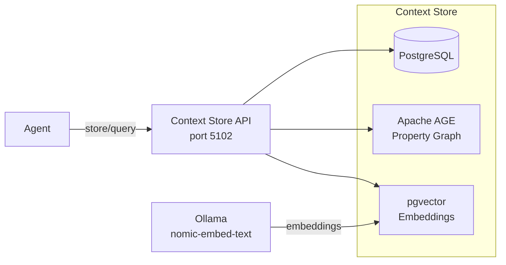

# Agent Memory

The **Context Store** gives agents persistent, queryable memory. Instead of losing context between sessions, agents store decisions, findings, plans, and knowledge in a graph database with vector search. Future tasks draw on this accumulated knowledge.

---

## Architecture

The Context Store combines three data layers:



- **PostgreSQL** — relational storage for nodes, attributes, and projects
- **Apache AGE** — property graph layer for relationships (parent-child, temporal edges)
- **pgvector** — 768-dimensional embeddings for semantic similarity search

---

## Nodes

Everything in the context store is a **node**. Nodes have a type, a name, a value, and optional attributes.

### Node Types

| Type | Purpose | Example |
|------|---------|---------|
| `decision` | A choice that was made | "Use PostgreSQL instead of MongoDB" |
| `finding` | Something discovered | "The auth middleware stores tokens insecurely" |
| `idea` | A potential approach | "Could use event sourcing for the audit log" |
| `question` | Something unresolved | "Should we support multi-tenancy?" |
| `action_item` | Something to do | "Add rate limiting to the API" |
| `plan` | A structured plan | Athena's L2 plan for the project |
| `task` | A unit of work | Individual task with output |
| `research` | Research results | "Comparison of auth libraries" |
| `conversation` | A conversation session | Agent session with turns |
| `turn` | A single exchange | One prompt-response pair |
| `topic` | A grouping concept | "Authentication", "Performance" |

### Hierarchy

Nodes form a tree via parent-child relationships:

```
Project: "Hekate"
  └── Plan: "Add health endpoints"
       ├── Task: "Create /health route"
       │    └── Finding: "FastAPI already has a health check pattern"
       ├── Task: "Add database check"
       └── Decision: "Include disk space in health response"
```

### Attributes

Nodes can carry arbitrary key-value attributes:

```python
store_node(
    node_type="decision",
    name="Use PostgreSQL for events",
    value="Chose Postgres over SQLite for the relay table due to JSONB support and concurrent access.",
    project_name="Hekate",
    attrs={"confidence": "high", "alternatives": "SQLite, Redis Streams"}
)
```

---

## Search

The context store supports two search modes:

### Text Search

Substring matching on node names and values:

```python
query_nodes(text="authentication", project_name="Hekate", limit=10)
```

### Semantic Search

Vector similarity using embeddings (requires Ollama with `nomic-embed-text`):

```python
semantic_search(query="how does the retry logic work", project_name="Hekate", limit=5)
```

When a node is stored, it's automatically embedded via Ollama. Semantic search finds conceptually related nodes even when the exact words don't match.

---

## Context Bridge

The **context bridge** is a set of pipeline handlers that automatically sync execution state to the context store:

| Event | What Gets Stored |
|-------|-----------------|
| `project_planned` | Plan structure as a node tree |
| `task_verified` | Task outcome, output summary, findings |
| `project_complete` | Project summary with key decisions |

This means the context store automatically accumulates knowledge from every project the pipeline executes — without any manual intervention.

---

## MCP Access

External agents access the context store through the **Agent Context MCP** server (port 5213):

| Tool | Purpose |
|------|---------|
| `ensure_project` | Get or create a project |
| `store_node` | Store a decision, finding, idea, etc. |
| `query_nodes` | Text search across nodes |
| `semantic_search` | Vector similarity search |
| `get_node` | Fetch a node with children |
| `get_children` | List direct children of a node |
| `list_projects` | Show all projects with node counts |
| `list_recent` | Recently modified nodes |
| `history` | Temporal edge history for a node |

---

## Temporal Edges

The graph layer (AGE) supports temporal edges — relationships with `valid_from` and `valid_to` timestamps. This enables:

- Tracking how a decision evolved over time
- Seeing what the plan looked like at a specific point
- Understanding provenance (which agent made which change)

---

## Infrastructure

The context store runs on Docker:

```yaml
services:
  postgres:
    image: custom-age-pgvector  # PostgreSQL + AGE + pgvector
    ports: ["5433:5432"]
    environment:
      POSTGRES_DB: code_storage
      POSTGRES_USER: postgres
      POSTGRES_PASSWORD: postgres
```

The Context Store API (port 5102) is a .NET 8 application that connects to this Postgres instance.
