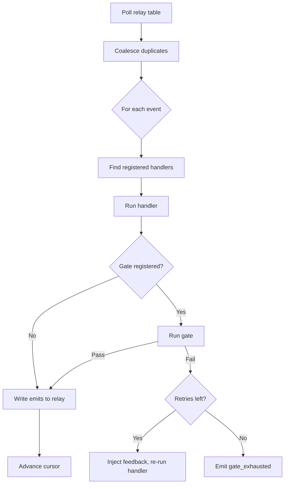

# Events and Handlers

Events are Hekate's unit of communication. Every state change in the system — a project created, a task dispatched, a verification result — is an event written to the `god_relay_events` table. Handlers are functions that react to events and emit new ones.

---

## Event Anatomy

```python
@dataclass
class Event:
    event_type: str        # e.g., "project_created", "task_verified"
    payload: dict          # event-specific data
    source: str            # which handler/system emitted it ("god:odin", "api")
    timestamp: float       # creation time
    severity: str          # "info", "warning", "error"
    id: int                # relay table row ID (cursor position)
```

### Key Properties

- **Immutable** — once written, events never change
- **Ordered** — the relay table assigns monotonically increasing IDs
- **Typed** — `event_type` determines which handlers receive it
- **Idempotent** — optional `idempotency_key` prevents duplicates

### Idempotency

Events can carry an `idempotency_key`. If a key already exists in the relay table, the emit is silently skipped. This is critical for crash recovery — if the engine restarts mid-processing, re-emitting the same event is safe.

```python
Emit(
    event_type="dispatch_command",
    payload={"task_id": "abc-123", "provider": "claude_code"},
    idempotency_key="dispatch-abc-123-attempt-1"
)
```

---

## Handlers

A handler is an async function that takes an event and a database connection and returns a list of emits (or None to emit nothing).

```python
async def my_handler(event: Event, db) -> list[Emit] | None:
    # Read state from db
    # Make decisions
    # Return new events to emit
    return [Emit("something_happened", {"detail": "value"})]
```

### Handler Contract

- Handlers **must not** call other handlers directly — communicate through events
- Handlers **should be** idempotent — the same event processed twice should not corrupt state
- Handlers **can** read and write the database within their scope
- Handlers **return** `list[Emit]` (new events) or `None` (no events)

### Registration

Handlers are bound to event types via `pipeline.register()`:

```python
pipeline.register("project_planned", odin_start)
pipeline.register("project_planned", context_bridge_plan)  # same event, different handler
```

Registrations can include an optional **filter** function and a **gate**:

```python
@dataclass
class Registration:
    event_type: str
    handler: Handler
    name: str
    filter: Callable[[Event], bool] | None = None  # pre-dispatch filter
    gate: Gate | None = None                         # post-handler validation
    max_retries: int = 0                             # retries if gate fails
```

---

## Emits

An **Emit** is what handlers produce — a request to write a new event to the relay.

```python
@dataclass
class Emit:
    event_type: str
    payload: dict
    source: str = ""           # auto-filled from handler name
    severity: str = "info"
    idempotency_key: str | None = None
```

Emits are not events yet — they become events when the pipeline writes them to the relay table. This distinction matters because **gates** can block emits before they become events.

---

## Gates

A **gate** is a validation function that runs after a handler produces emits but before those emits are written to the relay. Gates enforce invariants — "did this actually happen?"

```python
async def check_code_written(event: Event, emits: list[Emit], db) -> GateResult:
    task_id = event.payload["task_id"]
    task = await get_task(db, task_id)
    if not task.output_text or len(task.output_text.strip()) == 0:
        return GateResult(passed=False, reason="Task has no output")
    return GateResult(passed=True, reason="Output present")
```

### Gate Lifecycle

1. Handler runs and returns emits
2. Gate validates the emits against the current state
3. If gate **passes** → emits are written to the relay
4. If gate **fails** → a `gate_failed` event is emitted instead
5. If handler has `max_retries > 0`, the handler re-runs with `_gate_feedback` injected into the event payload
6. After max retries exhausted → `gate_exhausted` event emitted

### Built-in Gates

| Gate | Validates |
|------|-----------|
| `check_plan_created` | Plan ID exists and JSON is parseable |
| `check_plan_reviewed` | Plan has review data, confidence > 70% |
| `check_task_claimed` | Task is in RUNNING state |
| `check_code_written` | Output is non-empty and persisted |
| `check_code_parses` | Python syntax is valid |
| `check_tests_pass` | TDD phase complete |
| `check_verification_ran` | Verdict present in event |
| `check_files_staged` | Files committed with SHA |

### Composing Gates

Gates can be combined:

```python
from gods.gates import compose_gates

pipeline.register(
    "dispatch_command",
    hermes.handle_dispatch,
    gate=compose_gates(check_task_claimed, check_code_written)
)
```

---

## Event Flow Through the Pipeline

Each pipeline tick follows this path:



### Coalescing

The pipeline deduplicates certain high-frequency events to prevent storms:

- Multiple `tick` events → one tick per pipeline cycle
- Multiple `project_tick` events for the same project → one per project
- Multiple `dispatch_command` events for the same task → one per task

---

## The Relay Table

All events live in `god_relay_events`:

| Column | Type | Purpose |
|--------|------|---------|
| `id` | BIGSERIAL | Monotonic ordering, cursor position |
| `event_type` | TEXT | Handler dispatch key |
| `source` | TEXT | Who emitted it |
| `payload` | JSONB | Event-specific data |
| `severity` | TEXT | info, warning, error |
| `idempotency_key` | TEXT (UNIQUE) | Deduplication |
| `created_at` | FLOAT | Timestamp |

Indexed on `(event_type, created_at)` for efficient cursor-based polling.

---

## Atomic Transitions

When a task changes state and emits events, both happen in the same database transaction:

```python
await pipeline.transition_and_emit(
    db, task_id,
    new_status="completed",
    emits=[Emit("task_verified", {"task_id": task_id, "verdict": "passed"})]
)
```

This prevents split-brain: you'll never have a task marked completed without the corresponding event, or an event without the state change.
