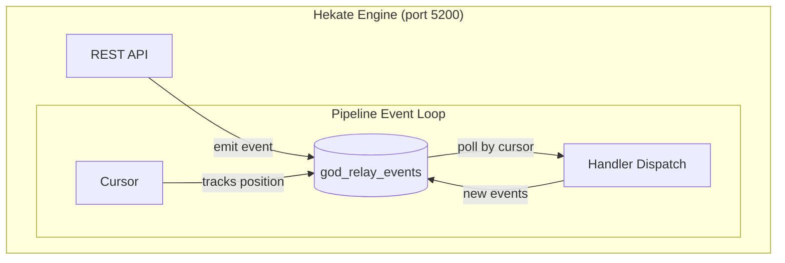

# Gods Pipeline

The gods pipeline is Hekate's execution engine. It runs inside the Hekate Engine process as an event loop that reads from the `god_relay_events` table, dispatches to handler functions, and writes new events back. No external message broker, no separate worker processes — one loop, one table, one cursor.

---

## The Pipeline Model



Each tick of the pipeline:

1. **Poll** — query events newer than the cursor, ordered by ID
2. **Coalesce** — deduplicate tick/dispatch events per entity (prevents storms)
3. **Dispatch** — call registered handlers for each event type
4. **Gate** — validate emitted events before writing (optional)
5. **Emit** — write new events to the relay table
6. **Advance** — update the cursor position

The cursor is persisted to the `god_registry` table. On restart, the pipeline resumes from the last saved position (or `max(id) - 50` to catch recent events if no cursor exists).

---

## The Six Pipeline Gods

These gods run as handler functions inside the engine. They process events and emit new ones.

### Athena — The Planner

Takes requirements and produces a structured execution plan.

- Generates plans via LLM (L1 rough tasks through L5 executable specs)
- Rule-checks every level transition before advancing
- Sends plans for adversarial review by a different model
- Generates TDD test specs when enabled
- Decomposes the final plan into executable task rows with dependencies
- Reassesses after each wave completes

**Subscribes to:** `project_created`, `plan_node_created`, `plan_node_complete`, `plan_node_executable`
**Emits:** `project_planned`, `plan_node_created`, `narration`

### Odin — The Orchestrator

Decides what runs, when, and on what. Manages the full project lifecycle.

- Starts projects (planned → executing)
- Dispatches tasks to CLI providers based on type, complexity, and availability
- Manages wave progression (wave N completes → unblock wave N+1)
- Detects deadlocks (all tasks blocked, none progressing)
- Diagnoses failures using 30 error pattern signatures
- Decides: retry with backoff, reassign provider, skip, or escalate to human
- Completes projects when all tasks finish

**Subscribes to:** `project_planned`, `project_tick`, `tick`, `task_verified`, `wave_assessed`, `task_diagnosis`
**Emits:** `project_started`, `dispatch_command`, `project_tick`, `wave_complete`, `project_complete`

### Hermes — The Executor

Runs the actual work. Launches CLI processes and captures output.

- Receives dispatch commands from Odin
- Looks up the CLI provider (Claude Code, Gemini CLI, Ollama)
- Builds prompts with task description, context, and feedback from prior attempts
- Launches CLI as an async subprocess (non-blocking, max 4 concurrent)
- Streams narration events in real time
- Captures output, cost, and token usage
- Reports completion or failure back through the relay

**Subscribes to:** `dispatch_command`
**Emits:** `worker_event` (status: completed or failed), `narration`

### Mimir — The Verifier

Checks the work. Determines if output satisfies requirements.

- Runs heuristic quality check (empty output, error patterns, "already done" detection)
- Calls LLM to verify output against task requirements (verdict: passed, gaps_found, human_needed)
- Reviews code quality (advisory — stores feedback, never auto-rejects)
- Extracts reusable knowledge from successful completions
- Handles all LLM response formats (JSON, markdown-fenced, prose, arrays)

**Subscribes to:** `worker_event`, `task_verified`
**Emits:** `task_verified` (via /verify API endpoint)

### Hephaestus — The Smith

Handles git operations after verified tasks.

- Stages changed files via `git add` after task verification
- Timeout protection on git operations (30s)

**Subscribes to:** `task_verified`, `project_complete`
**Emits:** `files_staged`, `pr_created`

### Tyche — The Accountant

Tracks spending and budget.

- Records cost from completed tasks (tokens, USD)
- Emits budget events for monitoring

**Subscribes to:** `worker_event`
**Emits:** `budget_spent`

---

## Infrastructure Gods

These run as standalone services, not inside the pipeline.

| God | Role | Port | Access |
|-----|------|------|--------|
| **Hades** | Service management, deployment, log tailing | 5201 | Admin only |
| **Prometheus** | Project/task management MCP for Claude Code | 5212 | Any Claude Code session |
| **Iris** | Dashboard — project list, tasks, events, budget | 5200 | Browser |
| **Apollo** | Code analysis (Roslyn, Jedi, TS Compiler) | 5110 | Pipeline + extension |

---

## The Relay

All gods communicate through a single table: `god_relay_events`.

```sql
CREATE TABLE god_relay_events (
    id           BIGSERIAL PRIMARY KEY,
    event_type   TEXT NOT NULL,
    source       TEXT NOT NULL,
    payload      JSONB NOT NULL,
    severity     TEXT DEFAULT 'info',
    idempotency_key TEXT UNIQUE,
    created_at   FLOAT NOT NULL
);

CREATE INDEX idx_relay_type_created ON god_relay_events(event_type, created_at);
```

Every decision, every state change, every narration is an event in the relay. Gods never call each other directly. This gives the system:

- **Auditability** — full history of every project in one table
- **Durability** — events persist before handlers run
- **Replay safety** — idempotency keys prevent duplicate processing
- **Extensibility** — add new gods by subscribing to existing events

---

## Handler Registration

Gods are wired to events in `registration.py`:

```python
def register_all_handlers(pipeline, max_concurrent=4):
    # Planning
    pipeline.register("project_created", athena_plan_leveled)
    pipeline.register("plan_node_created", athena_deepen)

    # Orchestration
    pipeline.register("project_planned", odin_start)
    pipeline.register("project_tick", odin_dispatch)
    pipeline.register("task_verified", odin_lifecycle)

    # Execution + Verification
    pipeline.register("dispatch_command", hermes.handle_dispatch)
    pipeline.register("worker_event", mimir.handle_verify)

    # Git + Budget
    pipeline.register("task_verified", hephaestus_stage)
    pipeline.register("worker_event", tyche_record_spend)
```

Multiple handlers can subscribe to the same event. When `task_verified` fires, Odin checks wave completion, Hephaestus stages files, and the context bridge syncs to the knowledge graph — all from the same event.

---

## Narration

Handlers stream real-time progress via `pipeline.narrate()`. Narration events flow to:

- **SSE broadcast** — the dashboard and extension show live output
- **Relay table** — persisted for later review

This is how you watch Hermes execute a task in real time, or see Athena's planning reasoning as it happens.

---

## Comparison with Conductor

| Conductor | Hekate Pipeline | Notes |
|-----------|-----------------|-------|
| Server + Task Queue | Single process + relay table | Simpler deployment, no broker needed |
| Worker polls queue | Handler called by event loop | Push model, not pull |
| Workflow JSON | Plan (generated by Athena) | Plans are generated, not hand-written |
| System Task | God handler | Same concept: engine-executed logic |
| DO_WHILE operator | Wave progression | Waves are implicit from dependency DAG |
| Compensation flow | Diagnosis + retry | 30 error patterns with automatic remediation |
| Metrics endpoint | Relay table queries | Every event is a metric |
