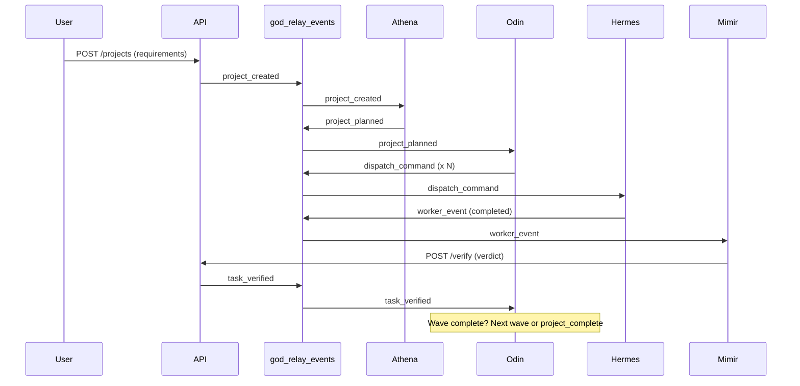

# Concepts

Hekate orchestrates AI coding agents through three primitives: **events**, **gods** (handlers), and **tasks**. This page introduces the mental model. Detailed pages follow for each concept.

---

## The Three Primitives

### Events — What Happened

An **event** is a durable record written to the `god_relay_events` table. Every meaningful thing that happens in the system — a project created, a task dispatched, a verification result, a git staging — is an event.

```python
Event(
    event_type="task_verified",
    payload={"task_id": "abc-123", "verdict": "passed"},
    source="god:mimir",
    severity="info",
    idempotency_key="verify-abc-123-attempt-1"
)
```

Events are **immutable** and **ordered**. The pipeline reads them via a cursor and never replays processed events. The idempotency key prevents duplicates.

[:octicons-arrow-right-24: Events and Handlers](events-and-handlers.md)

---

### Gods — Who Acts

A **god** is an async handler function that subscribes to events and emits new ones. Gods are the actors in the system — they make decisions and drive work forward.

```python
async def odin_dispatch(event: Event, db) -> list[Emit]:
    """Find pending tasks and dispatch them to providers."""
    tasks = await find_ready_tasks(db, event.payload["project_id"])
    return [
        Emit("dispatch_command", {"task_id": t.id, "provider": select_provider(t)})
        for t in tasks
    ]
```

Six **pipeline gods** run inside the engine. Three **infrastructure gods** run as standalone services. Each has a single responsibility.

[:octicons-arrow-right-24: Gods Pipeline](gods-pipeline.md)

---

### Tasks — What Gets Done

A **task** is a unit of work with a defined lifecycle. Tasks have states (pending, running, completed, failed), dependencies on other tasks, retry policies, and verification requirements.

Tasks are grouped into **waves** — dependency layers that execute in order. Wave 0 runs first. When all wave 0 tasks complete and verify, wave 1 unblocks, and so on.

```
Wave 0: [Setup project structure] [Create database schema]
                    ↓                       ↓
Wave 1: [Implement API endpoints]  [Write migration scripts]
                    ↓
Wave 2: [Add integration tests]
```

[:octicons-arrow-right-24: Plans and Tasks](plans-and-tasks.md)

---

## How They Fit Together



The relay table is the nervous system. Gods never call each other directly — they communicate exclusively through events. This makes the system:

- **Durable** — every state change is persisted before the next step
- **Replayable** — crash recovery resumes from the last cursor position
- **Observable** — the full history of every project lives in one table
- **Extensible** — add a new god by subscribing to existing events

---

## What's Next

| Page | Learn about |
|------|-------------|
| [Events and Handlers](events-and-handlers.md) | Event anatomy, handler contracts, gates, idempotency |
| [Gods Pipeline](gods-pipeline.md) | The six pipeline gods, infrastructure gods, the relay |
| [Plans and Tasks](plans-and-tasks.md) | Plan levels (L1-L5), task states, waves, dependencies |
| [Agent Memory](agent-memory.md) | Context store, semantic search, knowledge graphs |
| [MCP Integration](mcp-integration.md) | How external agents connect via MCP servers |
