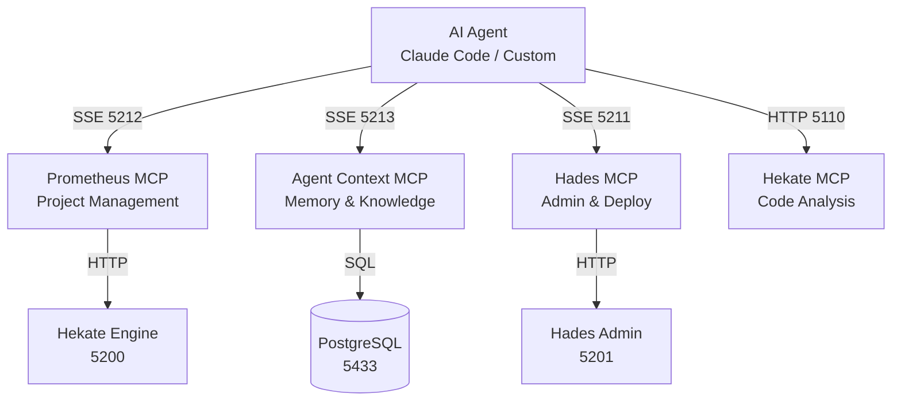

# MCP Integration

Hekate exposes its capabilities through the **Model Context Protocol (MCP)** — the standard for connecting AI agents to tools and data. Four MCP servers give agents access to project management, memory, administration, and code analysis.

---

## What Is MCP

MCP is a protocol that lets AI agents discover and use tools. Instead of hardcoding API calls, an agent connects to an MCP server and receives a list of available tools with typed parameters. The agent decides when and how to call them.

Hekate's MCP servers use **SSE (Server-Sent Events)** transport, which means any MCP-compatible client (Claude Code, Cursor, custom agents) can connect.

---

## The Four MCP Servers



### Prometheus — Project Management

Create and manage projects, start execution, monitor tasks.

| Tool | Purpose |
|------|---------|
| `create_project` | Create a new project with requirements |
| `list_projects` | List all projects (filterable by status) |
| `project_status` | Detailed project view with task breakdown |
| `start_project` | Trigger planning and execution |
| `list_tasks` | List tasks for a project |
| `task_detail` | Full task detail with output |
| `approve_task` | Approve a task in needs_review state |
| `retry_task` | Retry a failed task |
| `cancel_project` | Cancel an entire project |
| `get_events` | Recent events (narration, verification) |
| `submit_verification` | Report verification result |
| `submit_plan_children` | Submit deeper planning nodes |

**Port:** 5212 (SSE transport)

### Agent Context — Memory

Store and retrieve persistent knowledge across sessions.

| Tool | Purpose |
|------|---------|
| `ensure_project` | Get or create a project context |
| `store_node` | Store a decision, finding, idea, etc. |
| `query_nodes` | Text search across nodes |
| `semantic_search` | Vector similarity search |
| `get_node` | Fetch a node with its children |
| `get_children` | List children of a node |
| `list_projects` | All projects with node counts |
| `list_recent` | Recently modified nodes |
| `history` | Temporal edge history |

**Port:** 5213 (SSE transport)

### Hades — Administration

Manage services, deploy code, tail logs.

| Tool | Purpose |
|------|---------|
| `list_services` | All NSSM services with health status |
| `service_status` | Check a specific service |
| `restart_service` | Restart with health check |
| `start_service` | Start a service |
| `stop_service` | Stop a service |
| `restart_core` | Restart Engine + Context Store |
| `restart_all` | Restart everything |
| `deploy` | Full deploy from source repo |
| `tail_logs` | Stream service logs |
| `exec` | Execute a system command |
| `sync_check` | Verify source/target sync |
| `system_info` | System status overview |
| `clear_pycache` | Clean Python cache files |

**Port:** 5211 (SSE transport)

### Hekate MCP — Code Analysis

Static analysis for task enrichment and code review.

| Tool | Purpose |
|------|---------|
| `where` | Find best starting points for an intent |
| `decide` | Get constraints and guidelines for a file |
| `plan` | Full orchestration (where + decide + usages + graph) |
| `review` | Validate files against role constraints |
| `find_implementations` | Find implementations of an interface |
| `find_usages` | Find all usages of a symbol |
| `find_patterns` | Find matching code patterns |
| `analyze_file` | Full analysis of a single file |
| `build_index` | Build/rebuild the analysis index |
| `project_graph` | Dependency graph for a project |

**Port:** 5110 (HTTP JSON-RPC transport)

---

## Connecting to Hekate

### Claude Code

Add MCP servers to your `.mcp.json`:

```json
{
  "mcpServers": {
    "prometheus": {
      "url": "http://localhost:5212/sse"
    },
    "agent-context": {
      "url": "http://localhost:5213/sse"
    },
    "hades-admin": {
      "url": "http://localhost:5211/sse"
    }
  }
}
```

### External Executor Protocol

For agents that execute tasks directly, Hekate provides a claim/submit REST API:

1. `GET /api/external/{project_id}/claimable` — list available tasks
2. `POST /api/external/tasks/{task_id}/claim` — claim a task (exclusive lock)
3. `POST /api/external/tasks/{task_id}/result` — submit completed output
4. `POST /api/external/tasks/{task_id}/release` — release a claimed task

This enables hybrid execution: the internal pipeline (Hermes) handles most tasks while external agents claim specific ones.

---

## How the Pipeline Uses MCP

The pipeline itself consumes MCP tools during execution:

- **Athena** uses Hekate MCP (`plan`) to enrich task descriptions with code analysis
- **Hermes** passes MCP config to Claude Code so executors can use project-specific tools
- **Context Bridge** writes to the Context Store after each verification

This creates a feedback loop: the pipeline stores knowledge → future tasks draw on that knowledge → better results → more knowledge stored.
