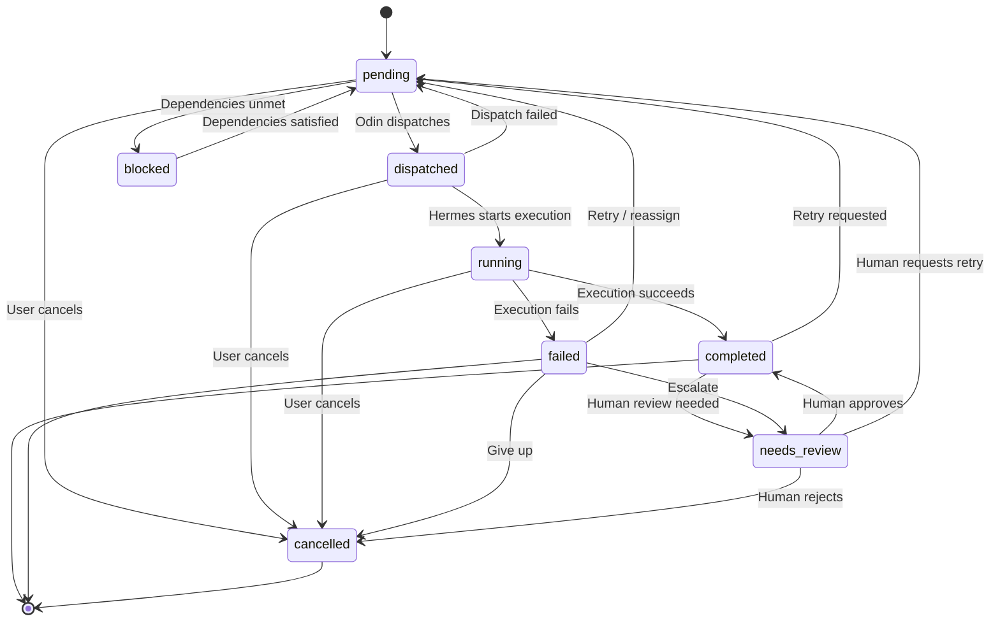

# Plans and Tasks

A **plan** is a structured breakdown of work generated by Athena. A **task** is a single unit of that work with a defined lifecycle. Plans have levels of detail (L1-L5). Tasks have states, dependencies, retry policies, and verification requirements.

---

## Plan Levels

Athena generates plans at progressive levels of detail. Each level adds more information, enabling deeper automation.

| Level | Name | What's Defined | Use Case |
|-------|------|----------------|----------|
| **L1** | Rough tasks | Title, task type, wave | Quick scoping, roadmaps |
| **L2** | Specs | Description, affected files, dependencies, complexity | Standard planning |
| **L3** | Implementation | Code patterns, test strategy, edge cases | Complex projects |
| **L4** | Exact changes | Method signatures, return types, parameters | Known patterns, refactoring |
| **L5** | Executable spec | Full code body — tool applies directly | Language tooling available |

### How Levels Work

Athena starts at L1 and progressively deepens. At each level transition, the plan passes through a **rule engine** that validates completeness:

- No empty plans or duplicate task IDs
- No missing dependencies (L2+)
- No circular dependencies (L2+)
- All required fields present at the target level

If validation fails, Athena regenerates with the rule failures as feedback.

### Language Tooling

L5 (executable specs) requires static analysis tooling. The pipeline auto-detects the project language and sets the target level:

| Language | Tooling | Max Level |
|----------|---------|-----------|
| C# | Roslyn | L5 |
| Python | Jedi | L5 |
| TypeScript | TS Compiler | L5 |
| C++ | Basic AST | L3 |
| Other | None | L2 |

Complex tasks stay at L3 regardless — the LLM needs room to explore solutions.

---

## Task States

Tasks move through a finite state machine:



### State Descriptions

| State | Meaning |
|-------|---------|
| `pending` | Ready to dispatch (dependencies satisfied) |
| `blocked` | Waiting for upstream tasks to complete |
| `dispatched` | Dispatch command sent, waiting for provider |
| `running` | CLI process actively executing |
| `completed` | Finished successfully, output captured |
| `failed` | Execution failed, error recorded |
| `cancelled` | Cancelled by user or system |
| `needs_review` | Stalled, waiting for human approval |

### Terminal States

`completed`, `failed`, and `cancelled` are terminal. A task can be **retried** from `failed` (resets to `pending`) but this creates a new attempt, not a state reversal.

---

## Dependencies and Waves

Tasks declare dependencies on other tasks. The dependency graph is a DAG (directed acyclic graph) — no cycles allowed.

### Wave Computation

Dependencies determine **waves** — groups of tasks that can run in parallel:

- **Wave 0**: Tasks with no dependencies
- **Wave 1**: Tasks that depend only on wave 0 tasks
- **Wave N**: Tasks that depend only on tasks in waves 0 through N-1

```
Wave 0: ██████████████ All complete + verified
                                │
                      Odin unblocks wave 1
                                │
Wave 1: ████████░░░░░░ Executing (3 of 4 done)
         ↑                      │
         │              Hermes deferred queue
         │              drains as slots open
         │
Wave 2: ░░░░░░░░░░░░░░ Blocked (waiting on wave 1)

█ = completed    ░ = blocked/pending
```

### Wave Progression

1. Odin dispatches all pending tasks in the current wave
2. Hermes executes them (max 4 concurrent by default)
3. Mimir verifies each completed task
4. When all tasks in the wave are verified, Odin emits `wave_complete`
5. Odin unblocks the next wave's tasks (blocked → pending)
6. Athena optionally **reassesses** the plan between waves

### Deadlock Detection

If all tasks in a wave are blocked and none are progressing, Odin detects a deadlock and escalates. This can happen if a task dependency was miscalculated or if a provider is permanently unavailable.

---

## Task Definitions

Each task carries execution configuration in its `context_json`:

```python
@dataclass
class TaskDefinition:
    # Retry
    retry_count: int = 3
    retry_logic: str = "FIXED"  # FIXED | EXPONENTIAL_BACKOFF | LINEAR_BACKOFF
    retry_delay_seconds: int = 60
    backoff_rate: float = 2.0

    # Timeout
    timeout_policy: str = "RETRY"  # RETRY | TIME_OUT_WF | ALERT_ONLY
    timeout_seconds: int = 600
    response_timeout_seconds: int = 600

    # Concurrency
    concurrent_exec_limit: int | None = None

    # Human task
    is_human: bool = False
    human_timeout_seconds: int = 86400
```

### Defaults by Complexity

| Complexity | Retries | Backoff | Timeout |
|------------|---------|---------|---------|
| Simple code | 3 | Fixed 30s | 5 min |
| Medium code | 3 | Fixed 60s | 10 min |
| Complex code | 5 | 2x exponential | 20 min |
| Research | 2 | Fixed 30s | 5 min |
| Human review | 0 | Alert only | 24 hours |

---

## Task Types

Plans classify tasks by type, which affects provider selection and execution behavior:

| Type | Description | Default Provider |
|------|-------------|-----------------|
| `code` | Write or modify code | claude_code |
| `test` | Write or run tests | claude_code |
| `research` | Investigate, analyze, gather info | claude_code |
| `docs` | Write documentation | claude_code |
| `integration` | Connect components, wire systems | claude_code |
| `analysis` | Code review, architecture analysis | claude_code |
| `asset` | Generate non-code assets | ollama |

---

## Verification

After execution, every task goes through verification:

1. **Heuristic check** (Mimir) — empty output? error patterns? "already done" detection?
2. **LLM verification** (Mimir) — does the output satisfy the task requirements?
3. **Verdict**: `passed`, `gaps_found`, or `human_needed`

If `gaps_found`, Odin diagnoses the failure and decides whether to retry, reassign to a different provider, or escalate. If `human_needed`, the task moves to `needs_review` and stalls until a human approves or retries via the Prometheus MCP or dashboard.

---

## Context Forwarding

When task B depends on task A, Odin injects task A's output into task B's prompt context. This means dependent tasks automatically receive the results of their prerequisites — no manual wiring needed.

```
Task A (wave 0): "Create the database schema"
    output: "Created users, posts, comments tables with migrations..."
        ↓ (injected as context)
Task B (wave 1): "Implement API endpoints for user CRUD"
    prompt includes: Task A's output + original requirements
```
