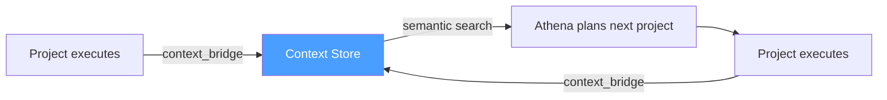
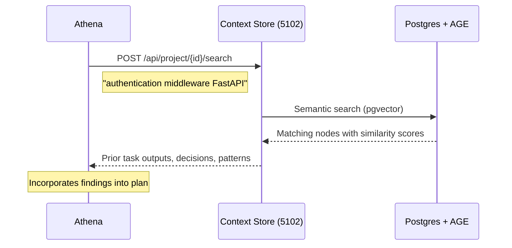
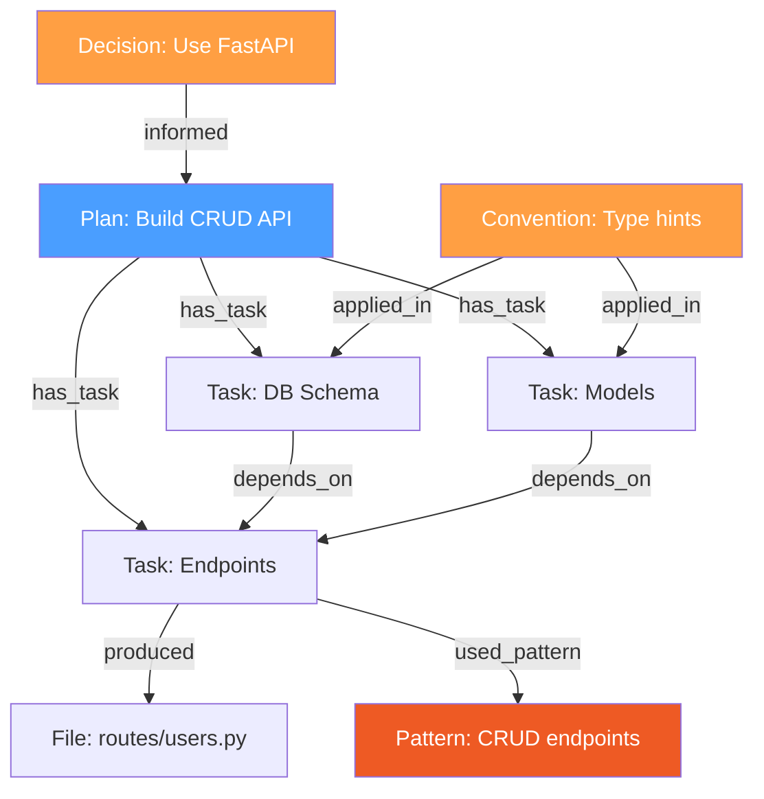

# Context-Enriched Planning

Every project the pipeline executes produces knowledge: what worked, what failed, which patterns were used, what decisions were made. The **context bridge** stores this knowledge in a graph database. When Athena plans the next project, it queries prior outcomes to make better decisions.

This page shows how the feedback loop works, how to manually seed the context store, and how semantic search finds relevant prior work.

## The Feedback Loop



Three events feed the context store:

| Event | What gets stored |
|-------|-----------------|
| `project_planned` | Plan structure: task names, descriptions, waves, dependency graph |
| `task_verified` | Task output, verification verdict, files changed, model used |
| `project_complete` | Completion status, total duration, total cost |

## How the Context Bridge Works

The bridge (`Odin/gods/handlers/context_bridge.py`) listens to pipeline events and creates nodes in the context store's knowledge graph via the HTTP API (port 5102).

### On `project_planned`

Creates a plan node with child nodes for each task:

```
Plan: "Build User CRUD API"
├── Task: "Database schema" (wave 0)
├── Task: "Pydantic models" (wave 0)
├── Task: "GET/POST endpoints" (wave 1)
├── Task: "PUT/DELETE endpoints" (wave 1)
└── Task: "Integration tests" (wave 2)
```

Each node stores:
- **name**: task title
- **value**: task description (searchable via semantic search)
- **attributes**: wave, priority, task_type, model_tier, dependencies

### On `task_verified`

Updates the task node with:
- **output**: the actual execution output (truncated to 10KB)
- **verdict**: pass/fail from Mimir
- **files_changed**: list of modified files
- **model_used**: which provider executed it

### On `project_complete`

Marks the plan node as completed with:
- **status**: completed/failed
- **duration**: wall-clock time from start to finish
- **task_summary**: counts by status (completed, failed, cancelled)

## How Athena Queries Context

During planning, Athena can query the context store for relevant prior work. The query flow:



The search is semantic, not keyword-based. Searching for "authentication middleware" finds prior tasks about "JWT validation", "auth guard", and "token verification" even if those exact words were not in the query.

## Manually Seeding the Context Store

You can pre-load the context store with domain knowledge before creating a project. This is useful for:

- Documenting architectural decisions
- Recording known patterns and conventions
- Storing API specifications or schema definitions
- Logging lessons learned from previous work

### Using the Agent Context MCP (port 5213)

```bash
# Ensure project exists
curl -s -X POST http://localhost:5213/sse \
  -H "Content-Type: application/json" \
  -d '{
    "method": "tools/call",
    "params": {
        "name": "ensure_project",
        "arguments": {
            "name": "Domain Knowledge",
            "rootPath": "/knowledge"
        }
    }
  }'
```

### Using the Context Store REST API directly

**Create a project:**

```bash
curl -s -X POST http://localhost:5102/api/projects \
  -H "Content-Type: application/json" \
  -d '{"name": "Domain Knowledge", "rootPath": "/knowledge"}' \
  | python -m json.tool
```

Response:

```json
{
    "id": "550e8400-e29b-41d4-a716-446655440000",
    "name": "Domain Knowledge",
    "rootPath": "/knowledge"
}
```

**Seed architectural decisions:**

```bash
PROJECT_ID="550e8400-e29b-41d4-a716-446655440000"

# Store a decision node
curl -s -X POST "http://localhost:5102/api/project/${PROJECT_ID}/nodes" \
  -H "Content-Type: application/json" \
  -d '{
    "nodeType": "Decision",
    "name": "Use FastAPI for all REST services",
    "value": "All new REST services should use FastAPI with Pydantic models for request/response validation. Use dependency injection via dependency-injector. Use async handlers throughout. SQLite for development, Postgres for production.",
    "attributes": {
        "category": "architecture",
        "confidence": "high",
        "date": "2026-03-01"
    }
  }' | python -m json.tool
```

**Seed coding conventions:**

```bash
curl -s -X POST "http://localhost:5102/api/project/${PROJECT_ID}/nodes" \
  -H "Content-Type: application/json" \
  -d '{
    "nodeType": "Convention",
    "name": "Python code style conventions",
    "value": "Use type hints on all function signatures. Prefer dataclasses over plain dicts for structured data. Use logging module, not print. Async functions for I/O. Tests in tests/ directory with pytest. Alembic for migrations with NNN revision IDs.",
    "attributes": {
        "category": "conventions",
        "language": "python"
    }
  }'
```

**Seed known patterns:**

```bash
curl -s -X POST "http://localhost:5102/api/project/${PROJECT_ID}/nodes" \
  -H "Content-Type: application/json" \
  -d '{
    "nodeType": "Pattern",
    "name": "Circuit breaker for external HTTP calls",
    "value": "When calling external services (context store, LLM gateway), use the circuit breaker pattern from context_store_client.py. Track consecutive failures, open the circuit after 3 failures, half-open after 30 seconds. This prevents cascade failures when a service is down.",
    "attributes": {
        "category": "reliability",
        "example_file": "orchestration/backend/services/context_store_client.py"
    }
  }'
```

### Seeding from existing documentation

You can bulk-load from markdown files:

```python
#!/usr/bin/env python3
"""Seed context store from markdown documentation files."""

import httpx
import glob
import os

CS_URL = "http://localhost:5102"
PROJECT_ID = "your-project-id"

def seed_file(filepath: str):
    name = os.path.basename(filepath).replace(".md", "").replace("_", " ").title()
    with open(filepath) as f:
        content = f.read()

    resp = httpx.post(f"{CS_URL}/api/project/{PROJECT_ID}/nodes", json={
        "nodeType": "Documentation",
        "name": name,
        "value": content[:10000],  # context store truncates at 10KB
        "attributes": {
            "source_file": filepath,
            "category": "documentation",
        },
    })
    print(f"  {name}: {resp.status_code}")

for md_file in glob.glob("docs/**/*.md", recursive=True):
    seed_file(md_file)
```

## Semantic Search

The context store uses pgvector for semantic similarity search. When Athena queries for prior work, it finds nodes by meaning rather than exact keywords.

### How it works

1. Each node's `value` field is embedded using a sentence transformer model
2. The embedding is stored as a vector in Postgres (pgvector extension)
3. Search queries are also embedded and compared via cosine similarity
4. Results are ranked by similarity score (0.0 to 1.0)

### Querying from the API

```bash
# Semantic search across all projects
curl -s -X POST "http://localhost:5102/api/project/${PROJECT_ID}/search" \
  -H "Content-Type: application/json" \
  -d '{"query": "how to handle JWT authentication in FastAPI", "limit": 5}' \
  | python -m json.tool
```

Response:

```json
[
    {
        "id": "node-123",
        "nodeType": "Task",
        "name": "Implement auth middleware",
        "value": "Created middleware/auth.py with JWT validation using python-jose...",
        "similarity": 0.89,
        "attributes": {
            "project": "Build User CRUD API",
            "verdict": "pass",
            "wave": 0
        }
    },
    {
        "id": "node-456",
        "nodeType": "Decision",
        "name": "Use FastAPI for all REST services",
        "value": "All new REST services should use FastAPI with Pydantic models...",
        "similarity": 0.72,
        "attributes": {
            "category": "architecture"
        }
    }
]
```

### Querying via MCP

The Agent Context MCP server (port 5213) provides the `semantic_search` tool:

```json
{
    "method": "tools/call",
    "params": {
        "name": "semantic_search",
        "arguments": {
            "query": "database migration patterns",
            "limit": 10
        }
    }
}
```

## The Knowledge Graph

The context store uses Apache AGE (a Postgres extension) to store nodes and edges as a graph. This enables relationship queries beyond simple search:



### Node Types

| Type | Description | Created by |
|------|-------------|-----------|
| `Plan` | A project's execution plan | context_bridge on `project_planned` |
| `Task` | An individual task with output | context_bridge on `task_verified` |
| `Decision` | An architectural or design decision | Manual seeding |
| `Convention` | A coding or process convention | Manual seeding |
| `Pattern` | A reusable implementation pattern | Manual seeding or extracted by Mimir |
| `Documentation` | Reference documentation | Bulk seeding from files |
| `Finding` | A lesson learned or discovery | Extracted during execution |

## Planning with Context: What Athena Sees

When Athena plans a new project, the context bridge query adds relevant prior work to the planning prompt. Here is what that looks like in practice:

**Without context enrichment:**
```
Plan a project: "Add rate limiting to the API"

Create tasks with waves and dependencies.
```

**With context enrichment:**
```
Plan a project: "Add rate limiting to the API"

Relevant prior work from the knowledge base:
- [Task, similarity=0.85] "Implement auth middleware" — Created middleware/auth.py
  with FastAPI dependency injection. Verdict: pass. Approach: created a separate
  middleware file, registered in app startup, used Depends() for injection.
- [Decision, similarity=0.78] "Use FastAPI for all REST services" — All new REST
  services should use FastAPI with Pydantic models. Use dependency injection.
- [Pattern, similarity=0.72] "Circuit breaker for external calls" — Track failures,
  open circuit after 3, half-open after 30s.
- [Convention, similarity=0.68] "Python code style" — Type hints, dataclasses,
  async handlers, pytest, Alembic migrations.

Create tasks with waves and dependencies. Leverage the patterns and conventions
from prior work where applicable.
```

This context helps Athena:
- Reuse working patterns (middleware approach, dependency injection)
- Avoid known pitfalls (the circuit breaker pattern for reliability)
- Follow established conventions (type hints, async, pytest)
- Produce more accurate wave assignments based on similar prior projects

## Viewing the Knowledge Graph

The Context Store UI (port 5179) provides a visual graph explorer:

```bash
# Open in browser
start http://localhost:5179
```

Navigate to your project to see the node tree, search results, and relationship graph.

You can also query nodes programmatically:

```bash
# List recent nodes
curl -s "http://localhost:5102/api/project/${PROJECT_ID}/nodes?limit=20" \
  | python -m json.tool

# Get a specific node and its children
curl -s "http://localhost:5102/api/project/${PROJECT_ID}/nodes/${NODE_ID}/children" \
  | python -m json.tool

# Query by node type
curl -s "http://localhost:5102/api/project/${PROJECT_ID}/nodes?type=Decision" \
  | python -m json.tool
```

## Next Steps

- [Your First Pipeline](first-pipeline.md) — See the context bridge in action
- [Multi-Wave Execution](multi-wave-execution.md) — How prior wave outputs inform later waves
- [Custom Gates](custom-gates.md) — Gates that validate against known conventions
