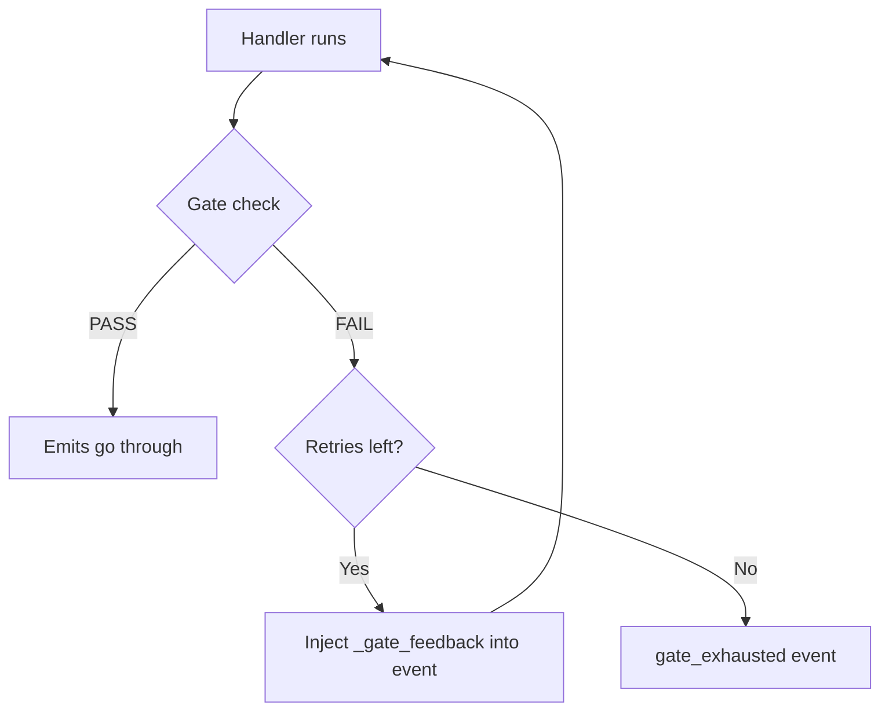

# Custom Gates

Gates are check functions that validate a handler's output before its emitted events enter the relay table. If the gate fails, the emits are blocked and the handler can retry with the gate's feedback. Gates answer one question: **"Did this actually happen? Is it right?"**

## Gate Function Signature

Every gate function has the same signature:

```python
from gods.pipeline import Event, Emit, GateResult

async def my_gate(
    event: Event,        # the original event that triggered the handler
    emits: list[Emit],   # the handler's proposed emits
    db,                  # database connection
) -> GateResult:
    # Validate the emits...
    return GateResult(
        passed=True,     # or False to block
        reason="...",    # human-readable explanation
        details={},      # optional structured data for audit trail
    )
```

### The GateResult Dataclass

```python
@dataclass
class GateResult:
    passed: bool                           # True = emits go through, False = blocked
    reason: str                            # Human-readable explanation
    details: dict[str, Any] = field(...)   # Structured data (logged to gate_passed/gate_failed events)
```

When a gate **passes**, a `gate_passed` event is emitted for the audit trail. When it **fails**, a `gate_failed` event is emitted with the reason, attempt number, and details.

## Registering a Gate

Gates are attached to handlers during registration:

```python
from gods.gates import check_code_written

pipeline.register(
    "dispatch_command",
    hermes.handle_dispatch,
    gate=check_code_written,    # validate after handler runs
    max_retries=2,              # retry up to 2 times if gate fails
)
```

The `max_retries` parameter controls how many times the handler is re-invoked with gate feedback before giving up. On the final failure, a `gate_exhausted` event is emitted.

## Built-in Gates Reference

All built-in gates live in `Odin/gods/gates.py`.

### Planning Gates

#### `check_plan_created`

Validates that Athena's planning handler actually produced a plan.

| Check | Failure reason |
|-------|---------------|
| `plan_generated` event exists in emits | "No plan_generated event emitted" |
| Event has `plan_id` | "plan_generated event has no plan_id" |
| Plan exists in database | "Plan {id} not found in database" |
| Plan JSON is parseable | "Plan JSON is not parseable" |
| Plan has tasks, phases, or epics | "Plan has no tasks, phases, or epics" |

#### `check_plan_reviewed`

Validates that the plan passed Model B's independent review.

| Check | Failure reason |
|-------|---------------|
| `project_planned` event exists | "No project_planned event emitted" |
| Review data present | "No review data in project_planned event" |
| Confidence >= 0.7 or no gaps | "Plan review found gaps (confidence=X)" |

### Execution Gates

#### `check_task_claimed`

Validates that Hermes successfully claimed a task.

| Check | Failure reason |
|-------|---------------|
| `worker_event` exists in emits | "No worker_event emitted" |
| Event has `task_id` | "worker_event has no task_id" |
| Task exists in database | "Task {id} not found" |
| If `started`, task is `running` | "Task status is X, expected running" |

#### `check_code_written`

Validates that execution produced non-empty output.

| Check | Failure reason |
|-------|---------------|
| Completed `worker_event` exists | "No completed worker_event emitted" |
| `output_len > 0` | "Task completed with empty output" |
| Output text exists in DB | "Task has empty/whitespace-only output in DB" |

#### `check_code_parses`

Validates that generated Python code is syntactically valid.

| Check | Failure reason |
|-------|---------------|
| Completed `worker_event` exists | "No completed worker_event" |
| No Python files changed → auto-pass | "No Python files changed, skipping" |
| `syntax_check_passed` is True | "Syntax errors in N file(s): ..." |

#### `check_tests_pass`

Validates that tests pass (for TDD-enabled tasks).

| Check | Failure reason |
|-------|---------------|
| Completed `worker_event` exists | "No completed worker_event" |
| No test results → auto-pass | "No test results reported, skipping" |
| `test_result.passed` is True | "Tests failed: N failure(s)" |

### Verification Gates

#### `check_verification_ran`

Validates that Mimir produced a verification verdict.

| Check | Failure reason |
|-------|---------------|
| `task_verified` or `task_rejected` event | "No verification event emitted" |
| Event has `verdict` | "Verification event has no verdict" |

### Git Gates

#### `check_files_staged`

Validates that Hephaestus successfully committed files.

| Check | Failure reason |
|-------|---------------|
| `files_committed` event exists | "No files_committed event emitted" |
| Commit has files | "Commit has no files" |
| Commit has SHA | "No commit SHA reported" |

#### `check_pr_created`

Validates that a pull request was created.

| Check | Failure reason |
|-------|---------------|
| `pr_created` event exists | "No pr_created event emitted" |
| Event has `pr_url` | "pr_created event has no pr_url" |

### TDD Gates

#### `check_test_written_first`

Enforces red-green-refactor TDD flow.

| Phase | Pass condition | Failure reason |
|-------|---------------|---------------|
| `test_written` | `test_fails` is True | "Test was written but doesn't fail" |
| `implementation` | `test_passes` is True | "Implementation written but test still fails" |
| `refactor` | `test_passes` is True | "Refactor broke the test" |
| (none) | Always pass | "No TDD phase reported, skipping" |

## Composing Gates

Combine multiple gates with `compose_gates()`. All gates must pass:

```python
from gods.gates import compose_gates, check_code_written, check_code_parses

# Both checks must pass — code exists AND it parses
combined = compose_gates(check_code_written, check_code_parses)

pipeline.register(
    "dispatch_command",
    hermes.handle_dispatch,
    gate=combined,
    max_retries=2,
)
```

The composed gate runs each gate in order. It short-circuits on the first failure — if `check_code_written` fails, `check_code_parses` never runs.

## Gate Retry Loop Mechanics

When a gate fails and `max_retries > 0`, the pipeline re-invokes the handler with feedback injected into the event payload:



The injected feedback fields:

| Field | Type | Description |
|-------|------|-------------|
| `_gate_feedback` | string | The gate's failure reason (from `GateResult.reason`) |
| `_gate_attempt` | int | Current attempt number (2, 3, ...) |

Handlers can read this feedback to adjust their behavior:

```python
async def my_handler(event: Event, db) -> list[Emit]:
    feedback = event.payload.get("_gate_feedback")
    attempt = event.payload.get("_gate_attempt", 1)

    if feedback:
        # Previous attempt failed — adjust approach
        logger.info("Retry attempt %d, gate said: %s", attempt, feedback)
        # ... modify behavior based on feedback ...

    # ... normal handler logic ...
```

## Writing a Custom Gate: Security Vulnerability Check

Let's walk through creating a gate that checks generated code for security vulnerabilities.

### Step 1: Define the Gate Function

```python
# gods/gates_custom.py
import re
from gods.pipeline import Event, Emit, GateResult

# Patterns that indicate security concerns
_SECURITY_PATTERNS = [
    (r"eval\(", "Use of eval() is a code injection risk"),
    (r"exec\(", "Use of exec() is a code injection risk"),
    (r"subprocess\.call\(.*shell=True", "shell=True in subprocess is a command injection risk"),
    (r"pickle\.loads?\(", "Pickle deserialization is an arbitrary code execution risk"),
    (r"__import__\(", "Dynamic import is a security risk"),
    (r'password\s*=\s*["\'][^"\']+["\']', "Hardcoded password detected"),
    (r'api_key\s*=\s*["\'][^"\']+["\']', "Hardcoded API key detected"),
]


async def check_no_security_vulnerabilities(
    event: Event, emits: list[Emit], db
) -> GateResult:
    """Gate: Check generated code for common security vulnerabilities."""

    # Find the completed worker_event
    worker_emit = next(
        (e for e in emits if e.event_type == "worker_event"
         and e.payload.get("status") == "completed"),
        None,
    )
    if not worker_emit:
        # Not a completion event — let it through
        return GateResult(True, "No completed worker_event, skipping security check")

    task_id = worker_emit.payload.get("task_id")
    if not task_id:
        return GateResult(True, "No task_id, skipping security check")

    # Read the task output from the database
    row = await db.fetchone(
        "SELECT output_text FROM tasks WHERE id = $1", (task_id,)
    )
    if not row:
        return GateResult(True, "Task not found, skipping security check")

    output = row["output_text"] if isinstance(row, dict) else row[0]
    if not output:
        return GateResult(True, "No output to check")

    # Scan for security patterns
    findings = []
    for pattern, description in _SECURITY_PATTERNS:
        matches = re.findall(pattern, output, re.IGNORECASE)
        if matches:
            findings.append({
                "pattern": pattern,
                "description": description,
                "count": len(matches),
            })

    if findings:
        descriptions = [f["description"] for f in findings]
        return GateResult(
            passed=False,
            reason=f"Security issues found: {'; '.join(descriptions)}",
            details={"findings": findings, "task_id": task_id},
        )

    return GateResult(
        passed=True,
        reason="No security vulnerabilities detected",
        details={"task_id": task_id, "patterns_checked": len(_SECURITY_PATTERNS)},
    )
```

### Step 2: Register the Gate

Add the gate to handler registration in `Odin/gods/handlers/registration.py`:

```python
from gods.gates_custom import check_no_security_vulnerabilities
from gods.gates import compose_gates, check_code_written

# Compose with existing gates
security_gate = compose_gates(
    check_code_written,
    check_no_security_vulnerabilities,
)

pipeline.register(
    "dispatch_command",
    hermes.handle_dispatch,
    gate=security_gate,
    max_retries=2,  # give the LLM 2 chances to fix security issues
)
```

### Step 3: Test the Gate

```python
import asyncio
from gods.pipeline import Event, Emit, GateResult
from gods.gates_custom import check_no_security_vulnerabilities

async def test_security_gate():
    # Mock DB that returns output with eval()
    class MockDB:
        async def fetchone(self, sql, params):
            return {"output_text": "result = eval(user_input)"}

    event = Event("dispatch_command", {"task_id": "test-1"}, "test")
    emits = [Emit("worker_event", {
        "task_id": "test-1", "status": "completed", "output_len": 100,
    })]

    result = await check_no_security_vulnerabilities(event, emits, MockDB())
    assert not result.passed
    assert "eval()" in result.reason
    print(f"Gate correctly blocked: {result.reason}")

asyncio.run(test_security_gate())
```

### Step 4: What Happens at Runtime

When the gate fires and blocks:

1. The handler's emits are discarded
2. A `gate_failed` event is written to the relay table:
   ```json
   {
       "handler": "hermes.handle_dispatch",
       "reason": "Security issues found: Use of eval() is a code injection risk",
       "attempt": 1,
       "max_attempts": 3,
       "findings": [{"pattern": "eval\\(", "description": "...", "count": 1}]
   }
   ```
3. The handler is re-invoked with `_gate_feedback` in the event payload
4. The LLM executor sees the feedback and (ideally) produces code without `eval()`
5. If all retries fail, a `gate_exhausted` event is emitted and the handler produces no emits

## Gate Design Principles

!!! tip "Gates should be fast"
    Gates run synchronously in the pipeline tick. Avoid LLM calls or network requests in gates. If you need deep analysis, do it in the handler and report the results in the emit payload — then have the gate check those results.

!!! tip "Gates should be deterministic"
    Given the same inputs, a gate should always produce the same result. This makes debugging and testing straightforward. Avoid randomness or time-dependent checks.

!!! warning "Gates block the pipeline tick"
    While a gate is running, the pipeline cannot process other events. Keep gate execution under 100ms. For expensive checks, run them in the handler (which can be async) and validate the cached results in the gate.

!!! note "Gate audit trail"
    Every gate pass and failure is logged to the relay table as `gate_passed` or `gate_failed` events. These are invaluable for debugging. Query them at:
    ```
    GET /api/events?event_type=gate_failed
    GET /api/events?event_type=gate_passed
    ```

## Next Steps

- [Your First Pipeline](first-pipeline.md) — See gates in action in a complete execution
- [Failure Semantics](failure-semantics.md) — How the pipeline handles gate exhaustion
- [External Agents](external-agents.md) — Gates that validate external agent output
