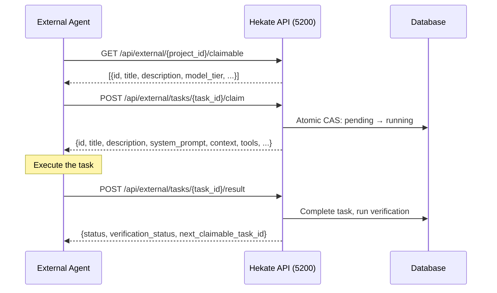
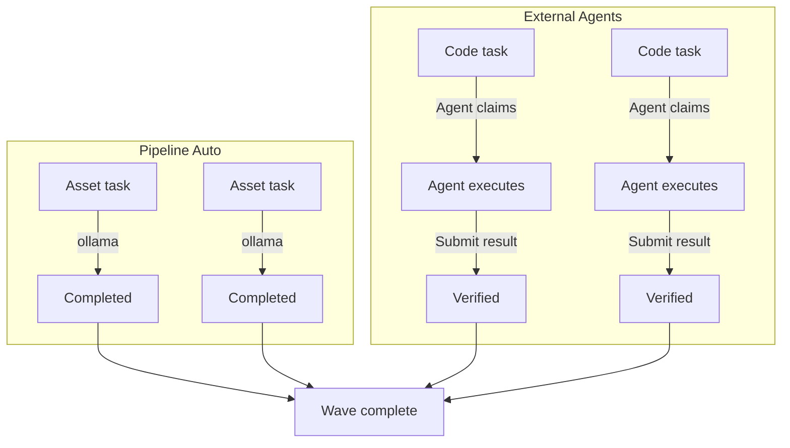

# Connecting External Agents

The pipeline handles most tasks autonomously, but sometimes you want an external agent (human, specialized tool, or remote Claude instance) to execute specific tasks. The **external executor protocol** provides a REST API for claiming, executing, and submitting task results.

## Execution Modes

Projects can run in three modes, set via `config_json`:

| Mode | Behavior |
|------|----------|
| `auto` | Pipeline handles everything (default). External claiming disabled. |
| `external` | All tasks are externally claimable. Pipeline does not dispatch. |
| `hybrid` | Pipeline handles `ollama` tasks internally. All other tasks are externally claimable. |

Set the mode when creating a project:

```bash
curl -s -X POST http://localhost:5200/api/projects \
  -H "Content-Type: application/json" \
  -d '{
    "name": "My Hybrid Project",
    "description": "Build a REST API with external code execution",
    "repo_path": "C:/Users/jruss/Documents/GitHub/Hekate",
    "config_json": {"execution_mode": "hybrid"}
  }' | python -m json.tool
```

## The Claim-Execute-Submit Cycle

External execution follows a strict protocol:



## Step 1: List Claimable Tasks

Find tasks that are ready for external execution:

```bash
curl -s "http://localhost:5200/api/external/${PROJECT_ID}/claimable" \
  -H "Authorization: Bearer ${TOKEN}" | python -m json.tool
```

Response:

```json
[
    {
        "id": "task-abc123",
        "title": "Implement user authentication middleware",
        "description": "Create a FastAPI middleware that validates JWT tokens...",
        "model_tier": "claude_code",
        "wave": 0,
        "priority": 1,
        "phase": "implementation",
        "task_type": "code",
        "depends_on": []
    },
    {
        "id": "task-def456",
        "title": "Write database migration for users table",
        "description": "Create an Alembic migration that adds...",
        "model_tier": "claude_code",
        "wave": 0,
        "priority": 2,
        "phase": "implementation",
        "task_type": "code",
        "depends_on": []
    }
]
```

!!! note "Claimable criteria"
    A task is claimable when:

    - It is `pending` (not already claimed or running)
    - It is in the current wave (lowest wave with non-terminal tasks)
    - All its dependencies are `completed`
    - The project is in `executing` status
    - The execution mode allows external claiming for this task's tier

## Step 2: Claim a Task

Atomically claim a task. Returns the full task details including system prompt and context:

```bash
curl -s -X POST "http://localhost:5200/api/external/tasks/task-abc123/claim" \
  -H "Authorization: Bearer ${TOKEN}" | python -m json.tool
```

Response:

```json
{
    "id": "task-abc123",
    "project_id": "proj-xyz789",
    "title": "Implement user authentication middleware",
    "description": "Create a FastAPI middleware that validates JWT tokens from the Authorization header. Use python-jose for JWT decoding. The middleware should: 1) Extract Bearer token, 2) Decode and validate, 3) Attach user info to request.state, 4) Return 401 on invalid/missing tokens.",
    "task_type": "code",
    "model_tier": "claude_code",
    "wave": 0,
    "priority": 1,
    "phase": "implementation",
    "system_prompt": "You are implementing a FastAPI middleware...",
    "context": [
        {"role": "system", "content": "Project: My Hybrid Project..."},
        {"role": "user", "content": "Prior task output: database schema..."}
    ],
    "tools": ["read_file", "write_file", "run_tests"],
    "depends_on": [],
    "rationale": "Auth middleware is foundational for all protected endpoints",
    "max_tokens": 8192,
    "requirement_ids": ["req-001", "req-002"]
}
```

The claim is atomic (compare-and-swap): if two agents try to claim the same task, exactly one succeeds and the other gets a `409 Conflict`.

!!! warning "Claim timeout"
    Claimed tasks have an implicit timeout (`external_claim_timeout_seconds`, default: 3600). If you claim a task and do not submit a result within one hour, the task may be reclaimed by the pipeline on the next tick. Release the task explicitly if you cannot complete it.

## Step 3: Execute the Task

Use the `system_prompt`, `description`, and `context` from the claim response to execute the task. The execution method depends on your agent:

**Human agent:**
```bash
# Read the task description and implement manually
echo "Task: Implement user authentication middleware"
echo "Description: Create a FastAPI middleware that validates JWT tokens..."
# ... write code, run tests ...
```

**Claude Code CLI:**
```bash
claude -p "$(cat <<EOF
${SYSTEM_PROMPT}

Task: ${TITLE}
${DESCRIPTION}

Context from prior tasks:
${CONTEXT}
EOF
)" --output-format stream-json 2>/dev/null | tail -1
```

**Python script with httpx:**
```python
import httpx

# Call your LLM of choice
response = httpx.post("http://localhost:5210/generate", json={
    "provider": "claude",
    "system_prompt": claim["system_prompt"],
    "user_message": claim["description"],
})
output_text = response.json()["text"]
```

## Step 4: Submit the Result

Submit the execution output back to Hekate:

```bash
curl -s -X POST "http://localhost:5200/api/external/tasks/task-abc123/result" \
  -H "Authorization: Bearer ${TOKEN}" \
  -H "Content-Type: application/json" \
  -d '{
    "output_text": "Created auth_middleware.py with JWT validation...\n\nFiles modified:\n- middleware/auth.py (new)\n- requirements.txt (added python-jose)\n- tests/test_auth.py (new)",
    "model_used": "claude-sonnet-4-20250514",
    "prompt_tokens": 2500,
    "completion_tokens": 1800
  }' | python -m json.tool
```

Response:

```json
{
    "task_id": "task-abc123",
    "status": "completed",
    "verification_status": "pass",
    "verification_notes": "Output addresses all requirements. JWT validation implemented correctly.",
    "next_claimable_task_id": "task-ghi789"
}
```

The `next_claimable_task_id` is a convenience — it tells you the next task you can claim without re-querying the claimable list.

!!! tip "Verification still runs"
    Even for externally-submitted results, the pipeline runs Mimir's verification. If verification fails, the task status will be `needs_review` instead of `completed`. The response tells you the verification outcome.

## Step 5: Release a Task (Optional)

If you claimed a task but cannot complete it, release it back to the pool:

```bash
curl -s -X POST "http://localhost:5200/api/external/tasks/task-abc123/release" \
  -H "Authorization: Bearer ${TOKEN}" | python -m json.tool
```

Response:

```json
{
    "status": "released",
    "task_id": "task-abc123"
}
```

The release sets the task back to `pending` without incrementing `retry_count`. Another agent (or the pipeline itself, in hybrid mode) can pick it up.

## Hybrid Execution Pattern

The most practical mode is `hybrid`. The pipeline handles simple tasks (asset generation via ollama) while external agents handle the complex code tasks:



## MCP Integration for External Agents

External agents with MCP support can use the Prometheus MCP server (port 5212) instead of raw REST calls:

```
Tools available via mcp__prometheus:
  - list_projects    → list all projects
  - project_status   → get project status and task summary
  - list_tasks       → list tasks with optional status filter
  - task_detail      → get full task details
  - create_project   → create a new project
  - start_project    → trigger planning and execution
  - retry_task       → retry a failed task
  - submit_verification → manually verify a task
```

### MCP Claim-Execute Flow

```python
# Using MCP client (e.g., from another Claude Code session)
import mcp

# Connect to Prometheus MCP
client = mcp.Client("http://localhost:5212/sse")

# List tasks
tasks = await client.call("list_tasks", {
    "project_id": "proj-xyz789",
    "status": "pending",
})

# Get task details (includes full context)
detail = await client.call("task_detail", {
    "task_id": "task-abc123",
})

# Execute the task using detail.description and detail.context
# ... your execution logic ...

# Submit verification
await client.call("submit_verification", {
    "task_id": "task-abc123",
    "verdict": "pass",
    "notes": "Implementation complete and tested.",
})
```

## Complete External Agent Script

Here is a complete Python script that acts as an external agent, claiming and executing tasks in a loop:

```python
#!/usr/bin/env python3
"""External agent that claims and executes tasks from Hekate."""

import httpx
import time
import sys

BASE = "http://localhost:5200/api"
TOKEN = "your-auth-token"
HEADERS = {"Authorization": f"Bearer {TOKEN}", "Content-Type": "application/json"}


def list_claimable(project_id: str) -> list[dict]:
    resp = httpx.get(f"{BASE}/external/{project_id}/claimable", headers=HEADERS)
    resp.raise_for_status()
    return resp.json()


def claim(task_id: str) -> dict:
    resp = httpx.post(f"{BASE}/external/tasks/{task_id}/claim", headers=HEADERS)
    resp.raise_for_status()
    return resp.json()


def submit(task_id: str, output: str, model: str = "manual") -> dict:
    resp = httpx.post(f"{BASE}/external/tasks/{task_id}/result", headers=HEADERS,
                      json={"output_text": output, "model_used": model})
    resp.raise_for_status()
    return resp.json()


def execute_task(task: dict) -> str:
    """Your execution logic here. This example just returns a placeholder."""
    print(f"  Executing: {task['title']}")
    print(f"  Description: {task['description'][:200]}...")

    # Replace with actual execution (call Claude, run code, etc.)
    return f"Completed: {task['title']}\nImplementation details..."


def main(project_id: str):
    print(f"External agent starting for project {project_id}")

    while True:
        tasks = list_claimable(project_id)
        if not tasks:
            print("No claimable tasks. Waiting...")
            time.sleep(10)
            continue

        for task_summary in tasks:
            task = claim(task_summary["id"])
            print(f"Claimed: {task['title']}")

            output = execute_task(task)
            result = submit(task["id"], output)

            print(f"  Result: {result['status']}")
            print(f"  Verification: {result.get('verification_status', 'pending')}")

            if result.get("next_claimable_task_id"):
                print(f"  Next task available: {result['next_claimable_task_id']}")


if __name__ == "__main__":
    main(sys.argv[1])
```

## Error Handling

| HTTP Status | Meaning | Action |
|-------------|---------|--------|
| `404` | Task or project not found | Check IDs |
| `409` | Task not claimable (already claimed, not pending, wrong mode) | Skip, try another task |
| `403` | Task claimed by different user | You do not own this claim |
| `401` | Authentication required | Provide valid Bearer token |

## Next Steps

- [Your First Pipeline](first-pipeline.md) — Understand the full pipeline before adding external agents
- [Multi-Wave Execution](multi-wave-execution.md) — How external agents interact with wave progression
- [Context-Enriched Planning](context-enriched-planning.md) — Seed the context store before planning
