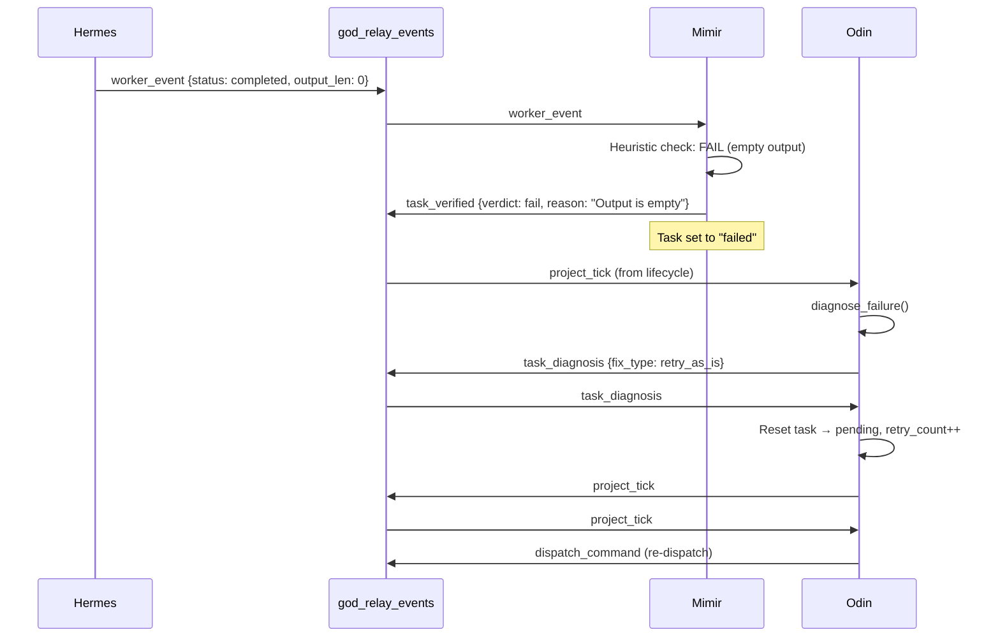
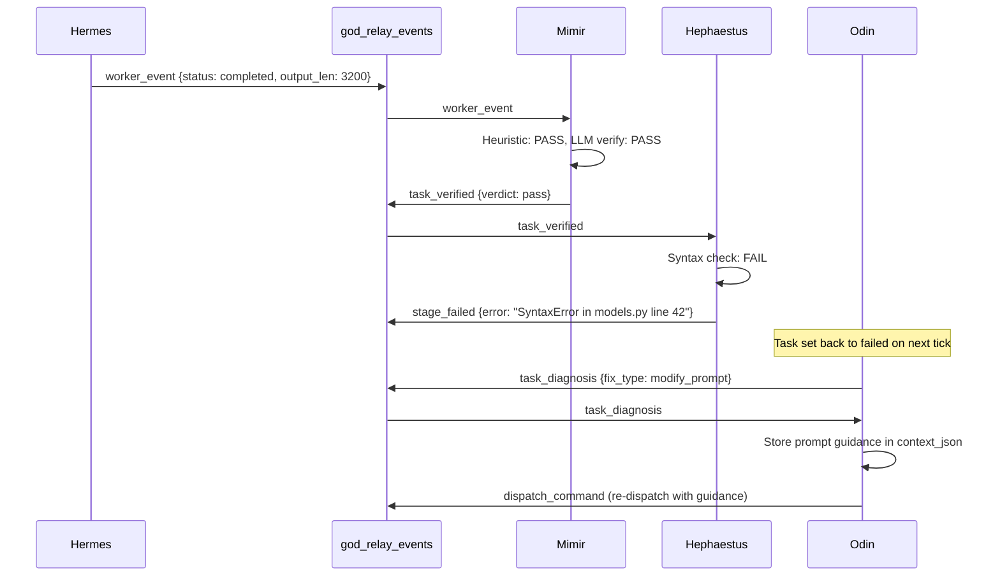
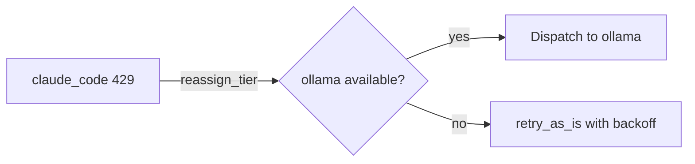
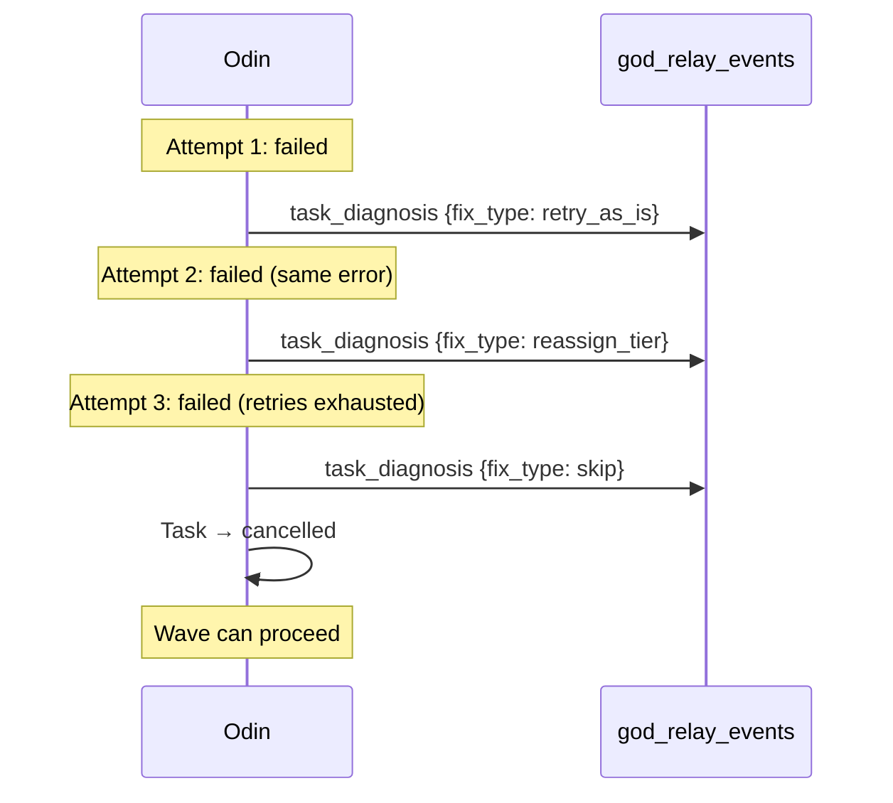

# Failure Semantics

The pipeline is designed for failure. CLI subprocesses crash, LLMs hallucinate, rate limits hit, and generated code has bugs. Every failure mode has a defined response path: detect, diagnose, act.

This page walks through five failure scenarios with their complete event traces, showing how the pipeline recovers (or escalates) at each step.

## The Diagnosis Engine

When a task fails, Odin's diagnosis engine (`gods/odin/dispatch.py`) performs pattern-matching against the error output. The engine produces a `FailureDiagnosis` with:

| Field | Type | Description |
|-------|------|-------------|
| `fix_type` | string | `retry_as_is`, `reassign_tier`, `modify_prompt`, `skip`, `escalate` |
| `confidence` | float | 0.0-1.0 how confident the diagnosis is |
| `root_cause` | string | Human-readable root cause |
| `why_chain` | list | Chain of reasoning steps (5-Whys style) |
| `new_tier` | string? | For `reassign_tier`: which provider to try next |
| `prompt_guidance` | string? | For `modify_prompt`: what to add to the prompt |

### Error Pattern Table

The engine matches error strings against known patterns:

| Pattern | Fix Type | Root Cause |
|---------|----------|------------|
| `rate limit`, `429` | `reassign_tier` | Provider rate-limited |
| `quota exceeded` | `reassign_tier` | Provider quota exhausted |
| `503` | `retry_as_is` | Provider temporarily unavailable |
| `timeout`, `timed out` | `retry_as_is` | Execution timed out |
| `unauthorized`, `401` | `reassign_tier` | Authentication failure |
| `SyntaxError`, `IndentationError` | `modify_prompt` | Generated code has syntax errors |
| `ImportError`, `ModuleNotFoundError` | `modify_prompt` | Missing import in generated code |
| `merge conflict` | `modify_prompt` | Git merge conflict |
| `CUDA out of memory` | `reassign_tier` | GPU memory exhausted |
| `disk space` | `skip` | Disk space exhausted |

### Fix Type Actions

When `odin_handle_diagnosis` receives a `task_diagnosis` event, it applies the fix:

| Fix Type | Action |
|----------|--------|
| `retry_as_is` | Reset task to `pending`, increment `retry_count`, emit `project_tick` |
| `reassign_tier` | Change `model_tier` to `new_tier`, reset to `pending`, emit `project_tick` |
| `modify_prompt` | Store `prompt_guidance` in `context_json`, reset to `pending`, emit `project_tick` |
| `skip` | Set task to `cancelled`, emit `project_tick` (unblocks dependents) |
| `escalate` | Set task to `needs_review`, emit `needs_human_review` |

## Scenario 1: Empty Output

The CLI subprocess exits successfully (exit code 0) but produces no meaningful output. This happens when the LLM misunderstands the task or the CLI session times out silently.

### Detection

Mimir's heuristic check catches this before the LLM verifier is called:

```python
def _check_output_quality(output):
    if not output or not output.strip():
        return {"passed": False, "reason": "Output is empty"}
    if len(stripped) < 10:
        return {"passed": False, "reason": "Output is suspiciously short"}
```

### Event Trace



| # | Event | Source | Key payload |
|---|-------|--------|-------------|
| 1 | `worker_event` | hermes | `{status: "completed", output_len: 0}` |
| 2 | `task_verified` | mimir | `{verdict: "fail", reason: "Output is empty"}` |
| 3 | `task_diagnosis` | odin | `{fix_type: "retry_as_is", confidence: 0.6}` |
| 4 | `dispatch_command` | odin | Re-dispatch with same provider |

!!! tip "Empty output is not a pattern match"
    Empty output does not match any error pattern, so the diagnosis engine defaults to `retry_as_is` with lower confidence (0.6). If the retry also produces empty output, the confidence drops further and the engine eventually escalates.

## Scenario 2: Syntax Errors in Generated Code

The CLI produces output, but the generated Python code has syntax errors. Hephaestus catches this during the staging phase.

### Event Trace



The re-dispatched task includes prompt guidance in its `context_json`:

```json
{
    "prompt_guidance": "Previous attempt produced a SyntaxError in models.py line 42. Ensure all generated Python code is syntactically valid. Pay attention to string quoting and indentation.",
    "_gate_attempt": 2
}
```

!!! warning "Known fragility"
    CLI executors sometimes write raw newlines in strings instead of `\n`, producing unparseable Python. The `modify_prompt` fix adds explicit guidance about string handling. This is the most common failure pattern in practice.

## Scenario 3: Provider Rate Limit (429)

The LLM Gateway returns a 429 rate limit error from the upstream provider.

### Event Trace

| # | Event | Source | Key payload |
|---|-------|--------|-------------|
| 1 | `worker_event` | hermes | `{status: "failed", error: "HTTP 429: rate limit exceeded"}` |
| 2 | `task_diagnosis` | odin | `{fix_type: "reassign_tier", new_tier: "ollama", why_chain: ["Error contains '429' → HTTP 429 rate limit", "Reassigning from claude_code to ollama"]}` |
| 3 | `dispatch_command` | odin | `{provider: "ollama"}` |



!!! note "Provider fallback chain"
    The fallback order is `["claude_code", "ollama"]`. When `claude_code` is rate-limited, Odin tries `ollama` (local, no rate limits). If ollama is also unavailable, it falls back to `retry_as_is` with a `retry_after` timestamp in the task's `context_json`.

## Scenario 4: Provider Timeout

The CLI subprocess takes longer than the configured timeout (default: 600 seconds).

### Event Trace

| # | Event | Source | Key payload |
|---|-------|--------|-------------|
| 1 | `worker_event` | hermes | `{status: "failed", error: "Execution timed out after 600s"}` |
| 2 | `task_diagnosis` | odin | `{fix_type: "retry_as_is", confidence: 0.8, root_cause: "Execution timed out"}` |
| 3 | `dispatch_command` | odin | Same provider, same task (retry count incremented) |

!!! tip "Timeout handling"
    Hermes kills the subprocess on timeout and captures whatever partial output was produced. The partial output is still saved to the task — sometimes it is sufficient for verification to pass on a subsequent attempt where the LLM can see the prior work.

## Scenario 5: Repeated Failure (Escalation)

A task fails three times with the same error. The diagnosis engine detects the pattern and escalates.

### Event Trace



The why chain for the final diagnosis:

```json
{
    "why_chain": [
        "Task has been retried 3/3 times",
        "Retry budget exhausted — escalating to skip"
    ],
    "fix_type": "skip",
    "confidence": 0.9,
    "root_cause": "Retries exhausted (3/3)"
}
```

### What Happens to Dependents

When a task is `cancelled` (skipped), its dependents remain `blocked`. On the next lifecycle check, Odin detects a potential deadlock:

- If there are no `pending`/`queued`/`running` tasks but `blocked` tasks exist: **deadlock detected**, project fails
- If other non-blocked tasks can still run: execution continues, but the blocked branch is dead

!!! warning "Skip vs. escalate"
    `skip` cancels the task and tries to continue the project. `escalate` sets the task to `needs_review` and emits `needs_human_review` — the project pauses until a human intervenes. The diagnosis engine uses `skip` when retries are exhausted and `escalate` when it encounters an unrecognized error pattern with low confidence.

## Comparison with Netflix Conductor

The Hekate failure model draws from Conductor's patterns:

| Concept | Conductor | Hekate |
|---------|-----------|--------|
| Retry policy | Per-task `retryCount` + `retryLogic` (FIXED, EXPONENTIAL_BACKOFF) | Per-task `max_retries` + pattern-based retry strategy |
| Failure handler | `failureWorkflow` launches a separate workflow | `task_diagnosis` event triggers inline fix (same pipeline) |
| Timeout | `timeoutSeconds` + `timeoutPolicy` (RETRY, TIME_OUT_WF, ALERT_ONLY) | Hermes subprocess timeout, retry via diagnosis |
| Rate limit | `rateLimitPerFrequency` on task definitions | Provider-level detection via error pattern matching |
| Compensation | Optional compensating tasks on failure | Not yet implemented (planned: rollback handlers) |

**Key difference:** Conductor separates failure handling into distinct workflow definitions. Hekate keeps it inline — the same pipeline loop handles normal execution and failure recovery. This trades Conductor's configurability for simplicity: one event loop, one table, one set of handlers.

## Monitoring Failures

Query failed and diagnosed tasks:

```bash
# All failed tasks for a project
curl -s "http://localhost:5200/api/projects/PROJECT_ID/tasks?status=failed" \
  | python -m json.tool

# Diagnosis events
curl -s "http://localhost:5200/api/events?event_type=task_diagnosis&project_id=PROJECT_ID" \
  | python -m json.tool

# Gate failures (handler output rejected)
curl -s "http://localhost:5200/api/events?event_type=gate_failed" \
  | python -m json.tool
```

## Next Steps

- [Custom Gates](custom-gates.md) — Prevent failures with pre-commit validation
- [Multi-Wave Execution](multi-wave-execution.md) — How failures in one wave affect subsequent waves
- [External Agents](external-agents.md) — Route failing tasks to human or external agents
