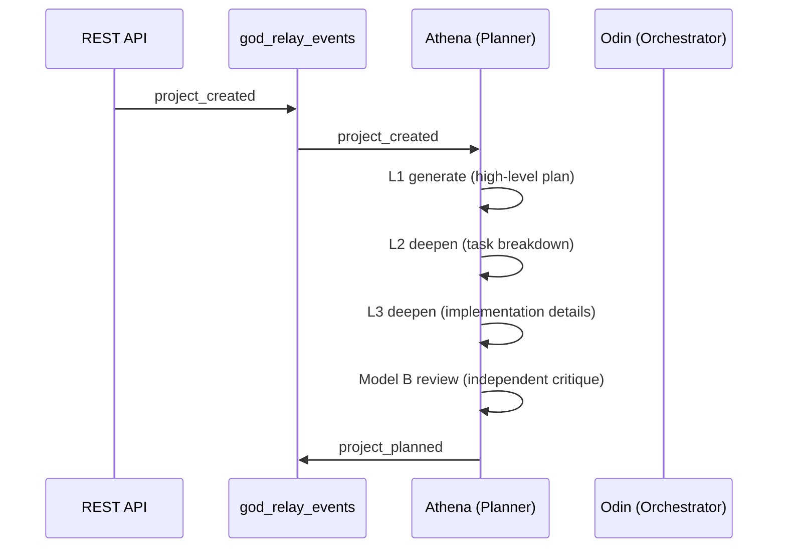
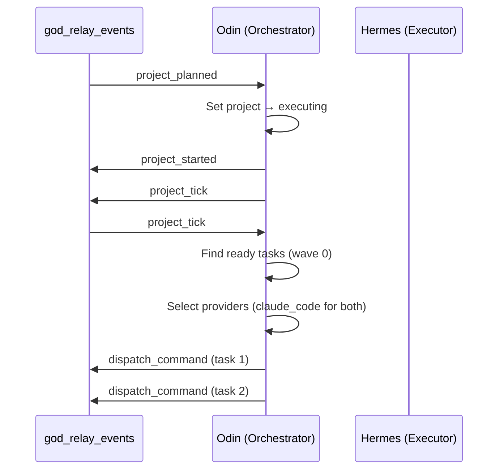
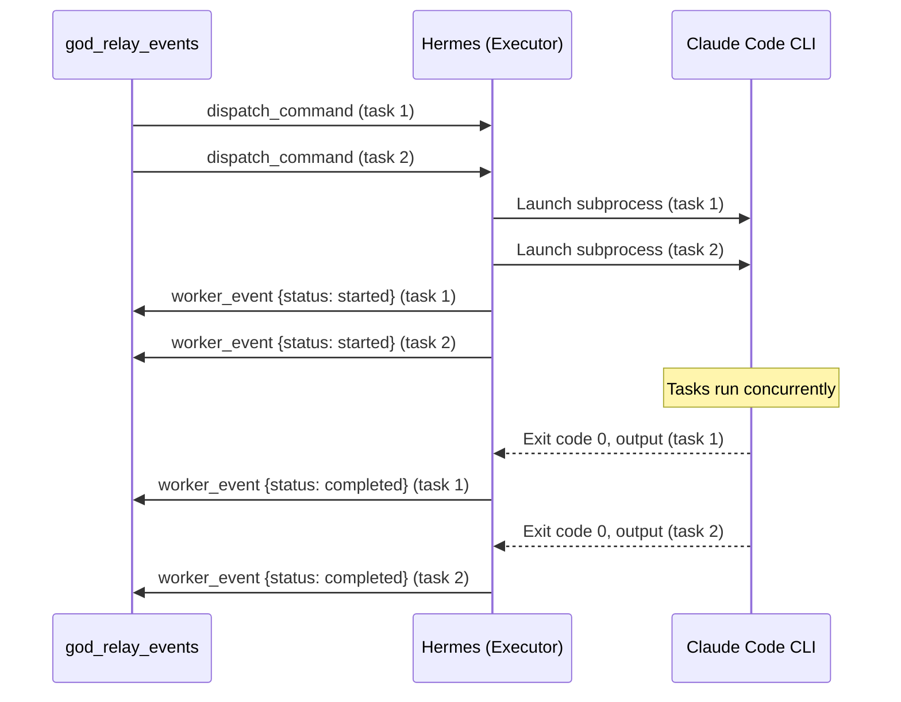
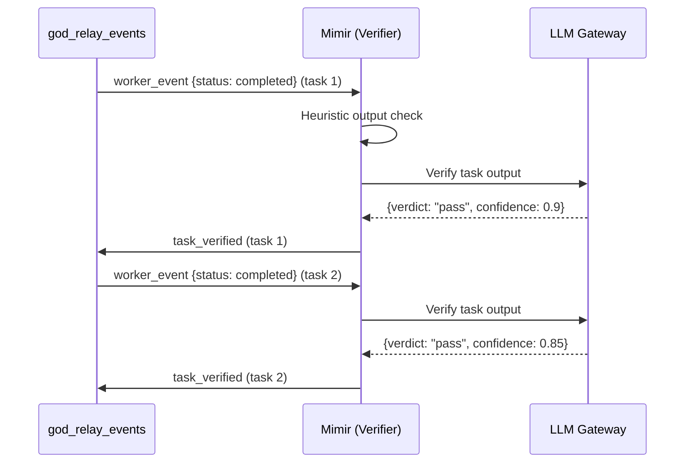
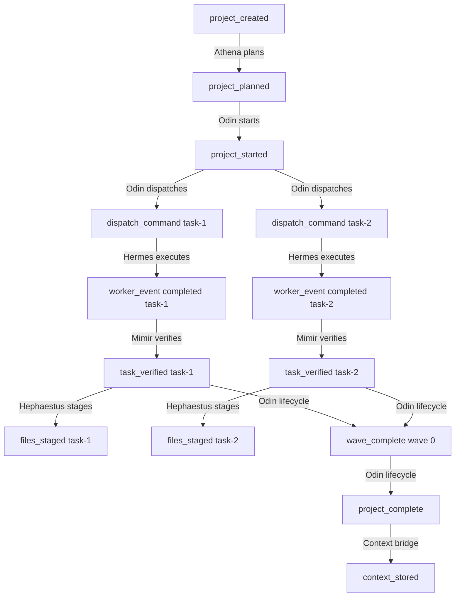

# Your First Pipeline

This walkthrough creates a project, watches the gods pipeline execute it end-to-end, and annotates every event so you understand exactly what each god does at each step.

## Prerequisites

- HekateEngine running on port 5200 (`nssm status HekateEngine`)
- LLM Gateway running on port 5210 (`nssm status HekateLLMGateway`)
- Context Store running on port 5102 (`nssm status HekateContextStore`)

## Create a Project

Use the REST API to create a simple project. We will add a health endpoint to an existing service — small enough to complete in one wave.

```bash
curl -s -X POST http://localhost:5200/api/projects \
  -H "Content-Type: application/json" \
  -d '{
    "name": "Add Health Endpoint",
    "description": "Add a GET /health endpoint to the Hades admin service that returns {\"status\": \"ok\", \"uptime_seconds\": ...}. Include a test.",
    "repo_path": "C:/Users/jruss/Documents/GitHub/Hekate"
  }' | python -m json.tool
```

Response:

```json
{
    "id": "a1b2c3d4-...",
    "name": "Add Health Endpoint",
    "status": "planning",
    "created_at": 1711900000.0
}
```

The engine inserts a `project_created` event into the relay table. From here, the pipeline takes over.

## The Event Trace

Every event flows through the `god_relay_events` table. You can query it live:

```bash
curl -s "http://localhost:5200/api/events?project_id=a1b2c3d4&limit=50" | python -m json.tool
```

Below is the annotated event trace for our health endpoint project. Each row shows the event type, which god produced it, and what it means.

### Phase 1: Planning (Athena)



| # | Event | Source | Payload (key fields) |
|---|-------|--------|----------------------|
| 1 | `project_created` | `api` | `{project_id, name, description}` |
| 2 | `project_planned` | `athena` | `{project_id, plan_id, task_count: 2, review: {confidence: 0.85}}` |

!!! note "What Athena does"
    Athena uses a two-model architecture. **Model A** (the generator) runs a continuous conversation through L1, L2, and L3 deepening. **Model B** (the reviewer) gets a fresh prompt with no shared context to provide an unbiased critique. If the review finds gaps, Model A revises and Model B reviews again (up to 2 cycles).

    For our small project, Athena produces two tasks:

    - **Task 1** (wave 0): "Add /health endpoint to hades/server.py"
    - **Task 2** (wave 0): "Add test for /health endpoint"

    Both are wave 0 with no dependencies between them, so they can execute concurrently.

### Phase 2: Dispatch (Odin)



| # | Event | Source | Payload (key fields) |
|---|-------|--------|----------------------|
| 3 | `project_started` | `odin` | `{project_id, plan_id}` |
| 4 | `project_tick` | `odin` | `{project_id}` |
| 5 | `dispatch_command` | `odin` | `{task_id: "task-1", provider: "claude_code"}` |
| 6 | `dispatch_command` | `odin` | `{task_id: "task-2", provider: "claude_code"}` |

!!! note "What Odin does"
    `odin_start` transitions the project from `planning` to `executing`. It immediately emits a `project_tick` to trigger dispatch. `odin_dispatch` finds all tasks in the current wave (0) whose dependencies are satisfied (both have none), selects `claude_code` as the provider via the tier map, and emits `dispatch_command` events.

### Phase 3: Execution (Hermes)



| # | Event | Source | Payload (key fields) |
|---|-------|--------|----------------------|
| 7 | `worker_event` | `hermes` | `{task_id: "task-1", status: "started", provider: "claude_code"}` |
| 8 | `worker_event` | `hermes` | `{task_id: "task-2", status: "started", provider: "claude_code"}` |
| 9 | `worker_event` | `hermes` | `{task_id: "task-1", status: "completed", output_len: 2847}` |
| 10 | `worker_event` | `hermes` | `{task_id: "task-2", status: "completed", output_len: 1923}` |

!!! note "What Hermes does"
    `HermesRunner.handle_dispatch` receives the dispatch command, launches a background Claude Code CLI subprocess, and returns immediately. The pipeline never blocks on execution. A background coroutine (`_monitor_task`) waits for the subprocess to complete, writes `output_text` to the tasks table, and emits a `worker_event` with `status: completed`. Both tasks run concurrently (up to `max_concurrent: 4`).

### Phase 4: Verification (Mimir)



| # | Event | Source | Payload (key fields) |
|---|-------|--------|----------------------|
| 11 | `task_verified` | `mimir` | `{task_id: "task-1", verdict: "pass", confidence: 0.9}` |
| 12 | `task_verified` | `mimir` | `{task_id: "task-2", verdict: "pass", confidence: 0.85}` |

!!! note "What Mimir does"
    `MimirRunner.handle_verify` first runs a fast heuristic check (empty output? error-only output?). If the heuristic passes, it calls the LLM Gateway for a deeper verification. The verifier checks whether the output actually addresses the task description. Like Hermes, verification runs in the background — the pipeline never blocks.

### Phase 5: Git Staging (Hephaestus)

| # | Event | Source | Payload (key fields) |
|---|-------|--------|----------------------|
| 13 | `files_staged` | `hephaestus` | `{task_id: "task-1", files: ["hades/server.py"]}` |
| 14 | `files_staged` | `hephaestus` | `{task_id: "task-2", files: ["hades/test_health.py"]}` |

!!! note "What Hephaestus does"
    Hephaestus listens for `task_verified` events. For each, it syntax-checks any Python files, then runs `git add` on the affected files. If syntax check fails, it emits `stage_failed` instead.

### Phase 6: Lifecycle Completion (Odin)

| # | Event | Source | Payload (key fields) |
|---|-------|--------|----------------------|
| 15 | `wave_complete` | `odin` | `{project_id, wave: 0}` |
| 16 | `project_complete` | `odin` | `{project_id}` |

!!! note "What Odin does at completion"
    After each `task_verified`, `odin_lifecycle` checks whether the wave is complete (all tasks in wave 0 are terminal). When the wave completes, it emits `wave_complete`. Since there are no more waves, all tasks are terminal, and none failed — it sets the project status to `completed` and emits `project_complete`.

### Phase 7: Context Learning (Context Bridge)

| # | Event | Source | Payload (key fields) |
|---|-------|--------|----------------------|
| 17 | `context_stored` | `context_bridge` | `{project_id, nodes_created: 3}` |

!!! note "What the Context Bridge does"
    The context bridge listens to `project_planned`, `task_verified`, and `project_complete`. It syncs plan structure, task outputs, and completion status into the context store's knowledge graph. Future projects can query this prior work during planning (see [Context-Enriched Planning](context-enriched-planning.md)).

## What Just Happened

Here is the complete flow in one diagram:



**Six gods, one loop, zero blocking.** Every handler receives an event, does its work, emits new events, and returns. The pipeline tick processes events in order, enforces gates, and advances the cursor. The entire execution for this two-task project takes 2-5 minutes wall-clock, limited only by CLI subprocess time.

## Querying the Relay Table

You can query the relay table directly to see the raw event log:

```bash
# All events for a project
curl -s "http://localhost:5200/api/events?project_id=PROJECT_ID" | python -m json.tool

# Events by type
curl -s "http://localhost:5200/api/events?event_type=task_verified" | python -m json.tool

# Pipeline status
curl -s "http://localhost:5200/api/pipeline/status" | python -m json.tool
```

The pipeline status endpoint shows the current tick count, cursor position, and registered handlers:

```json
{
    "running": true,
    "tick_count": 1247,
    "last_seen_id": 892,
    "handler_count": 18,
    "subscribed_events": [
        "project_created", "project_planned", "project_tick",
        "tick", "dispatch_command", "worker_event",
        "task_verified", "task_diagnosis", "wave_complete",
        "wave_assessed", "task_fork_requested",
        "review_rejected", "task_rejected",
        "project_complete", "plan_node_created",
        "plan_node_complete", "plan_node_executable"
    ]
}
```

## Budget Tracking (Tyche)

Throughout execution, Tyche silently listens to `worker_event` events and records token usage and cost. You will not see explicit Tyche events in the trace, but the `tasks` table is updated with `prompt_tokens`, `completion_tokens`, and cost data after each execution.

## Next Steps

- [Multi-Wave Execution](multi-wave-execution.md) — Projects with dependencies across waves
- [Failure Semantics](failure-semantics.md) — What happens when things go wrong
- [Custom Gates](custom-gates.md) — Adding validation checkpoints to the pipeline
