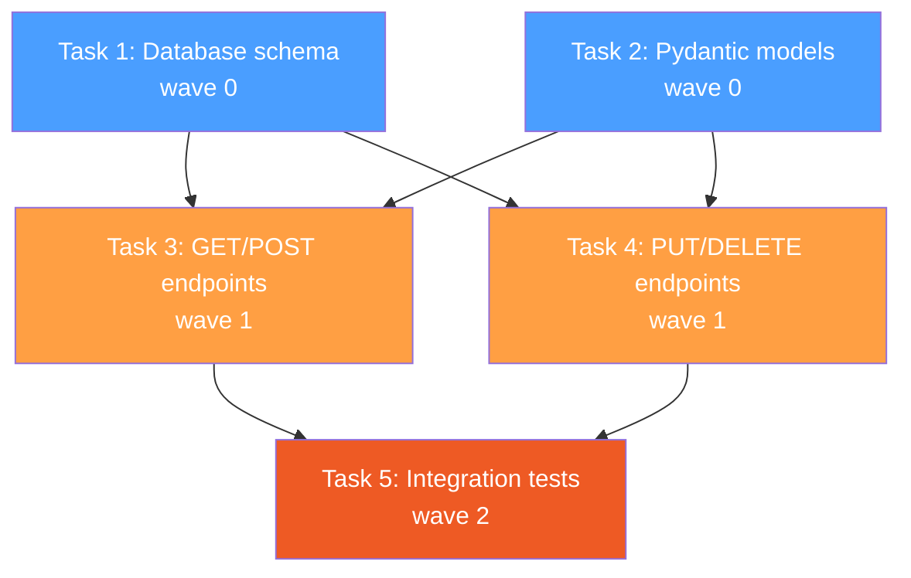
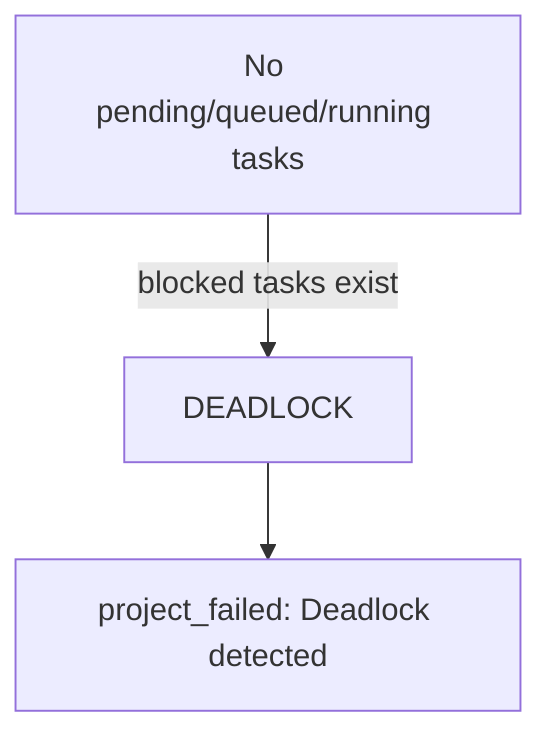
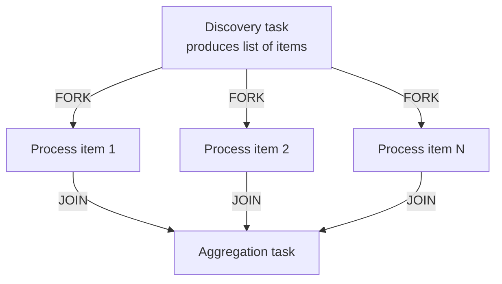

# Multi-Wave Execution

Real projects have dependencies. A test file depends on the API it tests. An API depends on the models it uses. The pipeline handles this through **waves** — groups of tasks that can execute concurrently, with dependency edges controlling progression.

This walkthrough builds a CRUD API project and shows how Athena decomposes it into waves, how Odin manages wave progression, and how concurrent execution works within a wave.

## The Project

```bash
curl -s -X POST http://localhost:5200/api/projects \
  -H "Content-Type: application/json" \
  -d '{
    "name": "Build User CRUD API",
    "description": "Build a complete CRUD API for user management: database schema with SQLite, Pydantic models, FastAPI endpoints (GET/POST/PUT/DELETE /api/users), and integration tests. Use the orchestration backend patterns.",
    "repo_path": "C:/Users/jruss/Documents/GitHub/Hekate"
  }' | python -m json.tool
```

## The Dependency DAG

Athena produces a plan with dependencies that naturally form waves:



| Wave | Tasks | Dependencies |
|------|-------|-------------|
| 0 | Database schema, Pydantic models | None (these are foundation tasks) |
| 1 | GET/POST endpoints, PUT/DELETE endpoints | Both depend on schema + models |
| 2 | Integration tests | Depends on all endpoints |

## Wave Mechanics

### How Waves Are Assigned

During planning, Athena assigns wave numbers based on the dependency graph. The decomposer in `plan_sync.py` performs a topological sort:

1. Tasks with no dependencies get wave 0
2. Tasks whose dependencies are all in wave N get wave N+1
3. The wave number equals the longest dependency chain to that task

### How Odin Dispatches Within a Wave

When `odin_dispatch` fires (triggered by `project_tick`), it:

1. Finds the **current wave** — the lowest wave number with non-terminal tasks
2. Queries for **ready tasks** — tasks in the current wave that are `pending` and whose dependencies are all `completed`
3. Checks **concurrency limits** — `max_concurrent` (default 4) minus currently running tasks
4. Selects **providers** for each ready task via the tier map
5. Emits `dispatch_command` events for each task to dispatch

```sql
-- This is the core query Odin runs (simplified)
SELECT t.id, t.task_type, t.priority
FROM tasks t
LEFT JOIN task_deps d ON d.task_id = t.id
LEFT JOIN tasks dep ON dep.id = d.depends_on AND dep.status != 'completed'
WHERE t.project_id = ? AND t.status = 'pending' AND t.wave = ?
GROUP BY t.id HAVING COUNT(dep.id) = 0
ORDER BY t.priority ASC
```

### Concurrent Execution Within a Wave

Tasks 1 and 2 (wave 0) have no dependencies on each other. Odin dispatches both simultaneously. Hermes launches two CLI subprocesses that run in parallel:

```
Time ─────────────────────────────────────────────►
       Task 1 (schema)  ████████████░░░░░░░
       Task 2 (models)  ██████████████████░
                         ▲ both started     ▲ both complete
                         at the same time   (different durations)
```

## Complete Event Timeline

### Wave 0: Foundation

| Time | Event | Source | Details |
|------|-------|--------|---------|
| 0:00 | `project_created` | api | Project submitted |
| 0:02 | `project_planned` | athena | 5 tasks, 3 waves |
| 0:02 | `project_started` | odin | Status → executing |
| 0:02 | `dispatch_command` | odin | Task 1 (schema) → claude_code |
| 0:02 | `dispatch_command` | odin | Task 2 (models) → claude_code |
| 0:02 | `worker_event` | hermes | Task 1 started |
| 0:02 | `worker_event` | hermes | Task 2 started |
| 1:30 | `worker_event` | hermes | Task 1 completed (output: 2.1KB) |
| 1:30 | `task_verified` | mimir | Task 1 pass (confidence: 0.9) |
| 2:00 | `worker_event` | hermes | Task 2 completed (output: 1.8KB) |
| 2:00 | `task_verified` | mimir | Task 2 pass (confidence: 0.88) |
| 2:00 | `wave_complete` | odin | Wave 0 done |

!!! tip "Wave completion detection"
    After each `task_verified`, `odin_lifecycle` counts remaining non-terminal tasks in that wave. When the count hits zero, it emits `wave_complete` and a `project_tick` to trigger the next wave's dispatch.

### Between Waves: Reassessment (Athena)

When a wave completes, the pipeline can optionally reassess the plan:

| Time | Event | Source | Details |
|------|-------|--------|---------|
| 2:00 | `wave_complete` | odin | Wave 0 done |
| 2:01 | `wave_assessed` | athena | Plan still valid, no changes needed |

!!! note "Reassessment"
    `athena_reassess_standalone` is registered on `wave_complete`. It checks whether the completed wave's outputs require plan adjustments — new tasks, modified descriptions, or wave reordering. For simple projects, reassessment often confirms the plan is still valid. For complex projects, it may add tasks or adjust wave assignments based on what was learned.

### Wave 1: API Endpoints

| Time | Event | Source | Details |
|------|-------|--------|---------|
| 2:01 | `dispatch_command` | odin | Task 3 (GET/POST) → claude_code |
| 2:01 | `dispatch_command` | odin | Task 4 (PUT/DELETE) → claude_code |
| 2:01 | `worker_event` | hermes | Task 3 started |
| 2:01 | `worker_event` | hermes | Task 4 started |
| 3:30 | `worker_event` | hermes | Task 3 completed |
| 3:30 | `task_verified` | mimir | Task 3 pass |
| 4:00 | `worker_event` | hermes | Task 4 completed |
| 4:00 | `task_verified` | mimir | Task 4 pass |
| 4:00 | `wave_complete` | odin | Wave 1 done |

### Wave 2: Integration Tests

| Time | Event | Source | Details |
|------|-------|--------|---------|
| 4:01 | `dispatch_command` | odin | Task 5 (tests) → claude_code |
| 4:01 | `worker_event` | hermes | Task 5 started |
| 5:30 | `worker_event` | hermes | Task 5 completed |
| 5:30 | `task_verified` | mimir | Task 5 pass |
| 5:30 | `wave_complete` | odin | Wave 2 done |
| 5:30 | `project_complete` | odin | All tasks terminal, none failed |

## Dependency Unblocking

When a task in wave 0 completes, Odin does not blindly advance to wave 1. It uses a precise dependency check:

```python
# From odin_lifecycle — atomic unblock of tasks whose deps are all completed
await db.execute_write(
    "UPDATE tasks SET status = 'pending', updated_at = ? "
    "WHERE project_id = ? AND status = 'blocked' "
    "AND NOT EXISTS ("
    "  SELECT 1 FROM task_deps d "
    "  LEFT JOIN tasks dep ON dep.id = d.depends_on "
    "  WHERE d.task_id = tasks.id AND dep.status != 'completed'"
    ")",
    (now, project_id),
)
```

This means:
- A task is unblocked only when **all** its dependencies are `completed`
- Tasks in wave 1 that depend on both Task 1 and Task 2 stay `blocked` until both finish
- If Task 1 finishes but Task 2 has not, wave 1 tasks remain blocked

## Deadlock Detection

If the pipeline reaches a state where no tasks are `pending`, `queued`, or `running`, but some are `blocked`, Odin detects a deadlock:



This can happen when:
- A dependency refers to a task that was `cancelled` or `skipped` (not `completed`)
- A circular dependency exists in the plan (Athena should catch this, but edge cases exist)

## FORK/JOIN: Dynamic Parallelism

For tasks that produce dynamic collections (e.g., "process each API endpoint"), the pipeline supports FORK/JOIN workflow edges:



The fork handler (`odin_workflow.py`) creates child tasks dynamically from a template, and the join task is unblocked when all forked children complete. Join modes:

| Mode | Behavior |
|------|----------|
| `all` | Wait for all forked tasks to complete (default) |
| `any` | Unblock as soon as one forked task completes |
| `threshold` | Unblock when N forked tasks complete |

## Concurrency Tuning

The `max_concurrent` parameter controls how many tasks Hermes runs simultaneously. It is computed by `compute_wave_parallelism` based on:

- Number of ready tasks
- Number of currently running tasks
- Provider availability
- Configured maximum (default: 4)

You can override it per-project in the config:

```bash
curl -s -X PATCH "http://localhost:5200/api/projects/PROJECT_ID" \
  -H "Content-Type: application/json" \
  -d '{"config_json": {"max_concurrent": 2}}'
```

!!! warning "CLI cold starts"
    The first Claude Code CLI call after a service restart takes 60-120 seconds (cold start). Subsequent calls are fast. If you dispatch 4 tasks simultaneously and all hit cold start, you may see temporary provider unavailability. The pipeline handles this gracefully — Hermes retries, and Odin re-dispatches on the next tick.

## Next Steps

- [Failure Semantics](failure-semantics.md) — What happens when a task in a wave fails
- [Custom Gates](custom-gates.md) — Adding quality checkpoints between waves
- [External Agents](external-agents.md) — Having external agents execute specific wave tasks
