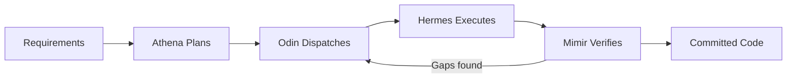

# Hekate

**AI Agent Orchestration Platform** — durable execution for autonomous coding agents.

Hekate is a unified platform that plans, executes, verifies, and manages AI-driven coding tasks. Give it requirements in plain English. It produces tested, committed code.

---

## How It Works

You create a **project** with requirements. Hekate's gods pipeline takes over:

1. **Athena** generates a structured plan with dependencies and test specs
2. **Odin** dispatches tasks to CLI agents (Claude Code, Gemini) wave by wave
3. **Hermes** executes each task asynchronously via CLI subprocesses
4. **Mimir** verifies output against requirements using a separate LLM
5. **Hephaestus** stages files and creates PRs
6. **Tyche** tracks cost so you stay within budget

Every state change is a durable event. Crash? Restart? The pipeline resumes from exactly where it left off.

---

## Three Building Blocks

Hekate is built on three primitives. Everything else is composition.

- :material-lightning-bolt: **Events**

    ---

    Durable records of what happened. Every plan generated, task dispatched, verification result, and git operation is an event in the relay table. Events have types, payloads, sources, and idempotency keys.

    [:octicons-arrow-right-24: Events and Handlers](concepts/events-and-handlers.md)

- :material-account-group: **Gods**

    ---

    Async handler functions that subscribe to events and emit new ones. Six pipeline gods (Athena, Odin, Hermes, Mimir, Hephaestus, Tyche) plus infrastructure gods (Hades, Prometheus, Iris). Each god has a single responsibility.

    [:octicons-arrow-right-24: Gods Pipeline](concepts/gods-pipeline.md)

- :material-checkbox-marked-outline: **Tasks**

    ---

    Units of work with defined states, dependencies, retry policies, and verification requirements. Tasks flow through a state machine (pending, running, completed, failed) and are grouped into dependency waves.

    [:octicons-arrow-right-24: Plans and Tasks](concepts/plans-and-tasks.md)

---

## Platform Components

| Component | Purpose | Port |
|-----------|---------|------|
| **Hekate Engine** | Gods pipeline + REST API + dashboard | 5200 |
| **Context Store** | Agent memory — graph DB + vector search | 5102 |
| **LLM Gateway** | Multi-provider LLM proxy (CLI OAuth bridge) | 5210 |
| **Hades** | Admin — service management, deployment | 5201 |
| **Hekate MCP** | Code analysis (Roslyn, Jedi, TS Compiler) | 5110 |
| **MCP Servers** | Prometheus (projects), Agent Context (memory), Hades (admin) | 5211-5213 |

---

## Quick Links

- **New here?** Start with the [Quick Start](getting-started/quickstart.md)
- **How does it work?** Read the [Concepts](concepts/index.md)
- **Building something?** Check the [Cookbook](cookbook/first-pipeline.md)
- **Need specifics?** Browse the [Reference](reference/event-types.md)
- **Deploying?** See [Deployment](deployment/local-dev.md)

---

## For Conductor Users

If you're familiar with Netflix Conductor, Hekate maps cleanly:

| Conductor | Hekate | Notes |
|-----------|--------|-------|
| Workflow | Project | Top-level execution unit |
| Workflow Definition | Plan (L1-L5) | Generated by Athena, reviewed by LLM |
| Task Definition | Task + context_json | Retry policy, timeout, concurrency |
| System Task | God handler | Engine-executed logic |
| Worker | CLI Provider (Hermes) | Claude Code, Gemini CLI, Ollama |
| Task Queue | god_relay_events | Cursor-based, not queue-based |
| DO_WHILE | Wave progression | Dependency-ordered execution rounds |
| HUMAN | needs_review state | Stalls until human approves |
| Compensation | Diagnosis + retry | 30 error patterns, provider fallback |
