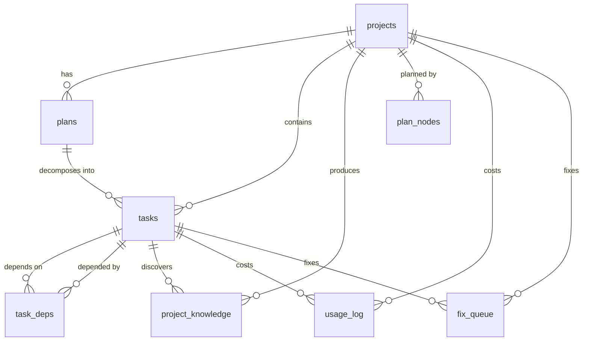

# Database Schema Reference

The orchestration engine uses SQLite (development) or PostgreSQL (production, via `ORCHESTRATION_DSN`). Schema is managed by Alembic migrations in `orchestration/backend/migrations/versions/`.

---

## projects

Core project table. Each project has a lifecycle: `draft` -> `planning` -> `planned` -> `executing` -> `completed`/`failed`.

| Column | Type | Nullable | Default | Description |
|--------|------|----------|---------|-------------|
| `id` | Text | PK | -- | UUID |
| `name` | Text | No | -- | Project display name |
| `requirements` | Text | No | -- | Full requirements text |
| `status` | Text | No | `draft` | `draft`, `planning`, `planned`, `executing`, `completed`, `failed` |
| `created_at` | Float | No | -- | Unix timestamp |
| `updated_at` | Float | No | -- | Unix timestamp |
| `completed_at` | Float | Yes | -- | Unix timestamp of completion |
| `config_json` | Text | Yes | `{}` | Project configuration (PlanConfig, pipeline_snapshot, etc.) |
| `repo_path` | Text | Yes | -- | Absolute path to the project's git repository |
| `git_base_branch` | Text | Yes | -- | Base branch for PRs (usually `main`) |
| `git_project_branch` | Text | Yes | -- | Feature branch for this project |
| `git_worktree_path` | Text | Yes | -- | Path to git worktree if isolated |
| `git_state_json` | Text | Yes | `{}` | Git state tracking (commits, PR URLs) |
| `additional_repos` | Text | Yes | -- | JSON array of additional repo paths |

### Indexes

| Index | Columns |
|-------|---------|
| (primary key) | `id` |

---

## plans

Generated plans (one or more per project). Each plan contains the full task breakdown as JSON.

| Column | Type | Nullable | Default | Description |
|--------|------|----------|---------|-------------|
| `id` | Text | PK | -- | UUID |
| `project_id` | Text | No | -- | FK -> projects.id (CASCADE) |
| `version` | Integer | No | `1` | Plan version number |
| `model_used` | Text | No | -- | Model that generated the plan |
| `prompt_tokens` | Integer | No | `0` | Input tokens consumed |
| `completion_tokens` | Integer | No | `0` | Output tokens generated |
| `cost_usd` | Float | No | `0.0` | Planning cost |
| `plan_json` | Text | No | -- | Full plan as JSON (array of task specs) |
| `status` | Text | No | `draft` | `draft`, `approved`, `executing`, `completed` |
| `created_at` | Float | No | -- | Unix timestamp |

### Indexes

| Index | Columns |
|-------|---------|
| `idx_plans_project` | `project_id` |

---

## tasks

Individual work units decomposed from a plan.

| Column | Type | Nullable | Default | Description |
|--------|------|----------|---------|-------------|
| `id` | Text | PK | -- | UUID |
| `project_id` | Text | No | -- | FK -> projects.id (CASCADE) |
| `plan_id` | Text | No | -- | FK -> plans.id (CASCADE) |
| `title` | Text | No | -- | Task display name |
| `description` | Text | No | -- | Full task description |
| `task_type` | Text | No | -- | `code`, `research`, `analysis`, `integration`, `documentation`, `asset` |
| `priority` | Integer | No | `50` | Sort priority (lower = higher priority) |
| `wave` | Integer | No | `0` | Execution wave (0-based) |
| `status` | Text | No | `pending` | See [Task States](task-states.md) |
| `model_tier` | Text | No | `haiku` | Selected provider (`claude_code`, `ollama`) |
| `model_used` | Text | Yes | -- | Actual model identifier used |
| `context_json` | Text | Yes | `[]` | Task context: verification_feedback, prompt_guidance, retry_after, etc. |
| `tools_json` | Text | Yes | `[]` | Tool configuration for the task |
| `system_prompt` | Text | Yes | `""` | Custom system prompt override |
| `output_text` | Text | Yes | -- | Full output from CLI execution |
| `output_artifacts_json` | Text | Yes | `[]` | Generated artifacts metadata |
| `prompt_tokens` | Integer | No | `0` | Input tokens consumed |
| `completion_tokens` | Integer | No | `0` | Output tokens generated |
| `cost_usd` | Float | No | `0.0` | Execution cost |
| `max_tokens` | Integer | No | `4096` | Max output tokens |
| `retry_count` | Integer | No | `0` | Current retry attempt |
| `max_retries` | Integer | No | `2` | Maximum retry attempts |
| `error` | Text | Yes | -- | Last error message |
| `started_at` | Float | Yes | -- | Execution start timestamp |
| `completed_at` | Float | Yes | -- | Execution completion timestamp |
| `created_at` | Float | No | -- | Row creation timestamp |
| `updated_at` | Float | No | -- | Last modification timestamp |
| `verification_status` | Text | Yes | -- | `passed`, `gaps_found`, `human_needed` |
| `verification_notes` | Text | Yes | -- | Verification feedback or review notes |
| `git_branch` | Text | Yes | -- | Branch where changes were made |
| `git_commit_sha` | Text | Yes | -- | Commit SHA of changes |
| `repo_paths` | Text | Yes | -- | JSON array of repo paths (task-level override) |
| `fork_group_id` | Text | Yes | -- | Groups forked tasks together |

### Indexes

| Index | Columns |
|-------|---------|
| `idx_tasks_project` | `project_id` |
| `idx_tasks_status` | `status` |
| `idx_tasks_priority` | `priority` |
| `idx_tasks_wave` | `wave` |

---

## task_deps

Dependency edges between tasks. A task cannot start until all its dependencies are completed.

| Column | Type | Nullable | Default | Description |
|--------|------|----------|---------|-------------|
| `task_id` | Text | No | -- | FK -> tasks.id (CASCADE). The dependent task. |
| `depends_on` | Text | No | -- | FK -> tasks.id (CASCADE). The prerequisite task. |

**Primary Key**: (`task_id`, `depends_on`)

### Indexes

| Index | Columns |
|-------|---------|
| `idx_deps_depends` | `depends_on` |

---

## god_relay_events

The durable event bus. All pipeline events are written here. Handlers poll for subscribed event types.

| Column | Type | Nullable | Default | Description |
|--------|------|----------|---------|-------------|
| `id` | BigInteger/Integer | PK | auto | Row ID (cursor tracking) |
| `event_type` | Text | No | -- | Event type string (see [Event Types](event-types.md)) |
| `source` | Text | No | -- | Emitting handler/god name |
| `payload` | JSONB/Text | Yes | -- | Event-specific JSON payload |
| `severity` | Text | No | `info` | `info`, `warning`, `error` |
| `idempotency_key` | Text | Yes | -- | UNIQUE. Prevents duplicate events on replay. |
| `created_at` | Float | No | -- | Unix timestamp |

### Indexes

| Index | Columns |
|-------|---------|
| `idx_relay_type_created` | `event_type`, `created_at` |
| `idx_relay_created` | `created_at` |
| (unique) | `idempotency_key` |

### Pruning

Events older than 7 days are deleted by the pipeline every 100 ticks. On PostgreSQL, a stored procedure `prune_old_relay_events(retention_seconds)` is also available.

---

## god_registry

Pipeline cursor and heartbeat tracking. One row per pipeline instance.

| Column | Type | Nullable | Default | Description |
|--------|------|----------|---------|-------------|
| `name` | Text | PK | -- | Pipeline instance name |
| `port` | Integer | Yes | -- | (unused, legacy) |
| `status` | Text | No | `unknown` | Pipeline status |
| `last_heartbeat` | Float | Yes | -- | Last activity timestamp |
| `last_seen_id` | Integer | Yes | -- | Cursor: last processed relay event ID |
| `config` | JSONB/Text | Yes | -- | Pipeline configuration snapshot |
| `updated_at` | Float | Yes | -- | Last update timestamp |

---

## usage_log

LLM API usage tracking for cost accounting.

| Column | Type | Nullable | Default | Description |
|--------|------|----------|---------|-------------|
| `id` | Integer | PK | auto | Row ID |
| `project_id` | Text | Yes | -- | FK -> projects.id |
| `task_id` | Text | Yes | -- | FK -> tasks.id |
| `provider` | Text | No | -- | Provider name (claude, ollama, etc.) |
| `model` | Text | No | -- | Model identifier |
| `prompt_tokens` | Integer | No | -- | Input tokens |
| `completion_tokens` | Integer | No | -- | Output tokens |
| `cost_usd` | Float | No | -- | Computed cost |
| `purpose` | Text | No | `""` | What the call was for (planning, execution, verification) |
| `timestamp` | Float | No | -- | Unix timestamp |

### Indexes

| Index | Columns |
|-------|---------|
| `idx_usage_project` | `project_id` |
| `idx_usage_timestamp` | `timestamp` |
| `idx_usage_task` | `task_id` |

---

## budget_periods

Aggregated cost tracking by time period.

| Column | Type | Nullable | Default | Description |
|--------|------|----------|---------|-------------|
| `period_key` | Text | PK | -- | Period identifier (e.g., `2026-03-31`, `2026-03`) |
| `period_type` | Text | No | -- | `daily`, `monthly`, `project` |
| `total_cost_usd` | Float | No | `0.0` | Accumulated cost |
| `total_prompt_tokens` | Integer | No | `0` | Accumulated input tokens |
| `total_completion_tokens` | Integer | No | `0` | Accumulated output tokens |
| `api_call_count` | Integer | No | `0` | Number of API calls |

### Indexes

| Index | Columns |
|-------|---------|
| `idx_budget_type` | `period_type` |

---

## task_events

Legacy event log (predates god_relay_events). Still populated by some API routes.

| Column | Type | Nullable | Default | Description |
|--------|------|----------|---------|-------------|
| `id` | Integer | PK | auto | Row ID |
| `project_id` | Text | No | -- | Project UUID |
| `task_id` | Text | Yes | -- | Task UUID (nullable for project-level events) |
| `event_type` | Text | No | -- | Event type string |
| `message` | Text | Yes | -- | Human-readable message |
| `data_json` | Text | Yes | -- | Event data payload |
| `timestamp` | Float | No | -- | Unix timestamp |

### Indexes

| Index | Columns |
|-------|---------|
| `idx_events_project` | `project_id` |
| `idx_events_task` | `task_id` |

---

## project_knowledge

Reusable findings extracted from task outputs by Mimir.

| Column | Type | Nullable | Default | Description |
|--------|------|----------|---------|-------------|
| `id` | Text | PK | -- | UUID |
| `project_id` | Text | No | -- | FK -> projects.id (CASCADE) |
| `task_id` | Text | Yes | -- | FK -> tasks.id (SET NULL) |
| `category` | Text | No | `discovery` | Finding category |
| `content` | Text | No | -- | Finding text |
| `content_hash` | Text | No | -- | SHA hash for deduplication |
| `source_task_title` | Text | Yes | -- | Title of the source task |
| `created_at` | Float | No | -- | Unix timestamp |

### Indexes

| Index | Columns | Unique |
|-------|---------|--------|
| `idx_knowledge_project` | `project_id` | No |
| `idx_knowledge_dedup` | `project_id`, `content_hash` | Yes |

---

## plan_nodes

Parallel plan node tree for the new Athena architecture. Each node has a dotted index path indicating its position (e.g., `1.2.3`).

| Column | Type | Nullable | Default | Description |
|--------|------|----------|---------|-------------|
| `id` | Text | PK | -- | UUID |
| `plan_id` | Text | Yes | -- | FK -> plans.id (CASCADE) |
| `project_id` | Text | No | -- | FK -> projects.id (CASCADE) |
| `index_path` | Text | No | -- | Dotted path: `1`, `1.2`, `1.2.3` |
| `level` | Integer | No | -- | 0=epic, 1=task stub, 2=spec, 3=detail, 4=exact, 5=executable |
| `status` | Text | No | `stub` | `stub`, `planning`, `gap_check`, `complete`, `failed` |
| `title` | Text | Yes | -- | Node title |
| `content_json` | Text | Yes | `{}` | Level-specific structured content |
| `project_context` | Text | Yes | -- | Full requirements, propagated to children |
| `parent_index` | Text | Yes | -- | Parent node's index_path (NULL for L0 roots) |
| `conversation_id` | Text | Yes | -- | Gateway conversation thread ID |
| `error` | Text | Yes | -- | Failure reason if status=failed |
| `created_at` | Float | No | -- | Unix timestamp |
| `updated_at` | Float | No | -- | Unix timestamp |

### Indexes

| Index | Columns | Unique |
|-------|---------|--------|
| `ix_plan_nodes_project_index` | `project_id`, `index_path` | Yes |
| `ix_plan_nodes_parent` | `project_id`, `parent_index`, `status` | No |
| `ix_plan_nodes_status` | `project_id`, `status` | No |
| `ix_plan_nodes_level` | `project_id`, `level`, `status` | No |

---

## fix_queue

Unified failure resolution queue. Any subsystem can file a fix item.

| Column | Type | Nullable | Default | Description |
|--------|------|----------|---------|-------------|
| `id` | Text | PK | -- | UUID |
| `source` | Text | No | -- | `learner`, `sentinel`, `odin`, `lifecycle`, `human` |
| `category` | Text | No | -- | `model_failure`, `infra_bug`, `code_bug`, `config`, `pattern` |
| `severity` | Text | No | `medium` | `low`, `medium`, `high`, `critical` |
| `title` | Text | No | -- | One-line summary |
| `description` | Text | No | -- | Full problem description |
| `evidence_json` | Text | Yes | `[]` | Array of `{type, content}` evidence blocks |
| `proposed_fix` | Text | Yes | -- | Suggested resolution |
| `status` | Text | No | `open` | `open`, `claimed`, `in_progress`, `resolved`, `wont_fix` |
| `project_id` | Text | Yes | -- | FK -> projects.id (SET NULL) |
| `task_id` | Text | Yes | -- | FK -> tasks.id (SET NULL) |
| `affected_component` | Text | Yes | -- | Component name |
| `resolution` | Text | Yes | -- | What was done (filled on resolve) |
| `resolved_by` | Text | Yes | -- | `human`, `odin`, `learner`, `auto` |
| `claimed_by` | Text | Yes | -- | Who is working on it |
| `dedupe_key` | Text | Yes | -- | Prevents duplicate filings |
| `created_at` | Float | No | -- | Unix timestamp |
| `updated_at` | Float | No | -- | Unix timestamp |
| `resolved_at` | Float | Yes | -- | Resolution timestamp |

### Indexes

| Index | Columns | Unique |
|-------|---------|--------|
| `ix_fix_queue_status` | `status` | No |
| `ix_fix_queue_severity` | `severity` | No |
| `ix_fix_queue_category` | `category` | No |
| `ix_fix_queue_dedupe` | `dedupe_key` | Yes |
| `ix_fix_queue_created` | `created_at` | No |

---

## daily_metrics

Aggregated daily metrics extracted from pipeline logs.

| Column | Type | Nullable | Default | Description |
|--------|------|----------|---------|-------------|
| `id` | BigInteger/Integer | PK | auto | Row ID |
| `date` | Text | No | -- | ISO date string (e.g., `2026-03-31`) |
| `metric_name` | Text | No | -- | Metric identifier (e.g., `tasks_completed`, `total_cost`) |
| `metric_value` | Float | Yes | -- | Numeric metric value |
| `details_json` | JSONB/Text | Yes | -- | Structured breakdown details |
| `extracted_at` | Float | Yes | -- | Extraction timestamp |

### Indexes

| Index | Columns |
|-------|---------|
| `ix_daily_metrics_date_metric` | `date`, `metric_name` |

---

## god_events

Cross-god event system (PostgreSQL-specific, used by legacy god servers). Distinct from `god_relay_events` which is the active pipeline bus.

| Column | Type | Nullable | Default | Description |
|--------|------|----------|---------|-------------|
| `id` | BigInteger | PK | auto | Row ID |
| `god_name` | Text | No | -- | God name |
| `event_type` | Text | No | -- | Event type |
| `payload` | JSONB/Text | Yes | -- | Event payload |
| `severity` | Text | No | `info` | Severity level |
| `created_at` | Timestamptz/Float | No | `now()` | Creation time |

### Indexes

| Index | Columns |
|-------|---------|
| `idx_god_events_name_created` | `god_name`, `created_at` |
| `idx_god_events_created` | `created_at` |
| `idx_god_events_type` | `event_type` |

---

## Entity Relationship Diagram

---

## Migration History

Migrations use sequential numeric IDs (`001`, `002`, ..., `031`). Key schema additions:

| Migration | Description |
|-----------|-------------|
| `001` | Initial schema: projects, plans, tasks, task_deps, usage_log, budget_periods, task_events |
| `004` | Add `wave`, `verification_status`, `verification_notes` to tasks |
| `011` | Add git columns: repo_path, branches, worktree to projects; branch, commit to tasks |
| `012` | Create `project_knowledge` table |
| `025` | Create `god_events` table (PostgreSQL cross-god events) |
| `027` | Create `god_relay_events` and `god_registry` tables |
| `029` | Create `fix_queue` table |
| `030` | Create `plan_nodes` table (parallel plan tree) |
| `031` | Create `daily_metrics` table |
