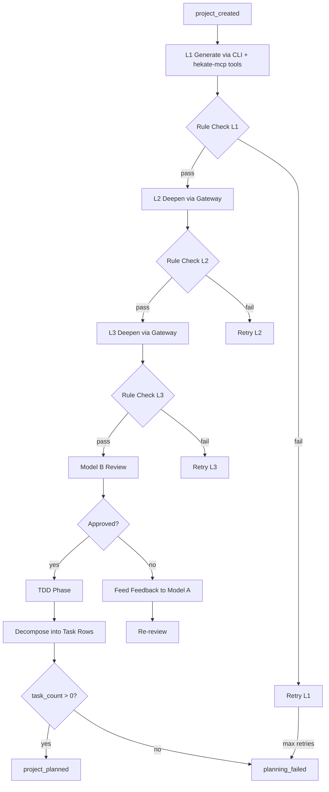

# Athena

Athena is the planning god. She receives a newly created project, generates a multi-level execution plan through a two-model adversarial architecture, validates it with a rule engine at every level, and decomposes the final plan into executable task rows with a dependency DAG. Athena also reassesses the plan after each wave completes, deciding whether to continue, replan, or escalate.

---

## Responsibility

Athena transforms project requirements into a validated, decomposed execution plan. She operates a two-model architecture: Model A (generator) builds and deepens the plan across levels L1 through L5 in a single continuous conversation, while Model B (reviewer) critiques the plan from a fresh, unbiased perspective. The rule engine validates structural completeness between every level transition, and a TDD phase optionally generates test specifications before decomposition.

## Event Subscriptions

| Event | Action |
|-------|--------|
| `project_created` | `athena_plan_leveled` -- full planning pipeline: generate, deepen, review, TDD, decompose |
| `plan_node_created` | `athena_deepen` -- deepen a single plan node (node-tree planner) |
| `plan_node_complete` | `athena_bubble_up` -- propagate completion up the node tree |
| `plan_node_executable` | `athena_materialize` -- convert leaf node into an executable task row |
| `wave_complete` | `athena_reassess_standalone` -- evaluate wave outcomes, decide next steps |

## Emitted Events

| Event | When | Payload |
|-------|------|---------|
| `project_planned` | Plan is fully validated and decomposed into tasks | `project_id`, `plan_id`, `level`, `review`, `test_specs?` |
| `planning_failed` | Any stage of planning fails irrecoverably | `project_id`, `error` |
| `plan_node_created` | A new node is added during node-tree deepening | Node metadata |
| `wave_assessed` | After evaluating a completed wave | `project_id`, `wave`, `outcome` (continue/replan/escalate), `rationale` |
| `narration` | At each significant planning step (if narration enabled) | `project_id`, `text` |

## Behavior Details

### Two-Model Adversarial Architecture

Athena uses two distinct LLM sessions to reduce bias and improve plan quality:

- **Model A (Generator)**: Maintains a single continuous conversation. Context accumulates as the plan deepens from L1 through L3+. This continuity allows the model to refine previous decisions without losing context.
- **Model B (Reviewer)**: Gets a fresh prompt with no shared conversation history. Reviews the plan critically for gaps, dependency correctness, task sizing, and requirement coverage.

### L1 Generation with Code Analysis

The L1 phase uses Claude Code CLI with hekate-mcp tools rather than a plain LLM call. This gives the planner direct access to the codebase:

- `mcp__hekate__analyze_file` -- understand file structure
- `mcp__hekate__find_usages` -- trace dependencies
- `mcp__hekate__find_implementations` -- locate implementations
- `mcp__hekate__where` -- find code locations
- `mcp__hekate__project_graph` -- understand module relationships

The planner is explicitly instructed to reference real files and fit within the existing architecture. If the CLI planner fails, Athena falls back to a plain gateway call.

### Plan Levels (L1-L5)

| Level | Contents | What gets added |
|-------|----------|-----------------|
| L1 | Rough task breakdown | `title`, `description`, `task_type`, `depends_on` |
| L2 | Detailed specs | `affected_files`, `complexity` (simple/medium/complex) |
| L3 | Implementation details | `implementation_notes`, `test_strategy`, `edge_cases` |
| L4 | Exact changes | `changes[]` with `file`, `action`, `name`, `signature`, `returns` |
| L5 | Executable spec | Full code body for each change |

The target level is determined automatically by `suggest_target_level()` based on task type, complexity, and available tooling, or can be set explicitly in project config.

### Rule Engine Validation

Between every level transition, the rule engine (`plan_levels.py`) validates:

- All tasks have required fields for the target level
- Dependencies reference valid task IDs
- No circular dependencies
- Task count is non-zero
- Requirements coverage (every requirement has at least one task)

Each level gets up to `MAX_RULE_RETRIES` (2) attempts before Athena either falls back to the previous good plan or fails.

### Adversarial Review

Model B answers five questions:
1. Does every requirement have at least one task?
2. Are there gaps -- things implied but no task covers?
3. Are dependencies correct?
4. Are tasks too large or too small?
5. Is the right approach being used?

If rejected, feedback goes back to Model A for fixes. Up to `MAX_REVIEW_CYCLES` (2) review rounds occur before Athena proceeds with the current plan. L1 plans skip review entirely to reduce latency.

### TDD Phase

When `tdd=True` in project config, Athena generates test specifications for each code task:
- Test file path (`tests/test_{slug}.py`)
- Test case names (happy path + edge cases)

These specs are attached to the `project_planned` payload.

### Decomposition

The final plan is decomposed into `tasks` and `task_deps` rows in the database. Each task receives:
- A `TaskDefinition` from the task registry (retry logic, timeout, provider preferences)
- Wave assignment based on phase ordering
- Initial status: `pending` (wave 0, no deps) or `blocked` (has unresolved deps)

### Wave Reassessment

After each wave completes, `athena_reassess_standalone` evaluates outcomes via LLM:
- **continue**: Remaining tasks look good, proceed to next wave
- **replan**: Results suggest the plan needs revision
- **escalate_to_human**: Something unexpected happened

## Configuration

| Parameter | Type | Default | Description |
|-----------|------|---------|-------------|
| `target_level` | `"auto"` / `"L1"`-`"L5"` | `"auto"` | Planning depth target |
| `tdd` | `bool` | `true` | Generate TDD test specifications |
| `narration` | `bool` | `true` | Emit narration events at each step |
| `use_node_tree_planner` | `bool` | `false` | Use parallel node-tree planner instead of leveled planner |
| `planning_model` | `string` | (gateway default) | Override LLM model for planning |
| `review_cycle` | `bool` | `true` | Enable adversarial Model B review |

Configuration is read from the project's `config_json` column.

## Key Files

| File | Purpose |
|------|---------|
| `Odin/gods/handlers/athena_leveled.py` | Main planning pipeline -- L1 through decomposition |
| `Odin/gods/handlers/athena_complete.py` | Node-tree handlers: `bubble_up`, `materialize` |
| `Odin/gods/handlers/athena_deepen.py` | Node-tree deepening handler |
| `Odin/gods/handlers/athena_l0.py` | L0 entry point for node-tree planner |
| `Odin/gods/plan_levels.py` | PlanLevel enum, TaskSpec dataclass, rule engine (`validate_plan`) |
| `Odin/gods/handlers/registration.py` | Wires Athena handlers to event subscriptions |
