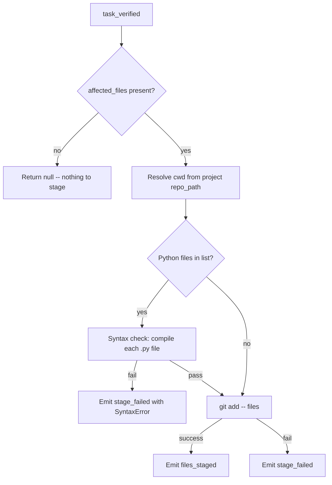
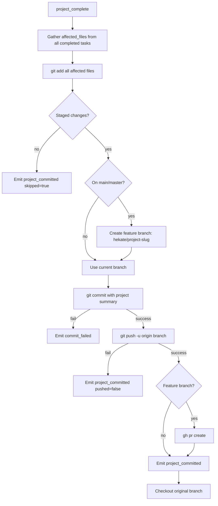

# Hephaestus

Hephaestus is the smith god. He handles all git operations in the pipeline: staging changed files after task verification, running syntax checks on Python files, and committing/pushing/creating PRs when a project completes. Hephaestus ensures that code produced by the execution pipeline is properly tracked in version control.

---

## Responsibility

Hephaestus operates at two points in the pipeline lifecycle. After each task is verified, he stages the affected files with syntax validation. When an entire project completes, he commits all staged changes, pushes to a feature branch, and creates a pull request via the GitHub CLI. All git operations have timeout protection to prevent the pipeline from hanging on I/O.

## Event Subscriptions

| Event | Action |
|-------|--------|
| `task_verified` | `hephaestus_stage` -- syntax check Python files, then `git add` affected files |
| `project_complete` | `hephaestus_complete` -- commit, push, create PR |

## Emitted Events

| Event | When | Payload |
|-------|------|---------|
| `files_staged` | Files successfully staged after verification | `task_id`, `project_id`, `files` |
| `stage_failed` | Syntax check or git add failed | `task_id`, `project_id`, `error` |
| `project_committed` | Project changes committed (may include push and PR) | `project_id`, `commit_sha`, `branch`, `pushed`, `pr_url?` |
| `commit_failed` | Git commit failed | `project_id`, `error` |

## Behavior Details

### Task-Level Staging

The `affected_files` list comes from the `task_verified` event payload, originally captured by Hermes during CLI execution.

### Syntax Checking

Before staging Python files, Hephaestus compiles each file using Python's built-in `compile()` function. This catches:
- `SyntaxError` -- malformed Python
- `IndentationError` -- incorrect whitespace

Files that do not exist locally are silently skipped (they may exist in a remote worktree). Non-Python files bypass the syntax check entirely.

This is a critical safety net because CLI executors sometimes generate Python with raw newlines in strings instead of `\n`, or produce files with indentation errors.

### Project-Level Completion

When `project_complete` fires, Hephaestus performs a full commit-push-PR workflow:

Key details:

- **File gathering**: Scans all completed tasks' `context_json` for `affected_files`. Does NOT use `git add -u` which would stage unrelated changes from other projects or local edits.
- **Branch naming**: `hekate/{slugified-project-name}` (max 50 chars). If the branch already exists, checks it out instead of failing.
- **Commit message**: Project name as subject, "Autonomous execution by Hekate gods pipeline" as body, followed by a task summary with status indicators.
- **PR creation**: Uses `gh pr create` with the project name as title and task summary as body. Times out after 30 seconds.
- **Branch restoration**: Always checks out the original branch after completion, even if push or PR creation fails.

### Timeout Protection

All git operations are wrapped with a 30-second timeout:
- `git add`: 30s
- `git commit`: 30s (via `_git_run`)
- `git push`: 60s (pushes can be slow)
- `gh pr create`: 30s

On timeout, the subprocess is killed and the operation is reported as failed.

## Configuration

| Parameter | Type | Default | Description |
|-----------|------|---------|-------------|
| git_timeout | `float` | `30.0` | Timeout in seconds for git operations |
| push_timeout | `float` | `60.0` | Timeout in seconds for git push |

## Key Files

| File | Purpose |
|------|---------|
| `Odin/gods/handlers/hephaestus.py` | All handlers: staging, syntax check, commit, push, PR creation |
| `Odin/gods/handlers/registration.py` | Wires `task_verified` to `hephaestus_stage` and `project_complete` to `hephaestus_complete` |
