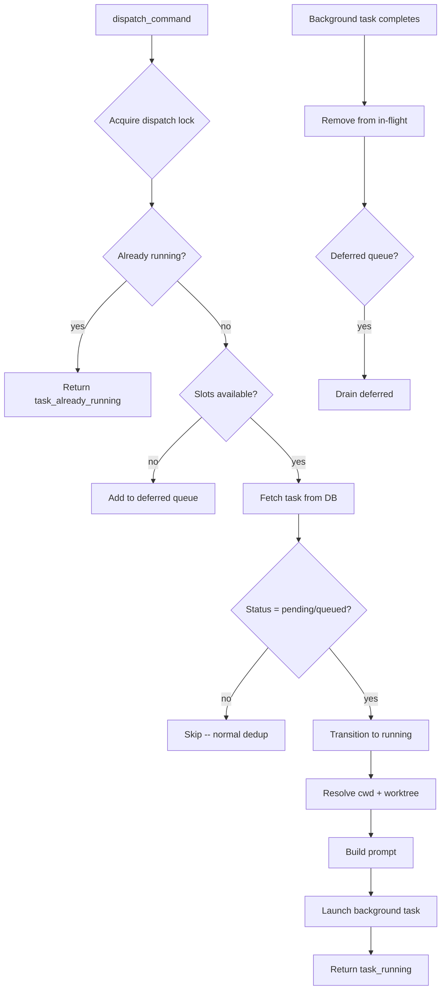

# Hermes

Hermes is the executor god. He receives dispatch commands from Odin and launches CLI subprocesses to execute tasks, running up to four concurrent workers in an async pool. Hermes never blocks the pipeline -- tasks run in the background, stream narration events in real time, and report results through the relay table for Mimir to verify.

---

## Responsibility

Hermes manages the full lifecycle of task execution: receiving dispatch commands, resolving CLI providers, building prompts with task context and prior feedback, launching async subprocesses, streaming live narration, capturing output/cost/tokens, and reporting completion or failure. He maintains a deferred queue for overflow when concurrency limits are reached, sends periodic heartbeats for stuck-task detection, and handles graceful shutdown with process tree cleanup.

## Event Subscriptions

| Event | Action |
|-------|--------|
| `dispatch_command` | `hermes.handle_dispatch` -- launch background CLI execution, return immediately |

## Emitted Events

| Event | When | Payload |
|-------|------|---------|
| `task_running` | CLI subprocess has started | `task_id`, `project_id`, `provider` |
| `worker_event` | Task completed or failed (written to relay table) | `task_id`, `project_id`, `status`, `cost_usd`, `prompt_tokens`, `completion_tokens`, `model_used` |
| `narration` | Real-time streaming during execution (written to relay table) | `task_id`, `project_id`, `type` (text_delta/tool_call/tool_result/assistant), `text`/`tool`/`input`/`output` |
| `heartbeat` | Every 30s while a task is running (written to relay table) | `task_id`, `project_id`, `provider`, `uptime_s` |
| `task_already_running` | Duplicate dispatch for an in-flight task | `task_id`, `project_id` |

## Behavior Details

### HermesRunner Architecture

Hermes is implemented as a `HermesRunner` class instantiated once during pipeline registration. It holds:

- **In-flight map**: `task_id` to `asyncio.Task` -- tracks background monitor coroutines
- **Process map**: `task_id` to `Process` -- tracks subprocesses for cancellation
- **Heartbeat map**: `task_id` to `asyncio.Task` -- tracks heartbeat coroutines
- **Dispatch lock**: `asyncio.Lock` -- serializes concurrency checks to prevent race conditions
- **Deferred queue**: list of `(Event, db)` tuples -- overflow when all slots are full

### Prompt Construction

Hermes builds a structured prompt for each task:

1. **Title and requirements** from the task's `title` and `description`
2. **Self-review instructions** -- the executor is told to review its own work for gaps, pattern consistency, and edge cases before finishing
3. **Prior verification feedback** -- if the task was previously attempted and Mimir found issues, that feedback is included
4. **Prompt guidance** -- if Odin's diagnosis added guidance (e.g., "avoid SyntaxError"), it is appended
5. **Review feedback** -- if Mimir's code review flagged issues

### Worktree Isolation

When a project has a `repo_path` set, Hermes creates a Claude CLI worktree name from the project slug and ID. This prevents branch conflicts between concurrent projects. The worktree is passed to the Claude Code provider via `--worktree`.

Additional repositories (`additional_repos` from the project, or `repo_paths` from the task) are passed via `--add-dir` for multi-repo access.

### Provider Execution

Hermes uses a `ProviderRegistry` to resolve providers by name. The registry is populated with defaults during pipeline registration:

| Provider | Implementation | Notes |
|----------|---------------|-------|
| `claude_code` | `ClaudeCodeProvider` | Claude Code CLI with `--stream-json`, hekate-mcp tools, permission skip |
| `gemini_cli` | `GeminiCliProvider` | Currently disabled (auth broken) |
| `ollama` | (fallback) | Local model for asset tasks |

Per-task config overrides (worktree, add_dirs) are applied via `provider.with_config()`.

### Real-Time Streaming (Peer Programming Mode)

During execution, Hermes streams events from the CLI's `--stream-json` output to the relay table:

| Stream Event Type | Relay Event | Content |
|-------------------|-------------|---------|
| `tool_use` | `narration` (tool_call) | Tool name + input (truncated to 500 chars) |
| `tool_result` | `narration` (tool_result) | Tool name + output (truncated to 500 chars) |
| `assistant` | `narration` (assistant) | Full assistant text blocks |
| `stream_event` (text_delta) | `narration` (text_delta) | Batched every 2 seconds to avoid flooding |

### Relay Write Strategy

Hermes uses two relay write modes:

- **Best-effort** (`_write_relay_event`): For narration and heartbeats. Swallows errors. Tracks consecutive failures and escalates to `CRITICAL` log level after 3 in a row.
- **Strict** (`_write_relay_event_strict`): For completion events. Raises on failure. The relay write MUST succeed before the task DB row is updated to prevent split-brain (DB says "completed" but Mimir never sees the relay event).

### Heartbeat

Every 30 seconds while a task runs, Hermes:
1. Updates `updated_at` on the task row (so Odin's stuck-task detection sees a live signal)
2. Writes a `heartbeat` relay event with uptime

### Timeout and Cancellation

- Task timeout comes from `TaskDefinition.timeout_seconds` (per-task), falling back to `default_timeout` (600s)
- The outer `asyncio.wait_for` uses 1.2x the effective timeout as a hard ceiling
- On timeout: subprocess is tree-killed (Windows: `taskkill /F /T /PID`), task marked failed
- On cancellation: subprocess killed, `CancelledError` handler writes failed status via `asyncio.shield` (must complete even during cancellation)

### Graceful Shutdown

`shutdown()` follows a specific order:
1. Cancel heartbeat tasks (non-critical)
2. Cancel all monitor tasks -- triggers `CancelledError` handlers which write "failed" status
3. Wait for handlers to finish (up to timeout)
4. Kill any remaining child processes via tree kill

### TDD Gate

For code/integration/refactor tasks, Hermes checks if the output mentions test files. If no test file patterns are found, a `tdd_warning` is attached to the completion event (advisory, does not block).

## Configuration

| Parameter | Type | Default | Description |
|-----------|------|---------|-------------|
| `max_concurrent` | `int` | `4` | Maximum simultaneous CLI executions |
| `default_timeout` | `int` | `600` | Default task timeout in seconds |
| `heartbeat_interval` | `float` | `30.0` | Seconds between heartbeat events |

## Key Files

| File | Purpose |
|------|---------|
| `Odin/gods/handlers/hermes_async.py` | HermesRunner: dispatch handling, background monitoring, relay writes |
| `Odin/gods/providers/base.py` | ProviderRegistry, base provider interface |
| `Odin/gods/providers/claude.py` | ClaudeCodeProvider: CLI invocation with `--stream-json` |
| `Odin/gods/task_definition.py` | TaskDefinition: per-task timeout and retry settings |
| `Odin/gods/handlers/registration.py` | Creates HermesRunner and registers dispatch_command handler |
