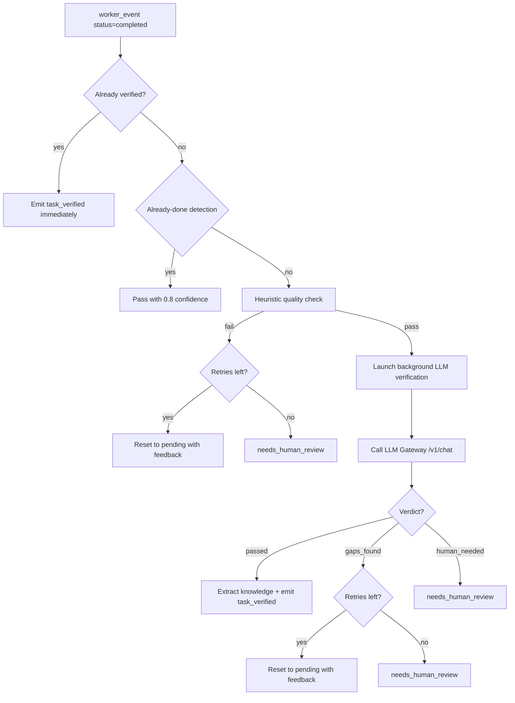

# Mimir

Mimir is the verification god. He receives completed task output from Hermes, applies heuristic quality checks, calls an LLM to verify output against requirements, extracts reusable knowledge from successful completions, and performs advisory code reviews. Mimir never blocks the pipeline -- verifications run in the background via an async pool, writing results to the relay table for Odin to pick up.

---

## Responsibility

Mimir is the quality gate between execution and completion. Every task that Hermes marks as completed passes through Mimir's three-stage verification: fast heuristic checks (no LLM), LLM-backed verification against task requirements, and optional code quality review. Mimir also extracts reusable knowledge findings from successful outputs and stores them in the project knowledge base. When verification fails, Mimir resets the task for retry with feedback or escalates to human review.

## Event Subscriptions

| Event | Action |
|-------|--------|
| `worker_event` | `mimir.handle_verify` -- verify completed task output (async background) |
| `task_verified` | `mimir_review` -- code quality review (synchronous, fast) |
| `review_rejected` | `mimir_handle_review_rejection` -- reset task with review feedback |
| `task_rejected` | `mimir_handle_task_rejection` -- emit tick for re-dispatch |

## Emitted Events

| Event | When | Payload |
|-------|------|---------|
| `task_verified` | Output passes heuristic + LLM verification (written to relay) | `task_id`, `project_id`, `confidence` |
| `task_rejected` | Verification found gaps and retries remain | `task_id`, `project_id`, `feedback` |
| `needs_human_review` | Retries exhausted or LLM says human needed | `task_id`, `project_id`, `reason` |
| `verification_started` | Background verification launched | `task_id`, `project_id` |
| `verification_deferred` | All verification slots full, task queued | `task_id`, `project_id`, `in_flight`, `queued` |
| `review_passed` | Code review complete (always emitted -- review is advisory) | `task_id`, `project_id`, `verdict`, `feedback` |
| `task_reset` | Task reset to pending after review rejection | `task_id`, `project_id`, `reason` |
| `narration` | Narration emitted for monitoring | `project_id`, `text` |

## Behavior Details

### MimirRunner Architecture

Like Hermes, Mimir uses an async runner pattern (`MimirRunner`) with:

- **In-flight map**: `task_id` to `asyncio.Task`
- **Deferred queue**: `collections.deque` for overflow
- **Max concurrent**: configurable (default 4)

When a slot opens, deferred verifications are drained automatically.

### Three-Stage Verification Pipeline

### Stage 1: Fast Path Checks (No LLM)

Before any LLM call, Mimir applies fast checks:

**Idempotency guard**: If `verification_status` is already `"passed"`, emit `task_verified` immediately.

**Already-done detection**: If the output contains phrases like "already exists", "nothing to do", "no changes needed", the task passes with 0.8 confidence. No LLM call needed.

**Heuristic quality check** (`_check_output_quality`):
- Empty or whitespace-only output: **fail**
- Output shorter than 10 characters: **fail** ("suspiciously short")
- More than 50% of lines match error patterns (`Traceback`, `fatal:`, `SyntaxError`, etc.): **fail**
- Single line that is an error message: **fail**
- Otherwise: **pass**

### Stage 2: LLM Verification

The LLM verifier receives:
- Task title and description
- Output text (truncated to 5000 chars)
- Instructions to judge ONLY whether the output addresses requirements (no external state checks)

Verdicts:
| Verdict | Meaning | Action |
|---------|---------|--------|
| `passed` | Output addresses requirements | Extract knowledge, emit `task_verified` |
| `gaps_found` | Output is missing something explicitly asked for | Reset for retry with feedback, or escalate if retries exhausted |
| `human_needed` | Output is empty, garbled, or completely unrelated | Escalate to `needs_human_review` |

The verifier also submits its verdict to the engine's `/api/tasks/{id}/verify` endpoint, which emits relay events for wave progression.

### Robust Response Parsing

Mimir handles all LLM response formats:

- **JSON object**: Standard path -- extract `verdict`, `confidence`, `feedback`
- **JSON array**: Take first element if it is a dict
- **Plain string**: If it contains "passed"/"satisf"/"correct"/"done"/"complet", treat as passed (0.7 confidence)
- **Anything else**: Default to `human_needed` with 0.0 confidence

### Graceful Degradation

If the LLM verifier is unavailable (timeout, connection error, HTTP error) but the task has substantive output (>20 chars), Mimir passes the task with **LOW confidence (0.5)** and notes "Verification skipped". This prevents the pipeline from stalling when the verification service is down.

### Stage 3: Code Review (Advisory)

After verification passes, `mimir_review` performs a code quality review:
- Calls a separate LLM reviewer (Gemini via gateway)
- Stores feedback in the task's `verification_notes`
- **Never auto-rejects** -- review is purely advisory
- If the reviewer is unavailable, the task passes through as approved

A human decides if review feedback warrants reopening a task.

### Knowledge Extraction

For every passed verification, Mimir calls a knowledge extractor LLM to identify reusable findings from the task output. Findings are stored in the `project_knowledge` table as concise strings, indexed by project and task. This builds a growing knowledge base that could inform future planning.

## Configuration

| Parameter | Type | Default | Description |
|-----------|------|---------|-------------|
| `max_concurrent_verifications` | `int` | `4` | Maximum simultaneous LLM verifications |
| `verification_model` | `string` | (gateway default, typically haiku) | LLM model for verification |

## Key Files

| File | Purpose |
|------|---------|
| `Odin/gods/handlers/mimir.py` | MimirRunner, heuristic checks, LLM verification, review, knowledge extraction |
| `Odin/gods/providers/response_validator.py` | `validate_verdict`, `validate_review`, `extract_json` -- response parsing utilities |
| `Odin/gods/task_states.py` | `transition_task` -- validated state transitions |
| `Odin/gods/handlers/registration.py` | Creates MimirRunner and registers event handlers |
