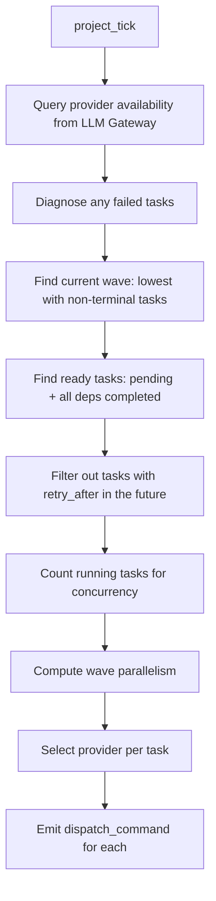

# Odin

Odin is the orchestration god. He manages the full lifecycle of project execution: starting projects, dispatching tasks to providers, tracking wave progression, detecting deadlocks, diagnosing failures with pattern-matched root cause analysis, and deciding retry strategies. Odin is the central coordinator that keeps the pipeline moving forward.

---

## Responsibility

Odin bridges planning and execution. When Athena finishes a plan, Odin transitions the project to executing and begins dispatching tasks to CLI providers. He monitors wave completion, unblocks dependent tasks, detects deadlocks, and diagnoses failures using a 30-pattern error signature library. For each failure, Odin decides whether to retry, reassign to a different provider, modify the prompt, skip, or escalate to a human.

## Event Subscriptions

| Event | Action |
|-------|--------|
| `project_planned` | `odin_start` -- transition project to executing, emit first tick |
| `project_tick` | `odin_dispatch` -- find ready tasks, select providers, emit dispatch commands |
| `tick` | `odin_tick` -- periodic scan of all executing projects, emit per-project ticks |
| `task_verified` | `odin_lifecycle` -- check wave/project completion, unblock dependents, detect deadlock |
| `wave_assessed` | `odin_decide` -- handle Athena's wave reassessment decision |
| `task_diagnosis` | `odin_handle_diagnosis` -- apply the recommended fix (retry/reassign/skip/escalate) |
| `task_fork_requested` | `odin_fork_handler` -- create forked child tasks from a parent's output |

## Emitted Events

| Event | When | Payload |
|-------|------|---------|
| `project_started` | Project transitions from planned to executing | `project_id`, `plan_id` |
| `dispatch_command` | A task is ready and a provider is selected | `task_id`, `project_id`, `provider` |
| `project_tick` | After any lifecycle check, to trigger re-dispatch | `project_id` |
| `wave_complete` | All tasks in a wave reach terminal status | `project_id`, `wave` |
| `project_complete` | All tasks across all waves are terminal with zero failures | `project_id` |
| `project_failed` | All tasks terminal but some failed, or deadlock detected | `project_id`, `reason` |
| `task_diagnosis` | A failed task is analyzed | `task_id`, `project_id`, `fix_type`, `confidence`, `root_cause`, `why_chain` |
| `task_reset` | A task is reset for retry (pending with incremented retry_count) | `task_id`, `project_id`, `retry_count` |
| `task_skipped` | A task is cancelled by diagnosis | `task_id`, `project_id`, `reason` |
| `needs_human_review` | A task is escalated to human review | `task_id`, `project_id`, `reason` |
| `task_fork_requested` | A completed task has a fork edge with items to fan out | `source_task_id`, `project_id`, `items`, `template` |

## Behavior Details

### Project Start

When `project_planned` arrives, `odin_start`:
1. Verifies the project exists and is not already executing
2. Sets status to `executing`
3. Emits `project_started` + an immediate `project_tick` to begin dispatch

Idempotent: if the project is already executing/completed/failed, returns no-op.

### Task Dispatch

### Provider Selection

Odin selects providers using a tier map keyed by `(task_type, complexity)`:

| Task Type | Provider |
|-----------|----------|
| code (all complexities) | `claude_code` |
| research (all) | `claude_code` |
| analysis (all) | `claude_code` |
| integration (all) | `claude_code` |
| documentation (all) | `claude_code` |
| asset (simple/medium) | `ollama` |

The fallback chain is `["claude_code", "ollama"]`. Provider availability is checked against the LLM Gateway `/providers` endpoint every dispatch cycle.

When a project has a `pipeline_snapshot` in its config, Odin uses the snapshotted tier map and task type definitions instead of the current globals. This provides Conductor-style workflow versioning -- a running project is immune to config changes from deploys.

### Wave Progression and Dependency Unblocking

After each `task_verified`, `odin_lifecycle`:

1. **Counts remaining non-terminal tasks** across all waves
2. **Unblocks dependents**: atomic UPDATE sets `blocked` tasks to `pending` where all dependencies are `completed`
3. **JOIN threshold unblock**: for tasks with `fork_group_id`, checks `join_threshold` and `join_mode` (all/any/threshold) to unblock partial-dependency joins
4. **Fork detection**: if the verified task has a `fork` workflow edge, extracts items from output and emits `task_fork_requested`
5. **Deadlock detection**: if no tasks are pending/queued/running but some are blocked, the project fails with a deadlock reason
6. **Wave completion**: if all tasks in the verified task's wave are terminal, emits `wave_complete`
7. **Project completion**: if all tasks across all waves are terminal, emits `project_complete` or `project_failed`

### Failure Diagnosis

Odin's diagnosis engine (`odin/dispatch.py`) uses deterministic pattern matching against 30 error signatures, organized into categories:

| Category | Example Patterns | Fix Type |
|----------|-----------------|----------|
| Provider issues | `rate limit`, `quota exceeded`, `429`, `503` | `reassign_tier` or `retry_as_is` |
| Auth issues | `unauthorized`, `401`, `credential` | `reassign_tier` |
| Code generation | `SyntaxError`, `IndentationError`, `ImportError` | `modify_prompt` |
| Git/workspace | `merge conflict`, `worktree`, `branch` | `modify_prompt` or `retry_as_is` |
| Resource issues | `CUDA out of memory`, `OOM`, `disk space` | `reassign_tier` or `skip` |
| CLI issues | `not found on PATH`, `FileNotFoundError`, `zombie` | `reassign_tier` or `retry_as_is` |

Each diagnosis produces a `FailureDiagnosis` with:
- **fix_type**: `retry_as_is`, `reassign_tier`, `modify_prompt`, `skip`, `escalate`
- **confidence**: 0.0-1.0 (low confidence triggers Odin's LLM reasoning loop)
- **root_cause**: human-readable cause
- **why_chain**: list of reasoning steps (5-Whys style)

### Applying Diagnosis Fixes

`odin_handle_diagnosis` uses `pipeline.transition_and_emit()` for atomic state changes:

| Fix Type | Action |
|----------|--------|
| `retry_as_is` | Reset to `pending`, increment `retry_count`, compute backoff delay from `TaskDefinition` |
| `reassign_tier` | Change `model_tier`, reset to `pending`, increment `retry_count` |
| `modify_prompt` | Store `prompt_guidance` in `context_json`, reset to `pending` |
| `skip` | Set status to `cancelled` |
| `escalate` | Set status to `needs_review`, emit `needs_human_review` |

Retry delay is computed from the task's `TaskDefinition` which supports fixed, exponential, and linear backoff strategies. Tasks with `retry_after` in the future are skipped during dispatch until the delay expires.

### Retry Exhaustion

If `retry_count >= max_retries` during a `retry_as_is` diagnosis, Odin automatically escalates to `needs_review` instead of retrying.

## Configuration

| Parameter | Type | Default | Description |
|-----------|------|---------|-------------|
| `max_concurrent_tasks` | `int` | `4` | Maximum tasks running in parallel across a project |
| `tick_interval_sec` | `int` | (pipeline setting) | Interval between periodic ticks |
| `max_task_retries` | `int` | `3` | Default max retries per task |
| `stale_task_threshold_seconds` | `int` | `300` | Seconds before a running task is considered stale |

## Key Files

| File | Purpose |
|------|---------|
| `Odin/gods/handlers/odin.py` | Core handlers: start, tick, dispatch, lifecycle, diagnosis |
| `Odin/gods/odin/dispatch.py` | Provider selection, failure diagnosis (30 patterns), wave parallelism |
| `Odin/gods/handlers/odin_workflow.py` | Workflow primitives: `odin_decide`, fork handler |
| `Odin/gods/task_states.py` | Task state machine: valid states and transitions |
| `Odin/gods/task_definition.py` | TaskDefinition: retry logic, timeout, provider preferences |
| `Odin/gods/handlers/registration.py` | Wires Odin handlers to event subscriptions |
