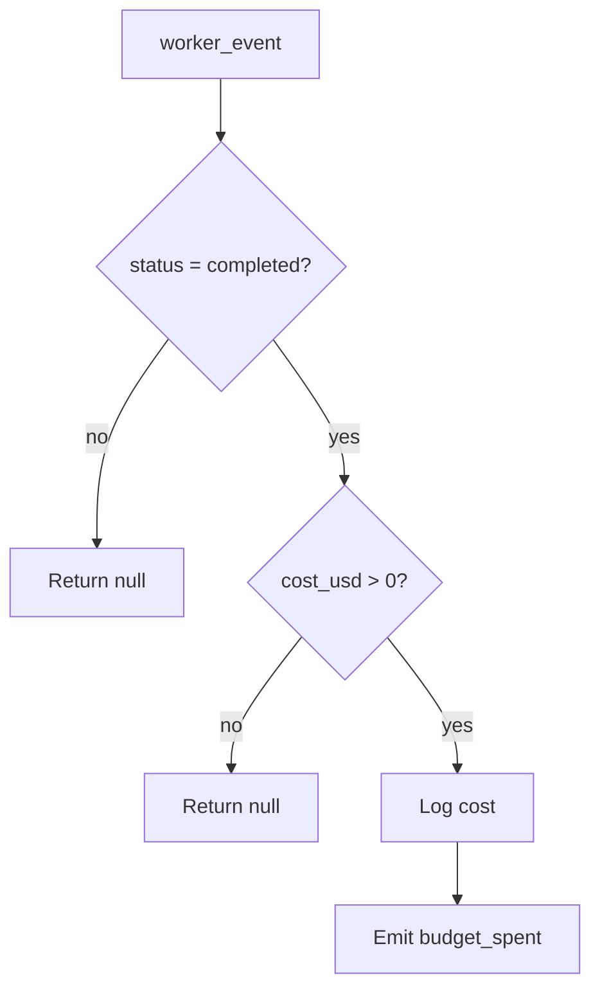

# Tyche

Tyche is the accountant god. She tracks the cost of every completed task in the pipeline, recording token usage and dollar amounts. Tyche emits budget events for monitoring and is designed to enforce spending limits in the future, though budget enforcement is not yet active.

---

## Responsibility

Tyche observes completed worker events and records their cost. For every task that finishes with a non-zero `cost_usd`, she emits a `budget_spent` event containing the cost, model, and task/project identifiers. This provides a real-time cost stream that can be consumed by dashboards, alerts, or budget enforcement logic.

## Event Subscriptions

| Event | Action |
|-------|--------|
| `worker_event` | `tyche_record_spend` -- record cost from completed tasks |

## Emitted Events

| Event | When | Payload |
|-------|------|---------|
| `budget_spent` | A completed task has non-zero cost | `task_id`, `project_id`, `cost_usd`, `model_used` |

## Behavior Details

### Cost Recording

Tyche's handler is intentionally simple and reliable:



The cost data originates from Hermes, which captures it from the CLI provider's output. For Claude Code, this includes:
- `cost_usd`: Total cost for the task execution
- `prompt_tokens`: Input token count
- `completion_tokens`: Output token count
- `model_used`: The specific model that ran (e.g., `claude_code`)

### Budget Gate (Pre-Dispatch)

Tyche also exposes `tyche_check_budget`, a callable function (not an event handler) that can be used as a gate before dispatch:

```python
result = await tyche_check_budget(event, db, budget_remaining=50.0)
# {"allowed": True, "reason": "Budget OK: $50.00 remaining"}
# or
# {"allowed": False, "reason": "Budget exhausted (remaining: $0.00)"}
```

This function is not currently wired into the event pipeline as a gate, but is available for Odin's dispatch logic to call. It checks:
1. Whether budget is exhausted (`budget_remaining <= 0`)
2. Whether the estimated task cost exceeds remaining budget

### Future Capabilities

Tyche is designed to support but does not yet implement:

| Capability | Status | Description |
|------------|--------|-------------|
| Budget enforcement | Planned | Block dispatch when project/daily/monthly limits are reached |
| Provider quota tracking | Planned | Track per-provider usage for rate limit avoidance |
| Cost alerts | Planned | Emit warning events at configurable spend thresholds |
| Per-project budgets | Planned | Enforce per-project spending caps |
| Cost forecasting | Future | Estimate remaining project cost based on task complexity |

### Integration with Odin

Odin's dispatch logic already considers budget in two places:
- `compute_wave_parallelism` reduces parallelism when `budget_remaining < $5.00`
- `select_provider` pushes Ollama (free, local) to the front when `budget_remaining < $1.00`

Tyche's `budget_spent` events provide the data stream needed to compute `budget_remaining`, but the aggregation and enforcement loop is not yet connected.

## Configuration

| Parameter | Type | Default | Description |
|-----------|------|---------|-------------|
| `daily_limit_usd` | `float` | (none) | Maximum daily spend across all projects |
| `monthly_limit_usd` | `float` | (none) | Maximum monthly spend |
| `per_project_limit_usd` | `float` | (none) | Maximum spend per project |
| `warn_at_pct` | `float` | (none) | Emit warning when this percentage of a limit is reached |

These configuration parameters are defined in the design but not yet read from project config.

## Key Files

| File | Purpose |
|------|---------|
| `Odin/gods/handlers/tyche.py` | Budget check function and spend recording handler |
| `Odin/gods/handlers/registration.py` | Wires `worker_event` to `tyche_record_spend` |
