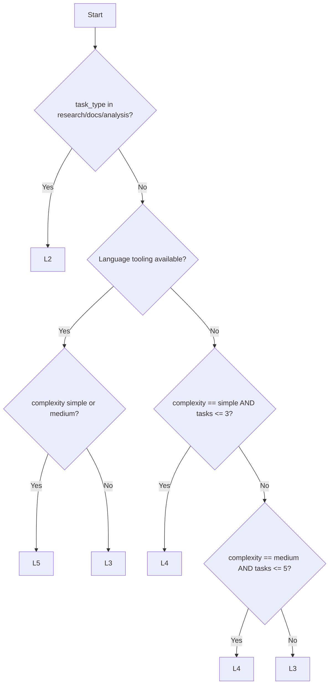

# Plan Levels Reference

The plan level system (L1-L5) defines progressive depth for task specifications. Each level adds more detail, validated by a rule engine before advancing. Defined in `Odin/gods/plan_levels.py`.

## Level Summary

| Level | Name | Purpose | Key Addition |
|-------|------|---------|--------------|
| L1 | Rough Breakdown | What needs doing | Title, type, wave |
| L2 | Detailed Specs | How to do it | Description, affected files, deps, complexity |
| L3 | Implementation Details | Patterns and edge cases | Implementation notes, test strategy, edge cases |
| L4 | Exact Changes | Specific code blocks | Method signatures, return values |
| L5 | Executable Spec | Tool applies directly | Full method bodies, no LLM needed |

---

## L1: Rough Breakdown

Minimal task decomposition. Enough to establish the work graph.

### Required Fields

| Field | Type | Description |
|-------|------|-------------|
| `id` | `string` | Unique task identifier |
| `title` | `string` | Human-readable task name (non-empty) |
| `task_type` | `string` | `code`, `research`, `analysis`, `integration`, `documentation`, `asset` |
| `wave` | `int` | Execution wave (0-based). Tasks in wave N execute after wave N-1 completes. |

### Validation Rules

- `title` must be non-empty after stripping whitespace
- `task_type` must be non-empty after stripping whitespace
- `wave` must not be `None`

### Use Case

Quick planning for well-understood work. Executor (Claude Code) figures out the details at runtime.

---

## L2: Detailed Specs

Adds structural information: what files are touched, what depends on what, how complex the task is.

### Required Fields (in addition to L1)

| Field | Type | Description |
|-------|------|-------------|
| `description` | `string` | Detailed description of what the task does |
| `affected_files` | `string[]` | List of file paths this task will modify or create |
| `depends_on` | `string[]` | List of task IDs this task depends on |
| `complexity` | `string` | `simple`, `medium`, or `complex` |

### Validation Rules

All L1 rules, plus:

- `description` must be non-empty
- `affected_files` must be a non-empty list
- `complexity` must not be `None`
- Dependency targets must exist in the plan (no dangling references)
- No circular dependencies (verified by DFS cycle detection)

### Plan-Level Checks

| Check | Rule |
|-------|------|
| Duplicate IDs | No two tasks may share an ID |
| Missing deps | Every `depends_on` entry must reference an existing task ID |
| Circular deps | DFS traversal must not find cycles |

### Use Case

Standard planning depth for most code tasks. Executor has enough context to make good decisions.

---

## L3: Implementation Details

Adds guidance on how to implement: patterns to follow, edge cases to handle, test approach.

### Required Fields (in addition to L2)

| Field | Type | Description |
|-------|------|-------------|
| `implementation_notes` | `string` | Code patterns, architecture decisions, approach guidance |
| `test_strategy` | `string` | How to test this task (unit, integration, manual) |
| `edge_cases` | `string[]` | Known edge cases to handle |

### Validation Rules

All L2 rules, plus:

- `implementation_notes` must be non-empty
- `test_strategy` must be non-empty
- `edge_cases` must be a non-empty list

### Use Case

Complex tasks where the executor needs guidance. Also the deepest practical level for languages without tooling (C++, Go, etc.).

---

## L4: Exact Changes

Specifies the exact code changes: method signatures, return types, parameter lists.

### Required Fields (in addition to L3)

| Field | Type | Description |
|-------|------|-------------|
| `changes` | `object[]` | List of code change specifications |
| `changes[].signature` | `string` | Method/function signature (non-empty) |

### Validation Rules

All L3 rules, plus:

- `changes` must be a non-empty list
- Each change must have a non-empty `signature` field

### Use Case

Well-understood changes where the planner can specify exact signatures. Executor fills in implementations.

---

## L5: Executable Spec

The plan is the implementation. Each change includes the full method body. A tool can apply changes directly without LLM involvement.

### Required Fields (in addition to L4)

| Field | Type | Description |
|-------|------|-------------|
| `changes[].body` | `string` | Full implementation body (non-empty) |

### Validation Rules

All L4 rules, plus:

- Each change must have a non-empty `body` field

### Use Case

Simple, well-understood changes where language tooling (Roslyn, Jedi, TSC) provides enough context for the planner to write the code directly.

---

## Language Tooling Matrix

Language tooling determines the maximum achievable plan level. Tooling is provided by the Hekate MCP server (port 5110) and its workers.

| Language | Tooling | Max Level | Service | Port |
|----------|---------|-----------|---------|------|
| C# | Roslyn | L5 | HekateServer | 5110 |
| Python | Jedi 0.19.2 | L5 | HekatePythonWorker | 9200 |
| TypeScript | TS Compiler API | L5 | HekateTypeScriptWorker | 9202 |
| C++ | Partial (no Clang) | L3 | HekateCppWorker | 9201 |
| Other | None | L2 | -- | -- |

---

## `suggest_target_level()` Algorithm

Automatically determines the target planning depth based on task characteristics.

```python
def suggest_target_level(
    task_type: str = "code",
    complexity: str = "medium",
    has_roslyn: bool = False,
    has_jedi: bool = False,
    has_ts_compiler: bool = False,
    task_count: int = 1,
) -> PlanLevel:
```

### Decision Logic



### Decision Table

| Task Type | Complexity | Tooling | Task Count | Result |
|-----------|-----------|---------|------------|--------|
| `research` | any | any | any | L2 |
| `documentation` | any | any | any | L2 |
| `analysis` | any | any | any | L2 |
| `code` | `simple` | Yes | any | L5 |
| `code` | `medium` | Yes | any | L5 |
| `code` | `complex` | Yes | any | L3 |
| `code` | `simple` | No | <= 3 | L4 |
| `code` | `medium` | No | <= 5 | L4 |
| `code` | `complex` | No | any | L3 |
| `code` | `simple` | No | > 3 | L3 |
| `code` | `medium` | No | > 5 | L3 |

---

## `validate_plan()` Checks

Whole-plan validation at a given level.

### Checks Applied at Every Level

| Check | Failure Condition |
|-------|-------------------|
| Empty plan | Zero tasks |
| Duplicate IDs | Two or more tasks share the same ID |

### Additional Checks at L2+

| Check | Failure Condition |
|-------|-------------------|
| Missing dependency targets | Task depends on an ID not in the plan |
| Circular dependencies | DFS detects a cycle in the dependency graph |

### Per-Task Checks

Each task is individually validated against `validate_task_at_level()`. The results are merged -- all tasks must pass for the plan to be valid.

### Return Value

```python
@dataclass
class RuleResult:
    passed: bool          # True if all checks pass
    reason: str           # First error message, or "Plan is valid at L3"
    errors: list[str]     # All validation errors
```

---

## Planning Flow (Leveled Planner)

The `athena_plan_leveled` handler uses a two-model architecture:

```
Model A (generator)          Model B (reviewer)
  L1 generate ──────────┐
  rule check L1          │
  L2 deepen  ──────────┐ │
  rule check L2         │ │
  L3 deepen  ─────────┐│ │
  rule check L3        ││ │
                       └┴─┴──→ thorough review
                               rule check
                               ├── approved → project_planned
                               └── rejected → feedback → Model A fixes → review again
```

- **Model A**: Single continuous conversation. Context accumulates L1 through L3.
- **Model B**: Fresh prompt each time. No shared context. Unbiased critique.
- **Rule retries**: Up to 2 retries per level if validation fails.
- **Review cycles**: Up to 2 Model B rejection/fix cycles.

---

## PlanConfig

Configuration passed in project's `config_json`:

| Field | Type | Default | Description |
|-------|------|---------|-------------|
| `tdd` | `bool` | `True` | Generate TDD test specs during planning |
| `narration` | `bool` | `True` | Emit narration events during planning |
| `target_level` | `string` | `auto` | Target plan depth (`auto`, `L1`-`L5`) |
| `direct_write` | `bool` | `True` | Write tasks directly to DB (skip approval step) |
| `max_concurrent` | `int` | `2` | Max concurrent tasks during execution |
| `use_node_tree_planner` | `bool` | `False` | Use parallel node tree planner (new Athena) |
