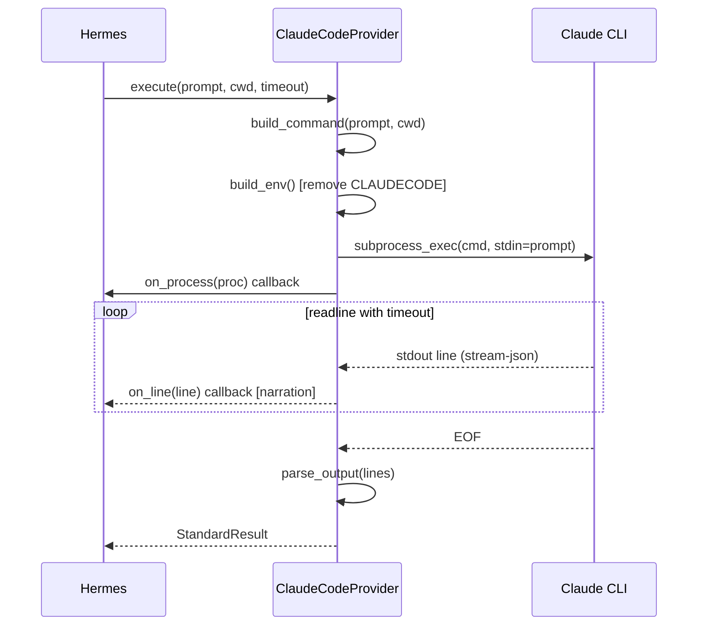

# Claude Code Provider Reference

The Claude Code provider (`Odin/gods/providers/claude.py`) wraps the Claude Code CLI as a task execution backend. It is the primary provider for all task types in the gods pipeline.

## Architecture

```
Hermes (dispatch)
  → ClaudeCodeProvider.execute()
    → build_command()    → CLI args + prompt
    → build_env()        → clean env (CLAUDECODE removed)
    → subprocess          → claude -p --output-format stream-json ...
    → parse_output()     → StandardResult
    → parse_error()      → error classification
```

The provider implements the `CLIProvider` abstract base class from `Odin/gods/providers/base.py`.

---

## ClaudeCodeConfig

Full configuration dataclass. Every Claude Code CLI flag is represented. Set a field to `None` to omit it from the command.

### Model

| Field | Type | Default | CLI Flag | Description |
|-------|------|---------|----------|-------------|
| `model` | `str \| None` | `None` | `--model` | Model name: `sonnet`, `opus`, or full identifier |
| `fallback_model` | `str \| None` | `None` | `--fallback-model` | Auto-fallback model on overload |

### Tools

| Field | Type | Default | CLI Flag | Description |
|-------|------|---------|----------|-------------|
| `allowed_tools` | `list[str] \| None` | See defaults | `--allowedTools` | Whitelist of allowed tools |
| `disallowed_tools` | `list[str] \| None` | `None` | `--disallowedTools` | Blacklist of tools |
| `tools` | `str \| None` | `None` | `--tools` | Restrict available tool set |

### System Prompt

| Field | Type | Default | CLI Flag | Description |
|-------|------|---------|----------|-------------|
| `system_prompt` | `str \| None` | `None` | `--system-prompt` | Replaces the default system prompt entirely |
| `system_prompt_file` | `str \| None` | `None` | `--system-prompt-file` | Load system prompt from file |
| `append_system_prompt` | `str \| None` | See defaults | `--append-system-prompt` | Appended after the default system prompt |
| `append_system_prompt_file` | `str \| None` | `None` | `--append-system-prompt-file` | Load append prompt from file |

### Output

| Field | Type | Default | CLI Flag | Description |
|-------|------|---------|----------|-------------|
| `output_format` | `str` | `stream-json` | `--output-format` | `text`, `json`, or `stream-json` |
| `json_schema` | `dict \| None` | `None` | `--json-schema` | JSON Schema for validated structured output |

### Input

| Field | Type | Default | CLI Flag | Description |
|-------|------|---------|----------|-------------|
| `input_format` | `str \| None` | `None` | `--input-format` | `text` or `stream-json` |

### Limits

| Field | Type | Default | CLI Flag | Description |
|-------|------|---------|----------|-------------|
| `max_turns` | `int \| None` | `30` | `--max-turns` | Maximum conversation turns. Allows multi-round read/plan/execute/review. |
| `max_budget_usd` | `float \| None` | `None` | `--max-budget-usd` | Per-session cost cap. `None` = no cap (CLI subscription). |

### Execution

| Field | Type | Default | CLI Flag | Description |
|-------|------|---------|----------|-------------|
| `permission_mode` | `str \| None` | `None` | `--permission-mode` | `default`, `plan`, or `bypassPermissions` |
| `dangerously_skip_permissions` | `bool` | `True` | `--dangerously-skip-permissions` | Skip all permission prompts. Required for automated pipeline. |
| `verbose` | `bool` | `True` | `--verbose` | Enable verbose output. Required for `stream-json` format. |

### Session

| Field | Type | Default | CLI Flag | Description |
|-------|------|---------|----------|-------------|
| `session_id` | `str \| None` | `None` | `--session-id` | Resume a specific session by ID |
| `resume` | `str \| None` | `None` | `--resume` | Resume by session ID or name |
| `continue_session` | `bool` | `False` | `--continue` | Continue the most recent session |
| `fork_session` | `bool` | `False` | `--fork-session` | Fork an existing session |
| `name` | `str \| None` | `None` | `--name` | Session display name |
| `no_session_persistence` | `bool` | `False` | `--no-session-persistence` | Don't persist session to disk |

### Git

| Field | Type | Default | CLI Flag | Description |
|-------|------|---------|----------|-------------|
| `worktree` | `str \| None` | `None` | `--worktree` | Use an isolated git worktree. Creates `<repo>/.claude/worktrees/<name>/`. |

### MCP

| Field | Type | Default | CLI Flag | Description |
|-------|------|---------|----------|-------------|
| `mcp_config` | `str \| None` | Auto-built | `--mcp-config` | MCP server configuration (JSON string or file path) |
| `strict_mcp_config` | `bool` | `False` | `--strict-mcp-config` | Fail if MCP servers can't connect |

### Miscellaneous

| Field | Type | Default | CLI Flag | Description |
|-------|------|---------|----------|-------------|
| `add_dirs` | `list[str] \| None` | `None` | `--add-dir` (repeated) | Additional working directories for multi-repo tasks |
| `effort` | `str \| None` | `None` | `--effort` | `low`, `medium`, `high`, or `max` |
| `include_partial_messages` | `bool` | `True` | `--include-partial-messages` | Stream partial assistant messages (enables live token streaming for peer programming) |
| `no_chrome` | `bool` | `True` | `--no-chrome` | Disable browser/UI opening |
| `debug` | `str \| None` | `None` | `--debug` | Debug category filtering |

---

## Default Configuration

When no config is provided, `ClaudeCodeProvider()` uses these defaults:

```python
ClaudeCodeConfig(
    allowed_tools=[
        "Edit", "Write", "Read", "Glob", "Grep", "Bash(*)",
        # Hekate code analysis
        "mcp__hekate__analyze_file",
        "mcp__hekate__find_usages",
        "mcp__hekate__find_implementations",
        "mcp__hekate__find_patterns",
        "mcp__hekate__where",
        "mcp__hekate__project_graph",
        "mcp__hekate__review",
        "mcp__hekate__verify",
        "mcp__hekate__test_impact",
        # Agent context — knowledge graph
        "mcp__agent-context__semantic_search",
        "mcp__agent-context__query_nodes",
        "mcp__agent-context__store_node",
        "mcp__agent-context__get_node",
    ],
    mcp_config=<auto-built from env vars>,
    max_turns=30,
    max_budget_usd=None,
    dangerously_skip_permissions=True,
    append_system_prompt=<self-review + MCP usage instructions>,
)
```

### MCP Configuration

The MCP config is auto-built from environment variables:

| Env Var | Default | MCP Server |
|---------|---------|------------|
| `HEKATE_MCP_URL` | `http://localhost:5110/` | `hekate` (HTTP transport) -- code analysis |
| `HEKATE_AGENT_CONTEXT_MCP_URL` | `http://localhost:5213/` | `agent-context` (SSE transport) -- knowledge graph |

---

## Environment Variables

### CLAUDECODE Removal

The `build_env()` method explicitly removes the `CLAUDECODE` environment variable:

```python
def build_env(self) -> dict[str, str]:
    env = {k: v for k, v in os.environ.items() if k != "CLAUDECODE"}
    return env
```

This prevents nested Claude Code sessions. If `CLAUDECODE` is set, the CLI detects it's running inside another instance and refuses to start (`nested_session` error).

### Required Environment for NSSM

When running as an NSSM service (LocalSystem account), these env vars must be set:

| Variable | Value | Purpose |
|----------|-------|---------|
| `HOME` | `C:\Users\jruss` | CLI reads auth from `~/.claude/.credentials.json` |
| `USERPROFILE` | `C:\Users\jruss` | Windows profile directory |
| `APPDATA` | `C:\Users\jruss\AppData\Roaming` | App data (npm, etc.) |
| `PATH` | Must include Node.js, npm, Python | CLI binary resolution |

---

## Per-Task Config Overrides

Hermes applies per-task overrides via `provider.with_config()`:

```python
cli_provider = cli_provider.with_config(
    add_dirs=["C:/Repos/other-repo"],
    worktree="project-slug-abc12345",
)
```

This returns a new `ClaudeCodeProvider` instance with the overrides applied, leaving the original unchanged.

### Override Sources

| Override | Source | Description |
|----------|--------|-------------|
| `worktree` | Project name + ID | Isolates git operations per project |
| `add_dirs` | Task `repo_paths` or project `additional_repos` | Multi-repo context |

---

## Output Parsing

`parse_output()` processes `stream-json` format line by line:

| Event Type | Extracted Data |
|------------|---------------|
| `system` | Model name |
| `assistant` | Text content blocks -> output |
| `tool_use` | Tool name + input -> narration; `Edit`/`Write` file_path -> affected_files |
| `tool_result` | Output -> narration |
| `result` | Final output text, `total_cost_usd`, usage tokens, `modelUsage` |
| `stream_event` | Text deltas (batched for peer programming) |

### StandardResult

```python
@dataclass
class StandardResult:
    output: str = ""                    # Concatenated text output
    cost_usd: float = 0.0              # Total session cost
    prompt_tokens: int = 0             # Input tokens
    completion_tokens: int = 0         # Output tokens
    model: str = ""                    # Model identifier used
    narration: list[dict] = []         # Tool calls + assistant messages (for streaming)
    affected_files: list[str] = []     # Files modified via Edit/Write tools
    exit_code: int = 0                 # Process exit code
```

---

## Error Classification

`parse_error()` classifies failures from CLI output for diagnosis routing:

| Classification | Pattern Match | Meaning | Diagnosis Action |
|---------------|---------------|---------|-----------------|
| `nested_session` | `nested session`, `cannot be launched inside another` | CLI detected it's inside another Claude instance | Check `CLAUDECODE` env var is removed |
| `rate_limit` | `rate limit`, `rate_limit_exceeded` | API rate limit hit | Retry with exponential backoff |
| `auth_error` | `authentication`, `unauthorized` | Auth credentials invalid or expired | Check `~/.claude/.credentials.json` |
| `context_overflow` | `context window`, `max.*token` | Input exceeds context limit | Reduce prompt size or truncate output |
| `overloaded` | `overloaded` | Model server overloaded | Retry with backoff or use `fallback_model` |
| `quota_exceeded` | (detected upstream) | Subscription quota exceeded | Wait for reset or switch provider |
| `model_not_found` | (detected upstream) | Requested model unavailable | Fall back to default model |
| `sandbox_error` | (detected upstream) | Sandbox/permission issue | Check `dangerously_skip_permissions` |
| `unknown_error_code_N` | No pattern match | Unclassified failure | Escalate to human review |

---

## Execution Flow

### Subprocess Lifecycle



### Timeout Behavior

The provider uses per-line inactivity timeouts in addition to overall timeout:

| Phase | Timeout | Description |
|-------|---------|-------------|
| Cold start | `min(600s, timeout)` | First line grace period (CLI init, MCP connect) |
| Active | `min(300s, timeout)` | Between subsequent lines |
| Overall | `timeout` parameter | Total execution limit |

If no output arrives within the line timeout, the process is killed. This prevents stuck CLI sessions from consuming a concurrency slot indefinitely.

---

## Provider Registry

The provider is registered in `ProviderRegistry.register_defaults()`:

```python
def register_defaults(self):
    from gods.providers.claude import ClaudeCodeProvider
    from gods.providers.gemini import GeminiCLIProvider
    self.register(ClaudeCodeProvider())
    self.register(GeminiCLIProvider())
```

Hermes resolves the provider by name:

```python
cli_provider = self.registry.get("claude_code")  # returns ClaudeCodeProvider
```

### Provider Selection

Odin selects the provider based on task type and complexity via `_TIER_MAP`:

| Task Type | Complexity | Provider |
|-----------|-----------|----------|
| `code` | any | `claude_code` |
| `research` | any | `claude_code` |
| `analysis` | any | `claude_code` |
| `integration` | any | `claude_code` |
| `documentation` | any | `claude_code` |
| `asset` | simple/medium | `ollama` |

Fallback chain: `["claude_code", "ollama"]`. If the preferred provider is unavailable (checked via LLM Gateway `/providers`), the next in the chain is used.
