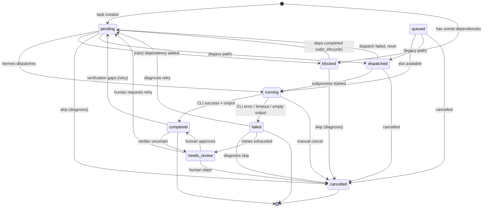

# Task States Reference

Tasks follow a formal state machine defined in `Odin/gods/task_states.py`. Transitions are validated but currently soft-enforced -- invalid transitions log warnings but proceed.

## State Enum

| State | Value | Description |
|-------|-------|-------------|
| `PENDING` | `pending` | Ready for dispatch. All dependencies satisfied. |
| `BLOCKED` | `blocked` | Waiting for upstream dependencies to complete. |
| `QUEUED` | `queued` | Accepted by Hermes but waiting for a concurrency slot. |
| `DISPATCHED` | `dispatched` | Assigned to a provider, subprocess not yet started. |
| `RUNNING` | `running` | CLI subprocess actively executing. |
| `COMPLETED` | `completed` | Execution finished. Output available. May still be verified/reviewed. |
| `FAILED` | `failed` | Execution failed. Error recorded. Eligible for diagnosis. |
| `CANCELLED` | `cancelled` | Permanently skipped (by diagnosis or manual action). |
| `NEEDS_REVIEW` | `needs_review` | Escalated to human. Retries exhausted or verifier uncertain. |

## Terminal States

```python
TERMINAL_STATES = frozenset({TaskState.COMPLETED, TaskState.FAILED, TaskState.CANCELLED})
```

`needs_review` is **not** terminal. A task in `needs_review` still blocks wave and project completion.

---

## State Diagram



---

## Transition Matrix

| From | To | Condition | Handler |
|------|----|-----------|---------|
| `pending` | `running` | Hermes picks up dispatch_command | `hermes.handle_dispatch` |
| `pending` | `dispatched` | (legacy) Provider assigned | `odin_dispatch` |
| `pending` | `blocked` | Dependency added after creation | (rare, manual) |
| `pending` | `cancelled` | Diagnosis recommends skip | `odin_handle_diagnosis` |
| `blocked` | `pending` | All dependencies completed | `odin_lifecycle` (atomic UPDATE) |
| `blocked` | `cancelled` | Diagnosis recommends skip | `odin_handle_diagnosis` |
| `queued` | `running` | Concurrency slot opens | `hermes._drain_deferred` |
| `queued` | `dispatched` | (legacy path) | -- |
| `queued` | `cancelled` | Manual cancel | `hermes.cancel` |
| `dispatched` | `running` | Subprocess started | `hermes.handle_dispatch` |
| `dispatched` | `pending` | Dispatch failed, reset | -- |
| `dispatched` | `cancelled` | Manual cancel | -- |
| `running` | `completed` | CLI exits 0 with output | `hermes._monitor_task` |
| `running` | `failed` | CLI error, timeout, or empty output | `hermes._monitor_task` |
| `running` | `cancelled` | `hermes.cancel()` called | `hermes.cancel` |
| `completed` | `pending` | Verification found gaps (retry) | `mimir._verify_task` |
| `completed` | `needs_review` | Verifier returns `human_needed` | `mimir._verify_task` |
| `failed` | `pending` | Diagnosis: retry_as_is or reassign_tier | `odin_handle_diagnosis` |
| `failed` | `cancelled` | Diagnosis: skip | `odin_handle_diagnosis` |
| `failed` | `needs_review` | Retries exhausted or diagnosis: escalate | `odin_handle_diagnosis` |
| `needs_review` | `completed` | Human approves | API / MCP |
| `needs_review` | `pending` | Human requests retry | API / MCP |
| `needs_review` | `cancelled` | Human skips | API / MCP |

---

## Atomic Transitions with `transition_and_emit`

The pipeline provides `transition_and_emit()` for handlers that need to atomically update task state AND write relay events in a single transaction:

```python
await pipeline.transition_and_emit(
    task_id=task_id,
    new_state="pending",
    emits=[Emit("task_reset", {...}, source="odin")],
    extra_fields={"retry_count": retry_count + 1, "error": None},
    source="odin.retry",
)
```

This method:

1. Opens a database transaction
2. Reads current task state and validates the transition
3. Updates the task row (status + any extra_fields)
4. Writes all emit events to `god_relay_events`
5. Commits atomically -- if any step fails, everything rolls back

This prevents split-brain scenarios where the task state changes but the relay event is lost (or vice versa).

### Standalone `transition_task`

For simpler cases where no relay event is needed alongside the transition:

```python
await transition_task(
    db, task_id, "needs_review",
    extra_fields={"verification_notes": feedback},
    source="mimir.heuristic",
)
```

This validates and logs the transition but does not use a transaction wrapper (just a single UPDATE).

---

## Typical Paths

### Happy Path

```
pending → running → completed → (verified) → terminal
```

1. Odin finds task with satisfied deps, emits `dispatch_command`
2. Hermes sets `running`, launches CLI subprocess
3. CLI completes, Hermes writes `worker_event` (status=completed)
4. Mimir verifies output, emits `task_verified`
5. Odin checks wave/project completion

### Failure + Retry Path

```
pending → running → failed → pending → running → completed
```

1. CLI fails (error, timeout, empty output)
2. Hermes writes `worker_event` (status=failed)
3. Odin diagnoses failure, emits `task_diagnosis` (fix_type=retry_as_is)
4. Odin resets task to `pending` with incremented `retry_count`
5. Next tick dispatches the task again

### Verification Rejection Path

```
pending → running → completed → pending → running → completed
```

1. CLI completes, but Mimir finds gaps in output
2. Mimir resets task to `pending` with `verification_feedback` in context_json
3. Next dispatch includes the feedback so the CLI addresses the gaps
4. Second attempt passes verification

### Human Review Path

```
running → completed → needs_review → completed (or pending)
```

1. CLI completes but verifier returns `human_needed`
2. Mimir sets `needs_review`, emits `needs_human_review`
3. Human reviews via dashboard or MCP
4. Human either approves (completed) or requests retry (pending)

### Escalation Path

```
running → failed → pending → running → failed → needs_review
```

1. Task fails, gets retried
2. Fails again, `retry_count >= max_retries`
3. Diagnosis escalates to `needs_review`

---

## Dependency-Driven Transitions

Tasks start as `blocked` if they have unmet dependencies. Odin unblocks them atomically:

```sql
UPDATE tasks SET status = 'pending', updated_at = ?
WHERE project_id = ? AND status = 'blocked'
AND NOT EXISTS (
    SELECT 1 FROM task_deps d
    LEFT JOIN tasks dep ON dep.id = d.depends_on
    WHERE d.task_id = tasks.id AND dep.status != 'completed'
)
```

This single UPDATE atomically unblocks all tasks whose dependencies are satisfied, avoiding read-then-write race conditions.

### JOIN Threshold Unblock

For FORK/JOIN workflows, tasks may have a `join_threshold` in their `context_json`:

| Join Mode | Threshold | Behavior |
|-----------|-----------|----------|
| `all` | N/A | Standard: all deps must be completed |
| `any` | 1 | Unblock when any single dep completes |
| `threshold` | M | Unblock when M-of-N deps complete |

---

## Deadlock Detection

After processing `task_verified`, Odin checks for deadlock:

1. Count tasks in `pending`, `queued`, `running` -- if **zero**:
2. Count tasks in `blocked` -- if **greater than zero**:
3. Project is deadlocked (blocked tasks with no active tasks to unblock them)
4. Project set to `failed` with reason "Deadlock: N task(s) blocked, no forward progress"
